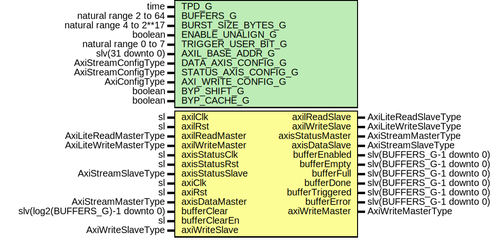

# Entity: AxiStreamDmaRingWrite

- **File**: AxiStreamDmaRingWrite.vhd
## Diagram

## Description

-----------------------------------------------------------------------------
 Company    : SLAC National Accelerator Laboratory
-----------------------------------------------------------------------------
 Description: AXI Stream to DMA Ring Buffer Write Module
-----------------------------------------------------------------------------
 This file is part of 'SLAC Firmware Standard Library'.
 It is subject to the license terms in the LICENSE.txt file found in the
 top-level directory of this distribution and at:
    https://confluence.slac.stanford.edu/display/ppareg/LICENSE.html.
 No part of 'SLAC Firmware Standard Library', including this file,
 may be copied, modified, propagated, or distributed except according to
 the terms contained in the LICENSE.txt file.
-----------------------------------------------------------------------------
## Generics

| Generic name         | Type                     | Value           | Description                                               |
| -------------------- | ------------------------ | --------------- | --------------------------------------------------------- |
| TPD_G                | time                     | 1 ns            |                                                           |
| BUFFERS_G            | natural range 2 to 64    | 64              |                                                           |
| BURST_SIZE_BYTES_G   | natural range 4 to 2**17 | 4096            |                                                           |
| ENABLE_UNALIGN_G     | boolean                  | false           |                                                           |
| TRIGGER_USER_BIT_G   | natural range 0 to 7     | 2               |                                                           |
| AXIL_BASE_ADDR_G     | slv(31 downto 0)         | (others => '0') |                                                           |
| DATA_AXIS_CONFIG_G   | AxiStreamConfigType      |                 |                                                           |
| STATUS_AXIS_CONFIG_G | AxiStreamConfigType      |                 |                                                           |
| AXI_WRITE_CONFIG_G   | AxiConfigType            |                 |                                                           |
| BYP_SHIFT_G          | boolean                  | true            |  Bypass both because we do not want them to back-pressure |
| BYP_CACHE_G          | boolean                  | true            |                                                           |
## Ports

| Port name        | Direction | Type                            | Description                            |
| ---------------- | --------- | ------------------------------- | -------------------------------------- |
| axilClk          | in        | sl                              | AXI-Lite Interface for local registers |
| axilRst          | in        | sl                              |                                        |
| axilReadMaster   | in        | AxiLiteReadMasterType           |                                        |
| axilReadSlave    | out       | AxiLiteReadSlaveType            |                                        |
| axilWriteMaster  | in        | AxiLiteWriteMasterType          |                                        |
| axilWriteSlave   | out       | AxiLiteWriteSlaveType           |                                        |
| axisStatusClk    | in        | sl                              | Status stream                          |
| axisStatusRst    | in        | sl                              |                                        |
| axisStatusMaster | out       | AxiStreamMasterType             |                                        |
| axisStatusSlave  | in        | AxiStreamSlaveType              |                                        |
| axiClk           | in        | sl                              | AXI (DDR) clock domain                 |
| axiRst           | in        | sl                              |                                        |
| axisDataMaster   | in        | AxiStreamMasterType             | Axi Stream data to be buffered         |
| axisDataSlave    | out       | AxiStreamSlaveType              |                                        |
| bufferClear      | in        | slv(log2(BUFFERS_G)-1 downto 0) | Low level buffer control               |
| bufferClearEn    | in        | sl                              |                                        |
| bufferEnabled    | out       | slv(BUFFERS_G-1 downto 0)       |                                        |
| bufferEmpty      | out       | slv(BUFFERS_G-1 downto 0)       |                                        |
| bufferFull       | out       | slv(BUFFERS_G-1 downto 0)       |                                        |
| bufferDone       | out       | slv(BUFFERS_G-1 downto 0)       |                                        |
| bufferTriggered  | out       | slv(BUFFERS_G-1 downto 0)       |                                        |
| bufferError      | out       | slv(BUFFERS_G-1 downto 0)       |                                        |
| axiWriteMaster   | out       | AxiWriteMasterType              | AXI4 Interface for RAM                 |
| axiWriteSlave    | in        | AxiWriteSlaveType               |                                        |
## Signals

| Name                | Type                                               | Description |
| ------------------- | -------------------------------------------------- | ----------- |
| locAxilWriteMasters | AxiLiteWriteMasterArray(AXIL_MASTERS_C-1 downto 0) |             |
| locAxilWriteSlaves  | AxiLiteWriteSlaveArray(AXIL_MASTERS_C-1 downto 0)  |             |
| locAxilReadMasters  | AxiLiteReadMasterArray(AXIL_MASTERS_C-1 downto 0)  |             |
| locAxilReadSlaves   | AxiLiteReadSlaveArray(AXIL_MASTERS_C-1 downto 0)   |             |
| r                   | RegType                                            |             |
| rin                 | RegType                                            |             |
| dmaAck              | AxiWriteDmaAckType                                 |             |
| startRamDout        | slv(RAM_DATA_WIDTH_C-1 downto 0)                   |             |
| endRamDout          | slv(RAM_DATA_WIDTH_C-1 downto 0)                   |             |
| nextRamDout         | slv(RAM_DATA_WIDTH_C-1 downto 0)                   |             |
| trigRamDout         | slv(RAM_DATA_WIDTH_C-1 downto 0)                   |             |
| modeRamDout         | slv(31 downto 0)                                   |             |
| statusRamDout       | slv(31 downto 0)                                   |             |
| modeWrValid         | sl                                                 |             |
| modeWrStrobe        | slv(3 downto 0)                                    |             |
| modeWrAddr          | slv(RAM_ADDR_WIDTH_C-1 downto 0)                   |             |
| modeWrData          | slv(31 downto 0)                                   |             |
## Constants

| Name                     | Type                             | Value                                                                                                                                                                                                                                                                                                                                                                                                                                                                                                                                                                                                                                                                                                                                                                                                                                                                                                                                                                                                                                                                                                                                                                                                                                                                                                                                                                                                                                                                                                                                                                                                                                                                                                                                                                                                                                                                                                                                                                                                                                                                                                                                                                                                                              | Description                                                                                         |
| ------------------------ | -------------------------------- | ---------------------------------------------------------------------------------------------------------------------------------------------------------------------------------------------------------------------------------------------------------------------------------------------------------------------------------------------------------------------------------------------------------------------------------------------------------------------------------------------------------------------------------------------------------------------------------------------------------------------------------------------------------------------------------------------------------------------------------------------------------------------------------------------------------------------------------------------------------------------------------------------------------------------------------------------------------------------------------------------------------------------------------------------------------------------------------------------------------------------------------------------------------------------------------------------------------------------------------------------------------------------------------------------------------------------------------------------------------------------------------------------------------------------------------------------------------------------------------------------------------------------------------------------------------------------------------------------------------------------------------------------------------------------------------------------------------------------------------------------------------------------------------------------------------------------------------------------------------------------------------------------------------------------------------------------------------------------------------------------------------------------------------------------------------------------------------------------------------------------------------------------------------------------------------------------------------------------------------- | --------------------------------------------------------------------------------------------------- |
| RAM_DATA_WIDTH_C         | integer                          |  AXI_WRITE_CONFIG_G.ADDR_WIDTH_C                                                                                                                                                                                                                                                                                                                                                                                                                                                                                                                                                                                                                                                                                                                                                                                                                                                                                                                                                                                                                                                                                                                                                                                                                                                                                                                                                                                                                                                                                                                                                                                                                                                                                                                                                                                                                                                                                                                                                                                                                                                                                                                                                                                                   |                                                                                                     |
| RAM_ADDR_WIDTH_C         | integer                          |  log2(BUFFERS_G)                                                                                                                                                                                                                                                                                                                                                                                                                                                                                                                                                                                                                                                                                                                                                                                                                                                                                                                                                                                                                                                                                                                                                                                                                                                                                                                                                                                                                                                                                                                                                                                                                                                                                                                                                                                                                                                                                                                                                                                                                                                                                                                                                                                                                   |                                                                                                     |
| AXIL_RAM_ADDR_WIDTH_C    | integer                          |  RAM_ADDR_WIDTH_C + log2((RAM_DATA_WIDTH_C-1)/4)                                                                                                                                                                                                                                                                                                                                                                                                                                                                                                                                                                                                                                                                                                                                                                                                                                                                                                                                                                                                                                                                                                                                                                                                                                                                                                                                                                                                                                                                                                                                                                                                                                                                                                                                                                                                                                                                                                                                                                                                                                                                                                                                                                                   |                                                                                                     |
| DMA_ADDR_LOW_C           | integer                          |  log2(BURST_SIZE_BYTES_G)                                                                                                                                                                                                                                                                                                                                                                                                                                                                                                                                                                                                                                                                                                                                                                                                                                                                                                                                                                                                                                                                                                                                                                                                                                                                                                                                                                                                                                                                                                                                                                                                                                                                                                                                                                                                                                                                                                                                                                                                                                                                                                                                                                                                          |                                                                                                     |
| BURST_SIZE_SLV_C         | slv(3 downto 0)                  |  toSlv(DMA_ADDR_LOW_C-2,  4)                                                                                                                                                                                                                                                                                                                                                                                                                                                                                                                                                                                                                                                                                                                                                                                                                                                                                                                                                                                                                                                                                                                                                                                                                                                                                                                                                                                                                                                                                                                                                                                                                                                                                                                                                                                                                                                                                                                                                                                                                                                                                                                                                                    |  Create burst size constant for status  0 = burst size 4  1 = burst size 8  15 = burst size 131072  |
| STATUS_RAM_INIT_C        | slv(31 downto 0)                 |  statusRamInit                                                                                                                                                                                                                                                                                                                                                                                                                                                                                                                                                                                                                                                                                                                                                                                                                                                                                                                                                                                                                                                                                                                                                                                                                                                                                                                                                                                                                                                                                                                                                                                                                                                                                                                                                                                                                                                                                                                                                                                                                                                                                                                                                                                                                     |                                                                                                     |
| AXIL_CONFIG_C            | AxiLiteCrossbarMasterConfigArray |  (       START_AXIL_C    => (          baseAddr     => getBufferAddr(AXIL_BASE_ADDR_G,  START_AXIL_C,  0),           addrBits     => AXIL_RAM_ADDR_WIDTH_C,           connectivity => X"FFFF"),        END_AXIL_C      => (          baseAddr     => getBufferAddr(AXIL_BASE_ADDR_G,  END_AXIL_C,  0),           addrBits     => AXIL_RAM_ADDR_WIDTH_C,           connectivity => X"FFFF"),        NEXT_AXIL_C     => (          baseAddr     => getBufferAddr(AXIL_BASE_ADDR_G,  NEXT_AXIL_C,  0),           addrBits     => AXIL_RAM_ADDR_WIDTH_C,           connectivity => X"FFFF"),        TRIG_AXIL_C     => (          baseAddr     => getBufferAddr(AXIL_BASE_ADDR_G,  TRIG_AXIL_C,  0),           addrBits     => AXIL_RAM_ADDR_WIDTH_C,           connectivity => X"FFFF"),        MODE_AXIL_C     => (          baseAddr     => getBufferAddr(AXIL_BASE_ADDR_G,  MODE_AXIL_C,  0),           addrBits     => RAM_ADDR_WIDTH_C+2,           connectivity => X"FFFF"),        STATUS_AXIL_C   => (          baseAddr     => getBufferAddr(AXIL_BASE_ADDR_G,  STATUS_AXIL_C,  0),           addrBits     => RAM_ADDR_WIDTH_C+2,           connectivity => X"FFFF")) |                                                                                                     |
| INT_STATUS_AXIS_CONFIG_C | AxiStreamConfigType              |        ssiAxiStreamConfig(1,  TKEEP_FIXED_C,  TUSER_FIRST_LAST_C,  4)                                                                                                                                                                                                                                                                                                                                                                                                                                                                                                                                                                                                                                                                                                                                                                                                                                                                                                                                                                                                                                                                                                                                                                                                                                                                                                                                                                                                                                                                                                                                                                                                                                                                                                                                                                                                                                                                                                                                                                                                                                                     |                                                                                                     |
| REG_INIT_C               | RegType                          |  (       wrRamAddr        => (others => '0'),        rdRamAddr        => (others => '0'),        activeBuffer     => (others => '0'),        initBufferEn     => '0',        ramWe            => '0',        nextAddr         => (others => '0'),        startAddr        => (others => '0'),        endAddr          => (others => '0'),        trigAddr         => (others => '0'),        mode             => (others => '0'),        status           => (others => '0'),        state            => WAIT_TVALID_S,        dmaReq           => (          request       => '0',           drop          => '0',           address       => (others => '0'),           maxSize       => toSlv(BURST_SIZE_BYTES_G,  32),           prot          => (others=>'0')),        trigger          => '0',        softTrigger      => (others => '0'),        eofe             => '0',        bufferEnabled    => (others => '0'),        bufferEmpty      => (others => '1'),        bufferFull       => (others => '0'),        bufferDone       => (others => '1'),        bufferTriggered  => (others => '0'),        bufferError      => (others => '0'),        axisStatusMaster => axiStreamMasterInit(INT_STATUS_AXIS_CONFIG_C))               |                                                                                                     |
## Types

| Name      | Type                                                                                                                                                                           | Description                                                                                                                                                                                                                                                                                          |
| --------- | ------------------------------------------------------------------------------------------------------------------------------------------------------------------------------ | ---------------------------------------------------------------------------------------------------------------------------------------------------------------------------------------------------------------------------------------------------------------------------------------------------- |
| StateType | (WAIT_TVALID_S,  ASSERT_ADDR_S,  LATCH_POINTERS_S,  WAIT_DMA_DONE_S)  |        (        TSTRB_EN_C    => false,        TDATA_BYTES_C => 1,        TDEST_BITS_C  => 4,        TID_BITS_C    => 0,        TKEEP_MODE_C  => TKEEP_FIXED_C,  --ite(BSA_STREAM_BYTE_WIDTH_G = 4, TKEEP_FIXED_C, TKEEP_COMP_C),        TUSER_BITS_C  => 2,        TUSER_MODE_C  => TUSER_NONE_C);  |
| RegType   |                                                                                                                                                                                |                                                                                                                                                                                                                                                                                                      |
## Functions
- statusRamInit () return slv 
## Processes
- comb: ( axiRst, axisDataMaster, bufferClear, bufferClearEn, dmaAck, endRamDout,
                   modeRamDout, modeWrAddr, modeWrData, modeWrStrobe, modeWrValid, nextRamDout, r,
                   startRamDout, statusRamDout, trigRamDout )
**Description**
 [in] -----------------------------------------------------------------------------------------------  Main logic ----------------------------------------------------------------------------------------------- 
- seq: ( axiClk )
## Instantiations

- U_AxiLiteCrossbar_1: surf.AxiLiteCrossbar
- U_AxiDualPortRam_Start: surf.AxiDualPortRam
**Description**
 [in]
-----------------------------------------------------------------------------------------------
 AXI RAMs store buffer information
-----------------------------------------------------------------------------------------------
 Start Addresses. AXIL writeable

- U_AxiDualPortRam_End: surf.AxiDualPortRam
**Description**
 End Addresses. AXIL writeable

- U_AxiDualPortRam_Next: surf.AxiDualPortRam
**Description**
 Next Addresses. System writeable

- U_AxiDualPortRam_Trigger: surf.AxiDualPortRam
- U_AxiDualPortRam_Mode: surf.AxiDualPortRam
- U_AxiDualPortRam_Status: surf.AxiDualPortRam
- U_AxiStreamDmaWrite_1: surf.AxiStreamDmaWrite
**Description**
 DMA Write block

- U_AxiStreamFifo_MSG: surf.AxiStreamFifoV2
**Description**
 [in]
 Pass status message through a small fifo to convert to statusClk
 And convert width

