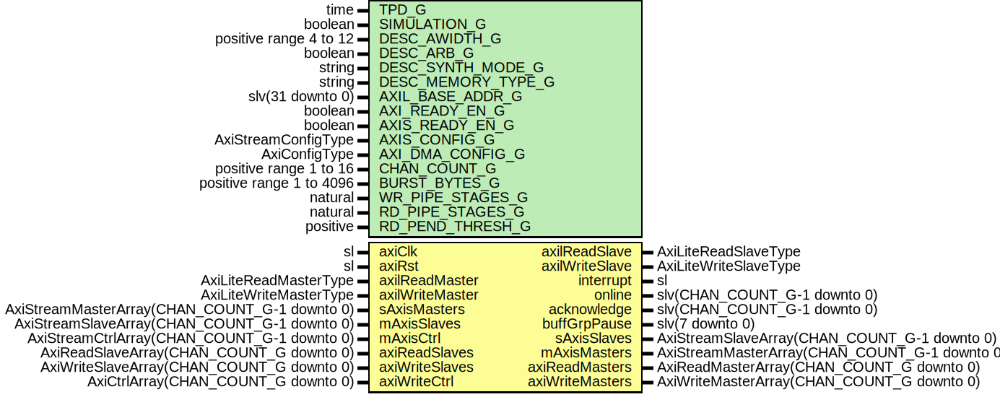

# Entity: AxiStreamDmaV2

## Diagram

## Description

Company    : SLAC National Accelerator Laboratory
Description:
Generic AXI Stream DMA block for frame at a time transfers.
This file is part of 'SLAC Firmware Standard Library'.
It is subject to the license terms in the LICENSE.txt file found in the
top-level directory of this distribution and at:
   https://confluence.slac.stanford.edu/display/ppareg/LICENSE.html.
No part of 'SLAC Firmware Standard Library', including this file,
may be copied, modified, propagated, or distributed except according to
the terms contained in the LICENSE.txt file.
## Generics

| Generic name       | Type                     | Value       | Description |
| ------------------ | ------------------------ | ----------- | ----------- |
| TPD_G              | time                     | 1 ns        |             |
| SIMULATION_G       | boolean                  | false       |             |
| DESC_AWIDTH_G      | positive range 4 to 12   | 12          |             |
| DESC_ARB_G         | boolean                  | true        |             |
| DESC_SYNTH_MODE_G  | string                   | "inferred"  |             |
| DESC_MEMORY_TYPE_G | string                   | "block"     |             |
| AXIL_BASE_ADDR_G   | slv(31 downto 0)         | x"00000000" |             |
| AXI_READY_EN_G     | boolean                  | false       |             |
| AXIS_READY_EN_G    | boolean                  | false       |             |
| AXIS_CONFIG_G      | AxiStreamConfigType      |             |             |
| AXI_DMA_CONFIG_G   | AxiConfigType            |             |             |
| CHAN_COUNT_G       | positive range 1 to 16   | 1           |             |
| BURST_BYTES_G      | positive range 1 to 4096 | 4096        |             |
| WR_PIPE_STAGES_G   | natural                  | 1           |             |
| RD_PIPE_STAGES_G   | natural                  | 1           |             |
| RD_PEND_THRESH_G   | positive                 | 1           |             |
## Ports

| Port name       | Direction | Type                                          | Description                                    |
| --------------- | --------- | --------------------------------------------- | ---------------------------------------------- |
| axiClk          | in        | sl                                            | Clock/Reset                                    |
| axiRst          | in        | sl                                            |                                                |
| axilReadMaster  | in        | AxiLiteReadMasterType                         | Register Access & Interrupt                    |
| axilReadSlave   | out       | AxiLiteReadSlaveType                          |                                                |
| axilWriteMaster | in        | AxiLiteWriteMasterType                        |                                                |
| axilWriteSlave  | out       | AxiLiteWriteSlaveType                         |                                                |
| interrupt       | out       | sl                                            |                                                |
| online          | out       | slv(CHAN_COUNT_G-1 downto 0)                  |                                                |
| acknowledge     | out       | slv(CHAN_COUNT_G-1 downto 0)                  |                                                |
| buffGrpPause    | out       | slv(7 downto 0)                               |                                                |
| sAxisMasters    | in        | AxiStreamMasterArray(CHAN_COUNT_G-1 downto 0) | AXI Stream Interface                           |
| sAxisSlaves     | out       | AxiStreamSlaveArray(CHAN_COUNT_G-1 downto 0)  |                                                |
| mAxisMasters    | out       | AxiStreamMasterArray(CHAN_COUNT_G-1 downto 0) |                                                |
| mAxisSlaves     | in        | AxiStreamSlaveArray(CHAN_COUNT_G-1 downto 0)  |                                                |
| mAxisCtrl       | in        | AxiStreamCtrlArray(CHAN_COUNT_G-1 downto 0)   |                                                |
| axiReadMasters  | out       | AxiReadMasterArray(CHAN_COUNT_G downto 0)     | AXI Interfaces, 0 = Desc, 1-CHAN_COUNT_G = DMA |
| axiReadSlaves   | in        | AxiReadSlaveArray(CHAN_COUNT_G downto 0)      |                                                |
| axiWriteMasters | out       | AxiWriteMasterArray(CHAN_COUNT_G downto 0)    |                                                |
| axiWriteSlaves  | in        | AxiWriteSlaveArray(CHAN_COUNT_G downto 0)     |                                                |
| axiWriteCtrl    | in        | AxiCtrlArray(CHAN_COUNT_G downto 0)           |                                                |
## Signals

| Name             | Type                                             | Description |
| ---------------- | ------------------------------------------------ | ----------- |
| dmaWrDescReq     | AxiWriteDmaDescReqArray(CHAN_COUNT_G-1 downto 0) |             |
| dmaWrDescAck     | AxiWriteDmaDescAckArray(CHAN_COUNT_G-1 downto 0) |             |
| dmaWrDescRet     | AxiWriteDmaDescRetArray(CHAN_COUNT_G-1 downto 0) |             |
| dmaWrDescRetAck  | slv(CHAN_COUNT_G-1 downto 0)                     |             |
| dmaRdDescReq     | AxiReadDmaDescReqArray(CHAN_COUNT_G-1 downto 0)  |             |
| dmaRdDescAck     | slv(CHAN_COUNT_G-1 downto 0)                     |             |
| dmaRdDescRet     | AxiReadDmaDescRetArray(CHAN_COUNT_G-1 downto 0)  |             |
| dmaRdDescRetAck  | slv(CHAN_COUNT_G-1 downto 0)                     |             |
| descWriteMasters | AxiWriteMasterArray(CHAN_COUNT_G-1 downto 0)     |             |
| descWriteSlaves  | AxiWriteSlaveArray(CHAN_COUNT_G-1 downto 0)      |             |
| dataWriteMasters | AxiWriteMasterArray(CHAN_COUNT_G-1 downto 0)     |             |
| dataWriteSlaves  | AxiWriteSlaveArray(CHAN_COUNT_G-1 downto 0)      |             |
| dataWriteCtrl    | AxiCtrlArray(CHAN_COUNT_G-1 downto 0)            |             |
| axiRdCache       | slv(3 downto 0)                                  |             |
| axiWrCache       | slv(3 downto 0)                                  |             |
| axiReset         | slv(CHAN_COUNT_G-1 downto 0)                     |             |
## Instantiations

- U_DmaDesc: surf.AxiStreamDmaV2Desc
