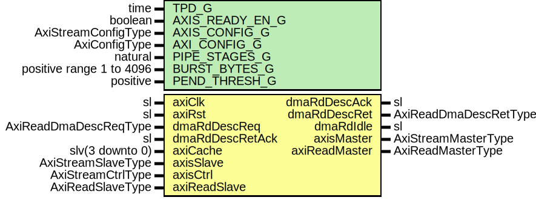

# Entity: AxiStreamDmaV2Read

- **File**: AxiStreamDmaV2Read.vhd
## Diagram

## Description

-----------------------------------------------------------------------------
 Company    : SLAC National Accelerator Laboratory
-----------------------------------------------------------------------------
 Description:
 Block to transfer a single AXI Stream frame from memory using an AXI
 interface.
-----------------------------------------------------------------------------
 This file is part of 'SLAC Firmware Standard Library'.
 It is subject to the license terms in the LICENSE.txt file found in the
 top-level directory of this distribution and at:
    https://confluence.slac.stanford.edu/display/ppareg/LICENSE.html.
 No part of 'SLAC Firmware Standard Library', including this file,
 may be copied, modified, propagated, or distributed except according to
 the terms contained in the LICENSE.txt file.
-----------------------------------------------------------------------------
## Generics

| Generic name    | Type                     | Value | Description |
| --------------- | ------------------------ | ----- | ----------- |
| TPD_G           | time                     | 1 ns  |             |
| AXIS_READY_EN_G | boolean                  | false |             |
| AXIS_CONFIG_G   | AxiStreamConfigType      |       |             |
| AXI_CONFIG_G    | AxiConfigType            |       |             |
| PIPE_STAGES_G   | natural                  | 1     |             |
| BURST_BYTES_G   | positive range 1 to 4096 | 4096  |             |
| PEND_THRESH_G   | positive                 | 1     |             |
## Ports

| Port name       | Direction | Type                  | Description           |
| --------------- | --------- | --------------------- | --------------------- |
| axiClk          | in        | sl                    | Clock/Reset           |
| axiRst          | in        | sl                    |                       |
| dmaRdDescReq    | in        | AxiReadDmaDescReqType | DMA Control Interface |
| dmaRdDescAck    | out       | sl                    |                       |
| dmaRdDescRet    | out       | AxiReadDmaDescRetType |                       |
| dmaRdDescRetAck | in        | sl                    |                       |
| dmaRdIdle       | out       | sl                    | Config and status     |
| axiCache        | in        | slv(3 downto 0)       |                       |
| axisMaster      | out       | AxiStreamMasterType   | Streaming Interface   |
| axisSlave       | in        | AxiStreamSlaveType    |                       |
| axisCtrl        | in        | AxiStreamCtrlType     |                       |
| axiReadMaster   | out       | AxiReadMasterType     | AXI Interface         |
| axiReadSlave    | in        | AxiReadSlaveType      |                       |
## Signals

| Name       | Type               | Description |
| ---------- | ------------------ | ----------- |
| r          | RegType            |             |
| rin        | RegType            |             |
| pause      | sl                 |             |
| notReqDone | sl                 |             |
| sSlave     | AxiStreamSlaveType |             |
| mSlave     | AxiStreamSlaveType |             |
## Constants

| Name         | Type     | Value                                                                                                                                                                                                                                                                                                                                                                                                                                                                                                                                                                                                                                                                                                                                                                                                                                                                                                                                                                                                                                                                                                                                                                                                                                                                               | Description |
| ------------ | -------- | ----------------------------------------------------------------------------------------------------------------------------------------------------------------------------------------------------------------------------------------------------------------------------------------------------------------------------------------------------------------------------------------------------------------------------------------------------------------------------------------------------------------------------------------------------------------------------------------------------------------------------------------------------------------------------------------------------------------------------------------------------------------------------------------------------------------------------------------------------------------------------------------------------------------------------------------------------------------------------------------------------------------------------------------------------------------------------------------------------------------------------------------------------------------------------------------------------------------------------------------------------------------------------------- | ----------- |
| DATA_BYTES_C | positive |  AXIS_CONFIG_G.TDATA_BYTES_C                                                                                                                                                                                                                                                                                                                                                                                                                                                                                                                                                                                                                                                                                                                                                                                                                                                                                                                                                                                                                                                                                                                                                                                                                                                        |             |
| ADDR_LSB_C   | natural  |  ite((DATA_BYTES_C=1), 0, bitSize(DATA_BYTES_C-1))                                                                                                                                                                                                                                                                                                                                                                                                                                                                                                                                                                                                                                                                                                                                                                                                                                                                                                                                                                                                                                                                                                                                                            |             |
| PEND_LSB_C   | natural  |  bitSize(PEND_THRESH_G-1)                                                                                                                                                                                                                                                                                                                                                                                                                                                                                                                                                                                                                                                                                                                                                                                                                                                                                                                                                                                                                                                                                                                                                                                                                                                           |             |
| REG_INIT_C   | RegType  |  (       idle         => '0',        pending      => true,        size         => (others => '0'),        reqSize      => (others => '0'),        reqCnt       => (others => '0'),        ackCnt       => (others => '0'),        dmaRdDescReq => AXI_READ_DMA_DESC_REQ_INIT_C,        dmaRdDescAck => '0',        dmaRdDescRet => AXI_READ_DMA_DESC_RET_INIT_C,        first        => '0',        leftovers    => '0',        axiLen       => AXI_LEN_INIT_C,        rMaster      => axiReadMasterInit(AXI_CONFIG_G,  "01",  "0000"),        sMaster      => axiStreamMasterInit(AXIS_CONFIG_G),        reqState     => IDLE_S,        state        => IDLE_S) |             |
## Types

| Name         | Type                                                                                                                                              | Description |
| ------------ | ------------------------------------------------------------------------------------------------------------------------------------------------- | ----------- |
| ReqStateType | ( IDLE_S,  NEXT_S,  ADDR_S,  DLY_S)      |             |
| StateType    | ( IDLE_S,  MOVE_S,  DONE_S,  BLOWOFF_S)  |             |
| RegType      |                                                                                                                                                   |             |
## Processes
- comb: ( axiCache, axiReadSlave, axiRst, dmaRdDescReq,
                   dmaRdDescRetAck, notReqDone, pause, r, sSlave )
 **Description**
  (a <  b) 
- seq: ( axiClk )
## Instantiations

- U_DspComparator: surf.DspComparator
 **Description**
 Check if last transfer completed

- U_Pipeline: surf.AxiStreamPipeline
