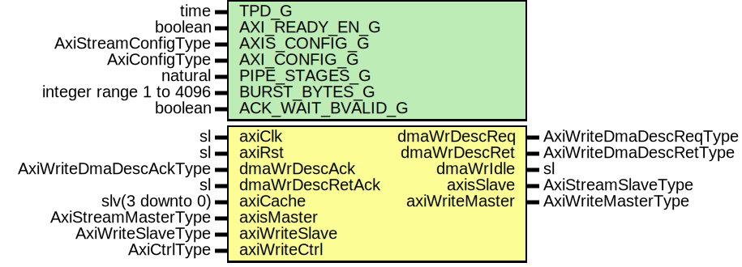

# Entity: AxiStreamDmaV2Write

- **File**: AxiStreamDmaV2Write.vhd
## Diagram

## Description

-----------------------------------------------------------------------------
 Company    : SLAC National Accelerator Laboratory
-----------------------------------------------------------------------------
 Description:
 Block to transfer a single AXI Stream frame into memory using an AXI
 interface. Version 2 supports interleaved frames.
-----------------------------------------------------------------------------
 This file is part of 'SLAC Firmware Standard Library'.
 It is subject to the license terms in the LICENSE.txt file found in the
 top-level directory of this distribution and at:
    https://confluence.slac.stanford.edu/display/ppareg/LICENSE.html.
 No part of 'SLAC Firmware Standard Library', including this file,
 may be copied, modified, propagated, or distributed except according to
 the terms contained in the LICENSE.txt file.
-----------------------------------------------------------------------------
## Generics

| Generic name      | Type                    | Value | Description |
| ----------------- | ----------------------- | ----- | ----------- |
| TPD_G             | time                    | 1 ns  |             |
| AXI_READY_EN_G    | boolean                 | false |             |
| AXIS_CONFIG_G     | AxiStreamConfigType     |       |             |
| AXI_CONFIG_G      | AxiConfigType           |       |             |
| PIPE_STAGES_G     | natural                 | 1     |             |
| BURST_BYTES_G     | integer range 1 to 4096 | 4096  |             |
| ACK_WAIT_BVALID_G | boolean                 | true  |             |
## Ports

| Port name       | Direction | Type                   | Description                                  |
| --------------- | --------- | ---------------------- | -------------------------------------------- |
| axiClk          | in        | sl                     | Clock/Reset                                  |
| axiRst          | in        | sl                     |                                              |
| dmaWrDescReq    | out       | AxiWriteDmaDescReqType | DMA write descriptor request, ack and return |
| dmaWrDescAck    | in        | AxiWriteDmaDescAckType |                                              |
| dmaWrDescRet    | out       | AxiWriteDmaDescRetType |                                              |
| dmaWrDescRetAck | in        | sl                     |                                              |
| dmaWrIdle       | out       | sl                     | Config and status                            |
| axiCache        | in        | slv(3 downto 0)        |                                              |
| axisMaster      | in        | AxiStreamMasterType    | Streaming Interface                          |
| axisSlave       | out       | AxiStreamSlaveType     |                                              |
| axiWriteMaster  | out       | AxiWriteMasterType     | AXI Interface                                |
| axiWriteSlave   | in        | AxiWriteSlaveType      |                                              |
| axiWriteCtrl    | in        | AxiCtrlType            |                                              |
## Signals

| Name          | Type                                       | Description |
| ------------- | ------------------------------------------ | ----------- |
| r             | RegType                                    |             |
| rin           | RegType                                    |             |
| pause         | sl                                         |             |
| intAxisMaster | AxiStreamMasterType                        |             |
| intAxisSlave  | AxiStreamSlaveType                         |             |
| trackDin      | slv(AXI_WRITE_DMA_TRACK_SIZE_C-1 downto 0) |             |
| trackDout     | slv(AXI_WRITE_DMA_TRACK_SIZE_C-1 downto 0) |             |
| trackData     | AxiWriteDmaTrackType                       |             |
## Constants

| Name              | Type    | Value                                                                                                                                                                                                                                                                                                                                                                                                                                                                                                                                                                                                                                                                                                                                                                                                                                                                                                                                                                                                                                                                                                                                                                                                                                                                                                          | Description |
| ----------------- | ------- | -------------------------------------------------------------------------------------------------------------------------------------------------------------------------------------------------------------------------------------------------------------------------------------------------------------------------------------------------------------------------------------------------------------------------------------------------------------------------------------------------------------------------------------------------------------------------------------------------------------------------------------------------------------------------------------------------------------------------------------------------------------------------------------------------------------------------------------------------------------------------------------------------------------------------------------------------------------------------------------------------------------------------------------------------------------------------------------------------------------------------------------------------------------------------------------------------------------------------------------------------------------------------------------------------------------- | ----------- |
| DATA_BYTES_C      | integer |  AXIS_CONFIG_G.TDATA_BYTES_C                                                                                                                                                                                                                                                                                                                                                                                                                                                                                                                                                                                                                                                                                                                                                                                                                                                                                                                                                                                                                                                                                                                                                                                                                                                                                   |             |
| ADDR_LSB_C        | integer |  bitSize(DATA_BYTES_C-1)                                                                                                                                                                                                                                                                                                                                                                                                                                                                                                                                                                                                                                                                                                                                                                                                                                                                                                                                                                                                                                                                                                                                                                                                                                                                                       |             |
| FIFO_ADDR_WIDTH_C | natural |  (AXI_CONFIG_G.LEN_BITS_C+1)                                                                                                                                                                                                                                                                                                                                                                                                                                                                                                                                                                                                                                                                                                                                                                                                                                                                                                                                                                                                                                                                                                                                                                                                                                                                                   |             |
| REG_INIT_C        | RegType |  (       dmaWrDescReq  => AXI_WRITE_DMA_DESC_REQ_INIT_C,        dmaWrTrack    => AXI_WRITE_DMA_TRACK_INIT_C,        dmaWrDescRet  => AXI_WRITE_DMA_DESC_RET_INIT_C,        result        => (others => '0'),        reqCount      => (others => '0'),        ackCount      => (others => '0'),        stCount       => (others => '0'),        awlen         => (others => '0'),        axiLen        => AXI_LEN_INIT_C,        wMaster       => axiWriteMasterInit(AXI_CONFIG_G,  '1',  "01",  "0000"),        slave         => AXI_STREAM_SLAVE_INIT_C,        state         => RESET_S,        lastUser      => (others=>'0'),        continue      => '0',        dmaWrIdle     => '0') |             |
## Types

| Name      | Type                                                                                                                                                                                                                                                                                                                                                                                                                    | Description |
| --------- | ----------------------------------------------------------------------------------------------------------------------------------------------------------------------------------------------------------------------------------------------------------------------------------------------------------------------------------------------------------------------------------------------------------------------- | ----------- |
| StateType | ( RESET_S,  INIT_S,  IDLE_S,  REQ_S,  ADDR_S,  MOVE_S,  PAD_S,  META_S,  RETURN_S,  DUMP_S)  |             |
| RegType   |                                                                                                                                                                                                                                                                                                                                                                                                                         |             |
## Processes
- comb: ( axiRst, axiWriteSlave, dmaWrDescAck, dmaWrDescRetAck,
                   intAxisMaster, trackData, pause, r, axiCache )
 **Description**
 State machine 
- seq: ( axiClk )
## Instantiations

- U_Pipeline: surf.AxiStreamPipeline
- U_TrackRam: surf.DualPortRam
 **Description**
------------------------
 Tracking RAM
------------------------

