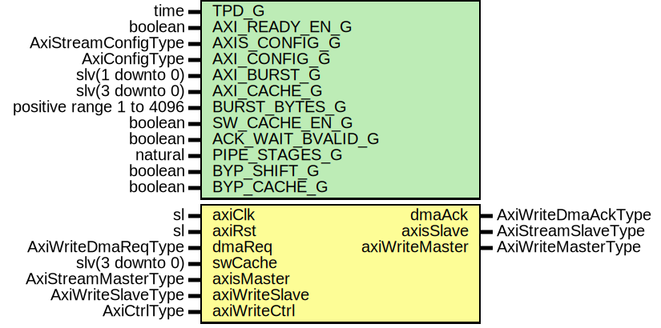

# Entity: AxiStreamDmaWrite

## Diagram

## Description

Company    : SLAC National Accelerator Laboratory
Description:
Block to transfer a single AXI Stream frame into memory using an AXI
interface.
This file is part of 'SLAC Firmware Standard Library'.
It is subject to the license terms in the LICENSE.txt file found in the
top-level directory of this distribution and at:
   https://confluence.slac.stanford.edu/display/ppareg/LICENSE.html.
No part of 'SLAC Firmware Standard Library', including this file,
may be copied, modified, propagated, or distributed except according to
the terms contained in the LICENSE.txt file.
## Generics

| Generic name      | Type                     | Value  | Description |
| ----------------- | ------------------------ | ------ | ----------- |
| TPD_G             | time                     | 1 ns   |             |
| AXI_READY_EN_G    | boolean                  | false  |             |
| AXIS_CONFIG_G     | AxiStreamConfigType      |        |             |
| AXI_CONFIG_G      | AxiConfigType            |        |             |
| AXI_BURST_G       | slv(1 downto 0)          | "01"   |             |
| AXI_CACHE_G       | slv(3 downto 0)          | "1111" |             |
| BURST_BYTES_G     | positive range 1 to 4096 | 4096   |             |
| SW_CACHE_EN_G     | boolean                  | false  |             |
| ACK_WAIT_BVALID_G | boolean                  | true   |             |
| PIPE_STAGES_G     | natural                  | 1      |             |
| BYP_SHIFT_G       | boolean                  | false  |             |
| BYP_CACHE_G       | boolean                  | false  |             |
## Ports

| Port name      | Direction | Type                | Description           |
| -------------- | --------- | ------------------- | --------------------- |
| axiClk         | in        | sl                  | Clock/Reset           |
| axiRst         | in        | sl                  |                       |
| dmaReq         | in        | AxiWriteDmaReqType  | DMA Control Interface |
| dmaAck         | out       | AxiWriteDmaAckType  |                       |
| swCache        | in        | slv(3 downto 0)     |                       |
| axisMaster     | in        | AxiStreamMasterType | Streaming Interface   |
| axisSlave      | out       | AxiStreamSlaveType  |                       |
| axiWriteMaster | out       | AxiWriteMasterType  | AXI Interface         |
| axiWriteSlave  | in        | AxiWriteSlaveType   |                       |
| axiWriteCtrl   | in        | AxiCtrlType         |                       |
## Signals

| Name          | Type                | Description |
| ------------- | ------------------- | ----------- |
| r             | RegType             |             |
| rin           | RegType             |             |
| pause         | sl                  |             |
| shiftMaster   | AxiStreamMasterType |             |
| shiftSlave    | AxiStreamSlaveType  |             |
| cache         | AxiStreamCtrlType   |             |
| intAxisMaster | AxiStreamMasterType |             |
| intAxisSlave  | AxiStreamSlaveType  |             |
| wrEn          | sl                  |             |
| rdEn          | sl                  |             |
| lastDet       | sl                  |             |
## Constants

| Name              | Type                | Value                                                                                                                                                                                                                                                                                                                                                                                                                                                                                                                                                                                                                                                                                                                                                                                                                                                                                                                                                                                                                                                                                                                                                   | Description |
| ----------------- | ------------------- | ------------------------------------------------------------------------------------------------------------------------------------------------------------------------------------------------------------------------------------------------------------------------------------------------------------------------------------------------------------------------------------------------------------------------------------------------------------------------------------------------------------------------------------------------------------------------------------------------------------------------------------------------------------------------------------------------------------------------------------------------------------------------------------------------------------------------------------------------------------------------------------------------------------------------------------------------------------------------------------------------------------------------------------------------------------------------------------------------------------------------------------------------------- | ----------- |
| LOC_AXIS_CONFIG_C | AxiStreamConfigType |  (       TSTRB_EN_C    => AXIS_CONFIG_G.TSTRB_EN_C,        TDATA_BYTES_C => AXIS_CONFIG_G.TDATA_BYTES_C,        TDEST_BITS_C  => AXIS_CONFIG_G.TDEST_BITS_C,        TID_BITS_C    => AXIS_CONFIG_G.TID_BITS_C,        TKEEP_MODE_C  => TKEEP_NORMAL_C,   -- Override       TUSER_BITS_C  => AXIS_CONFIG_G.TUSER_BITS_C,        TUSER_MODE_C  => TUSER_NORMAL_C)                                                                                                                                                                                                                                                                                                                                                                                                                                                                                                                                                                       |             |
| DATA_BYTES_C      | integer             |  LOC_AXIS_CONFIG_C.TDATA_BYTES_C                                                                                                                                                                                                                                                                                                                                                                                                                                                                                                                                                                                                                                                                                                                                                                                                                                                                                                                                                                                                                                                                                                                        | Override    |
| ADDR_LSB_C        | integer             |  bitSize(DATA_BYTES_C-1)                                                                                                                                                                                                                                                                                                                                                                                                                                                                                                                                                                                                                                                                                                                                                                                                                                                                                                                                                                                                                                                                                                                                |             |
| AWLEN_C           | slv(7 downto 0)     |  getAxiLen(AXI_CONFIG_G,  BURST_BYTES_G)                                                                                                                                                                                                                                                                                                                                                                                                                                                                                                                                                                                                                                                                                                                                                                                                                                                                                                                                                                                                                                                                             |             |
| FIFO_ADDR_WIDTH_C | natural             |  ite((AXI_CONFIG_G.LEN_BITS_C<3), 4, (AXI_CONFIG_G.LEN_BITS_C+1))                                                                                                                                                                                                                                                                                                                                                                                                                                                                                                                                                                                                                                                                                                                                                                                                                                                                                                                                                                                                                 |             |
| REG_INIT_C        | RegType             |  (       dmaReq    => AXI_WRITE_DMA_REQ_INIT_C,        dmaAck    => AXI_WRITE_DMA_ACK_INIT_C,        threshold => (others => '1'),        shift     => (others => '0'),        shiftEn   => '0',        first     => '0',        last      => '0',        reqCount  => (others => '0'),        ackCount  => (others => '0'),        stCount   => (others => '0'),        awlen     => (others => '0'),        wMaster   => axiWriteMasterInit(AXI_CONFIG_G,  '1',  AXI_BURST_G,  AXI_CACHE_G),        slave     => AXI_STREAM_SLAVE_INIT_C,        state     => IDLE_S) |             |
## Types

| Name      | Type                                                                                                                                                                                                                                                                                | Description |
| --------- | ----------------------------------------------------------------------------------------------------------------------------------------------------------------------------------------------------------------------------------------------------------------------------------- | ----------- |
| StateType | ( IDLE_S,  FIRST_S,  NEXT_S,  MOVE_S,  DUMP_S,  WAIT_S,  DONE_S)  |             |
| RegType   |                                                                                                                                                                                                                                                                                     |             |
## Processes
- comb: ( axiRst, axiWriteSlave, cache, dmaReq, intAxisMaster, lastDet, pause, r, swCache )
- seq: ( axiClk )
## Instantiations

- U_AxiStreamShift: surf.AxiStreamShift
