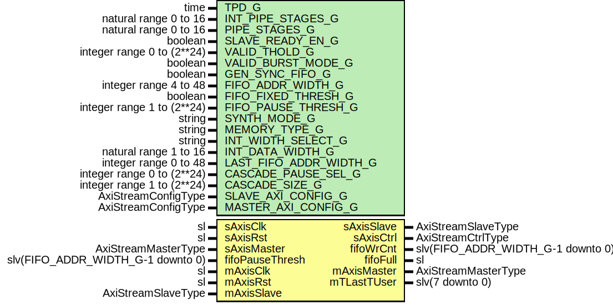

# Entity: AxiStreamFifoV2

- **File**: AxiStreamFifoV2.vhd
## Diagram

## Description

-----------------------------------------------------------------------------
 Company    : SLAC National Accelerator Laboratory
-----------------------------------------------------------------------------
 Description:
 Block to serve as an async FIFO for AXI Streams. This block also allows the
 bus to be compress/expanded, allowing different standard sizes on each side
 of the FIFO. Re-sizing is always little endian.
-----------------------------------------------------------------------------
 This file is part of 'SLAC Firmware Standard Library'.
 It is subject to the license terms in the LICENSE.txt file found in the
 top-level directory of this distribution and at:
    https://confluence.slac.stanford.edu/display/ppareg/LICENSE.html.
 No part of 'SLAC Firmware Standard Library', including this file,
 may be copied, modified, propagated, or distributed except according to
 the terms contained in the LICENSE.txt file.
-----------------------------------------------------------------------------
## Generics

| Generic name           | Type                       | Value      | Description                                                                                                                                                                                           |
| ---------------------- | -------------------------- | ---------- | ----------------------------------------------------------------------------------------------------------------------------------------------------------------------------------------------------- |
| TPD_G                  | time                       | 1 ns       | General Configurations                                                                                                                                                                                |
| INT_PIPE_STAGES_G      | natural range 0 to 16      | 0          |  Internal FIFO setting                                                                                                                                                                                |
| PIPE_STAGES_G          | natural range 0 to 16      | 1          |                                                                                                                                                                                                       |
| SLAVE_READY_EN_G       | boolean                    | true       |                                                                                                                                                                                                       |
| VALID_THOLD_G          | integer range 0 to (2**24) | 1          |  =1 = normal operation                                                                                                                                                                                |
| VALID_BURST_MODE_G     | boolean                    | false      |  only used in VALID_THOLD_G>1                                                                                                                                                                         |
| GEN_SYNC_FIFO_G        | boolean                    | false      | FIFO configurations                                                                                                                                                                                   |
| FIFO_ADDR_WIDTH_G      | integer range 4 to 48      | 9          |                                                                                                                                                                                                       |
| FIFO_FIXED_THRESH_G    | boolean                    | true       |                                                                                                                                                                                                       |
| FIFO_PAUSE_THRESH_G    | integer range 1 to (2**24) | 1          |                                                                                                                                                                                                       |
| SYNTH_MODE_G           | string                     | "inferred" |                                                                                                                                                                                                       |
| MEMORY_TYPE_G          | string                     | "block"    |                                                                                                                                                                                                       |
| INT_WIDTH_SELECT_G     | string                     | "WIDE"     | Internal FIFO width select, "WIDE", "NARROW" or "CUSTOM" WIDE uses wider of slave / master. NARROW  uses narrower. CUSOTM uses passed FIFO_DATA_WIDTH_G                                               |
| INT_DATA_WIDTH_G       | natural range 1 to 16      | 16         |                                                                                                                                                                                                       |
| LAST_FIFO_ADDR_WIDTH_G | integer range 0 to 48      | 0          | If VALID_THOLD_G /=1, FIFO that stores on tLast txns can be smaller. Set to 0 for same size as primary fifo (default) Set >4 for custom size. Use at own risk. Overflow of tLast fifo is not checked  |
| CASCADE_PAUSE_SEL_G    | integer range 0 to (2**24) | 0          | Index = 0 is output, index = n is input                                                                                                                                                               |
| CASCADE_SIZE_G         | integer range 1 to (2**24) | 1          |                                                                                                                                                                                                       |
| SLAVE_AXI_CONFIG_G     | AxiStreamConfigType        |            | AXI Stream Port Configurations                                                                                                                                                                        |
| MASTER_AXI_CONFIG_G    | AxiStreamConfigType        |            |                                                                                                                                                                                                       |
## Ports

| Port name       | Direction | Type                              | Description                                                                                       |
| --------------- | --------- | --------------------------------- | ------------------------------------------------------------------------------------------------- |
| sAxisClk        | in        | sl                                | Slave Port                                                                                        |
| sAxisRst        | in        | sl                                |                                                                                                   |
| sAxisMaster     | in        | AxiStreamMasterType               |                                                                                                   |
| sAxisSlave      | out       | AxiStreamSlaveType                |                                                                                                   |
| sAxisCtrl       | out       | AxiStreamCtrlType                 |                                                                                                   |
| fifoPauseThresh | in        | slv(FIFO_ADDR_WIDTH_G-1 downto 0) | FIFO status & config , synchronous to sAxisClk, be careful when using withoutput pipeline stages  |
| fifoWrCnt       | out       | slv(FIFO_ADDR_WIDTH_G-1 downto 0) |                                                                                                   |
| fifoFull        | out       | sl                                |                                                                                                   |
| mAxisClk        | in        | sl                                | Master Port                                                                                       |
| mAxisRst        | in        | sl                                |                                                                                                   |
| mAxisMaster     | out       | AxiStreamMasterType               |                                                                                                   |
| mAxisSlave      | in        | AxiStreamSlaveType                |                                                                                                   |
| mTLastTUser     | out       | slv(7 downto 0)                   |                                                                                                   |
## Signals

| Name            | Type                                                                             | Description                                  |
| --------------- | -------------------------------------------------------------------------------- | -------------------------------------------- |
| fifoWriteMaster | AxiStreamMasterType                                                              | --------------  FIFO Signals --------------  |
| fifoWriteSlave  | AxiStreamSlaveType                                                               |                                              |
| fifoReadMaster  | AxiStreamMasterType                                                              |                                              |
| fifoReadSlave   | AxiStreamSlaveType                                                               |                                              |
| fifoDin         | slv(FIFO_BITS_C-1 downto 0)                                                      |                                              |
| fifoWrite       | sl                                                                               |                                              |
| fifoWriteLast   | sl                                                                               |                                              |
| fifoWriteUser   | slv(maximum(FIFO_USER_BITS_C-1,  0) downto 0) |                                              |
| fifoWrCount     | slv(FIFO_ADDR_WIDTH_G-1 downto 0)                                                |                                              |
| fifoRdCount     | slv(FIFO_ADDR_WIDTH_G-1 downto 0)                                                |                                              |
| fifoAFull       | sl                                                                               |                                              |
| fifoReady       | sl                                                                               |                                              |
| fifoPFull       | sl                                                                               |                                              |
| fifoPFullVec    | slv(CASCADE_SIZE_G-1 downto 0)                                                   |                                              |
| fifoDout        | slv(FIFO_BITS_C-1 downto 0)                                                      |                                              |
| fifoRead        | sl                                                                               |                                              |
| fifoReadLast    | sl                                                                               |                                              |
| fifoReadUser    | slv(maximum(FIFO_USER_BITS_C-1,  0) downto 0) |                                              |
| fifoValidInt    | sl                                                                               |                                              |
| fifoValid       | sl                                                                               |                                              |
| fifoValidLast   | sl                                                                               |                                              |
| fifoInFrame     | sl                                                                               |                                              |
| burstEn         | sl                                                                               |                                              |
| burstLast       | sl                                                                               |                                              |
| burstCnt        | natural range 0 to VALID_THOLD_G                                                 |                                              |
| sideBand        | Slv8Array(1 downto 0)                                                            |                                              |
| axisMaster      | AxiStreamMasterType                                                              | -------------  Sync Signals -------------    |
| axisSlave       | AxiStreamSlaveType                                                               |                                              |
## Constants

| Name                   | Type                  | Value                                                                                                                                                                                                                                                                                                                                                                                                                                                                                                                                                                                                                                                                                                                                                                                                                                                                                                                                                                                                                                                                                                                                                                                                                                                                                                                                                                                                                                                                                                                                                                                                                                                                                                                                                                                                                                                                                                                                                                                                                                                                                                                                                                                                                                                                                                                                                                                                                                                                                                                        | Description                       |
| ---------------------- | --------------------- | ---------------------------------------------------------------------------------------------------------------------------------------------------------------------------------------------------------------------------------------------------------------------------------------------------------------------------------------------------------------------------------------------------------------------------------------------------------------------------------------------------------------------------------------------------------------------------------------------------------------------------------------------------------------------------------------------------------------------------------------------------------------------------------------------------------------------------------------------------------------------------------------------------------------------------------------------------------------------------------------------------------------------------------------------------------------------------------------------------------------------------------------------------------------------------------------------------------------------------------------------------------------------------------------------------------------------------------------------------------------------------------------------------------------------------------------------------------------------------------------------------------------------------------------------------------------------------------------------------------------------------------------------------------------------------------------------------------------------------------------------------------------------------------------------------------------------------------------------------------------------------------------------------------------------------------------------------------------------------------------------------------------------------------------------------------------------------------------------------------------------------------------------------------------------------------------------------------------------------------------------------------------------------------------------------------------------------------------------------------------------------------------------------------------------------------------------------------------------------------------------------------------------------- | --------------------------------- |
| LAST_FIFO_ADDR_WIDTH_C | integer range 4 to 48 |        ite(LAST_FIFO_ADDR_WIDTH_G < 4,  FIFO_ADDR_WIDTH_G,  LAST_FIFO_ADDR_WIDTH_G)                                                                                                                                                                                                                                                                                                                                                                                                                                                                                                                                                                                                                                                                                                                                                                                                                                                                                                                                                                                                                                                                                                                                                                                                                                                                                                                                                                                                                                                                                                                                                                                                                                                                                                                                                                                                                                                                                                                                                                                                                                                                                                                                                                                                                                                                                                                                                                    |                                   |
| FIFO_CONFIG_C          | AxiStreamConfigType   |  (        -- Enable strobe only if used on both sides       TSTRB_EN_C => SLAVE_AXI_CONFIG_G.TSTRB_EN_C and MASTER_AXI_CONFIG_G.TSTRB_EN_C,         -- Determine FIFO data bytes       TDATA_BYTES_C => ite(INT_WIDTH_SELECT_G = "CUSTOM",  INT_DATA_WIDTH_G,                             ite(INT_WIDTH_SELECT_G = "WIDE",                                  -- Using wider of the two                                ite(SLAVE_AXI_CONFIG_G.TDATA_BYTES_C > MASTER_AXI_CONFIG_G.TDATA_BYTES_C,                                     SLAVE_AXI_CONFIG_G.TDATA_BYTES_C,  MASTER_AXI_CONFIG_G.TDATA_BYTES_C),                                  -- Use narrower of the two                                ite(SLAVE_AXI_CONFIG_G.TDATA_BYTES_C > MASTER_AXI_CONFIG_G.TDATA_BYTES_C,                                     MASTER_AXI_CONFIG_G.TDATA_BYTES_C,  SLAVE_AXI_CONFIG_G.TDATA_BYTES_C))),         -- Use the lesser of the two DEST widths       TDEST_BITS_C => ite(SLAVE_AXI_CONFIG_G.TDEST_BITS_C > MASTER_AXI_CONFIG_G.TDEST_BITS_C,                            MASTER_AXI_CONFIG_G.TDEST_BITS_C,  SLAVE_AXI_CONFIG_G.TDEST_BITS_C),         -- Use the lesser of the two ID widths       TID_BITS_C => ite(SLAVE_AXI_CONFIG_G.TID_BITS_C > MASTER_AXI_CONFIG_G.TID_BITS_C,                          MASTER_AXI_CONFIG_G.TID_BITS_C,  SLAVE_AXI_CONFIG_G.TID_BITS_C),         -- Use the lesser of the two USER widths       TUSER_BITS_C => ite(SLAVE_AXI_CONFIG_G.TUSER_BITS_C > MASTER_AXI_CONFIG_G.TUSER_BITS_C,                            MASTER_AXI_CONFIG_G.TUSER_BITS_C,  SLAVE_AXI_CONFIG_G.TUSER_BITS_C),         -- Use slave settings for tkeep and tuser mode       TKEEP_MODE_C => SLAVE_AXI_CONFIG_G.TKEEP_MODE_C,        TUSER_MODE_C => SLAVE_AXI_CONFIG_G.TUSER_MODE_C) |  Generate configuration for FIFO  |
| FIFO_BITS_C            | integer               |  getSlvSize(FIFO_CONFIG_C)                                                                                                                                                                                                                                                                                                                                                                                                                                                                                                                                                                                                                                                                                                                                                                                                                                                                                                                                                                                                                                                                                                                                                                                                                                                                                                                                                                                                                                                                                                                                                                                                                                                                                                                                                                                                                                                                                                                                                                                                                                                                                                                                                                                                                                                                                                                                                                                                                                                                                                   |                                   |
| FIFO_USER_BITS_C       | integer               |  FIFO_CONFIG_C.TUSER_BITS_C                                                                                                                                                                                                                                                                                                                                                                                                                                                                                                                                                                                                                                                                                                                                                                                                                                                                                                                                                                                                                                                                                                                                                                                                                                                                                                                                                                                                                                                                                                                                                                                                                                                                                                                                                                                                                                                                                                                                                                                                                                                                                                                                                                                                                                                                                                                                                                                                                                                                                                  |                                   |
## Processes
- unnamed: ( fifoPFullVec, sAxisClk )
**Description**
-----------------------  FIFO -----------------------  Pause generation 
## Instantiations

- U_SlaveResize: surf.AxiStreamGearbox
**Description**
-----------------------
 Slave Resize
-----------------------

- U_Fifo: surf.FifoCascade
- U_MasterResize: surf.AxiStreamGearbox
**Description**
-----------------------
 Master Resize
-----------------------

- Synchronizer_1: surf.Synchronizer
**Description**
-----------------------
 Idle Generation
-----------------------
 Synchronize master side tvalid back to slave side ctrl.idle
 This is a total hack

- U_Pipe: surf.AxiStreamPipeline
**Description**
-----------------------
 Pipeline Logic
-----------------------

