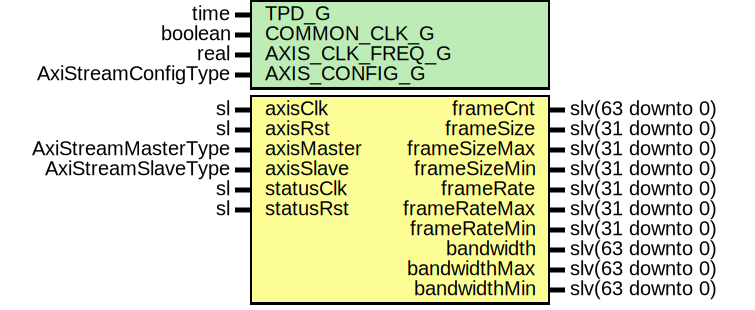

# Entity: AxiStreamMon

## Diagram

## Description

Company    : SLAC National Accelerator Laboratory
Description: AXI Stream Monitor Module
This file is part of 'SLAC Firmware Standard Library'.
It is subject to the license terms in the LICENSE.txt file found in the
top-level directory of this distribution and at:
   https://confluence.slac.stanford.edu/display/ppareg/LICENSE.html.
No part of 'SLAC Firmware Standard Library', including this file,
may be copied, modified, propagated, or distributed except according to
the terms contained in the LICENSE.txt file.
## Generics

| Generic name    | Type                | Value     | Description                 |
| --------------- | ------------------- | --------- | --------------------------- |
| TPD_G           | time                | 1 ns      |                             |
| COMMON_CLK_G    | boolean             | false     | true if axisClk = statusClk |
| AXIS_CLK_FREQ_G | real                | 156.25E+6 | units of Hz                 |
| AXIS_CONFIG_G   | AxiStreamConfigType |           |                             |
## Ports

| Port name    | Direction | Type                | Description           |
| ------------ | --------- | ------------------- | --------------------- |
| axisClk      | in        | sl                  | AXIS Stream Interface |
| axisRst      | in        | sl                  |                       |
| axisMaster   | in        | AxiStreamMasterType |                       |
| axisSlave    | in        | AxiStreamSlaveType  |                       |
| statusClk    | in        | sl                  | Status Interface      |
| statusRst    | in        | sl                  |                       |
| frameCnt     | out       | slv(63 downto 0)    | units of frames       |
| frameSize    | out       | slv(31 downto 0)    | units of Byte         |
| frameSizeMax | out       | slv(31 downto 0)    | units of Byte         |
| frameSizeMin | out       | slv(31 downto 0)    | units of Byte         |
| frameRate    | out       | slv(31 downto 0)    | units of Hz           |
| frameRateMax | out       | slv(31 downto 0)    | units of Hz           |
| frameRateMin | out       | slv(31 downto 0)    | units of Hz           |
| bandwidth    | out       | slv(63 downto 0)    | units of Byte/s       |
| bandwidthMax | out       | slv(63 downto 0)    | units of Byte/s       |
| bandwidthMin | out       | slv(63 downto 0)    |                       |
## Signals

| Name             | Type             | Description |
| ---------------- | ---------------- | ----------- |
| r                | RegType          |             |
| rin              | RegType          |             |
| bw               | slv(39 downto 0) |             |
| bwMax            | slv(39 downto 0) |             |
| bwMin            | slv(39 downto 0) |             |
| frameRateUpdate  | sl               |             |
| frameRateSync    | slv(31 downto 0) |             |
| frameRateMaxSync | slv(31 downto 0) |             |
| frameRateMinSync | slv(31 downto 0) |             |
## Constants

| Name       | Type    | Value                                                                                                                                                                                                                                                                                                                                                                                                                                                                                                                                                                                                                                                                                                                                                                                            | Description |
| ---------- | ------- | ------------------------------------------------------------------------------------------------------------------------------------------------------------------------------------------------------------------------------------------------------------------------------------------------------------------------------------------------------------------------------------------------------------------------------------------------------------------------------------------------------------------------------------------------------------------------------------------------------------------------------------------------------------------------------------------------------------------------------------------------------------------------------------------------ | ----------- |
| TKEEP_C    | natural |  AXIS_CONFIG_G.TDATA_BYTES_C                                                                                                                                                                                                                                                                                                                                                                                                                                                                                                                                                                                                                                                                                                                                                                     |             |
| TIMEOUT_C  | natural |  getTimeRatio(AXIS_CLK_FREQ_G,  1.0)-1                                                                                                                                                                                                                                                                                                                                                                                                                                                                                                                                                                                                                                                                                                                        |             |
| REG_INIT_C | RegType |  (       frameSent  => '0',        sizeValid  => '0',        armed      => '0',        tValid     => '0',        tKeep      => (others => '0'),        updated    => '0',        timer      => 0,        accum      => (others => '0'),        bandwidth  => (others => '0'),        frameAccum => (others => '0'),        frameSize  => (others => '0'),        frameCnt   => (others => '0')) |             |
## Types

| Name    | Type | Description |
| ------- | ---- | ----------- |
| RegType |      |             |
## Processes
- comb: ( axisMaster, axisRst, axisSlave, r )
- seq: ( axisClk )
## Instantiations

- U_packetRate: surf.SyncTrigRate
- SyncOut_frameRate: surf.SynchronizerFifo
- SyncOut_frameRateMax: surf.SynchronizerFifo
- SyncOut_frameRateMin: surf.SynchronizerFifo
- SyncOut_frameCnt: surf.SynchronizerFifo
- Sync_frameSize: surf.SyncMinMax
- Sync_bandwidth: surf.SyncMinMax
