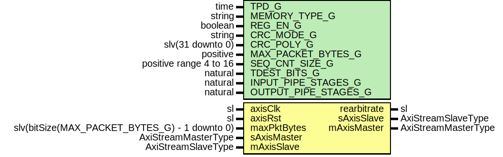

# Entity: AxiStreamPacketizer2

- **File**: AxiStreamPacketizer2.vhd
## Diagram

## Description

-----------------------------------------------------------------------------
 Title      : AxiStreamPackerizerV2 Protocol: https://confluence.slac.stanford.edu/x/3nh4DQ
-----------------------------------------------------------------------------
 Company    : SLAC National Accelerator Laboratory
-----------------------------------------------------------------------------
 Description: Formats an AXI-Stream for a transport link.
 Sideband fields are placed into the data stream in a header.
 Long frames are broken into smaller packets.
-----------------------------------------------------------------------------
 This file is part of 'SLAC Firmware Standard Library'.
 It is subject to the license terms in the LICENSE.txt file found in the
 top-level directory of this distribution and at:
    https://confluence.slac.stanford.edu/display/ppareg/LICENSE.html.
 No part of 'SLAC Firmware Standard Library', including this file,
 may be copied, modified, propagated, or distributed except according to
 the terms contained in the LICENSE.txt file.
-----------------------------------------------------------------------------
## Generics

| Generic name         | Type                   | Value         | Description              |
| -------------------- | ---------------------- | ------------- | ------------------------ |
| TPD_G                | time                   | 1 ns          |                          |
| MEMORY_TYPE_G        | string                 | "distributed" |                          |
| REG_EN_G             | boolean                | false         |                          |
| CRC_MODE_G           | string                 | "DATA"        |  or "NONE" or "FULL"     |
| CRC_POLY_G           | slv(31 downto 0)       | x"04C11DB7"   |                          |
| MAX_PACKET_BYTES_G   | positive               | 256*8         |  Must be a multiple of 8 |
| SEQ_CNT_SIZE_G       | positive range 4 to 16 | 16            |                          |
| TDEST_BITS_G         | natural                | 8             |                          |
| INPUT_PIPE_STAGES_G  | natural                | 0             |                          |
| OUTPUT_PIPE_STAGES_G | natural                | 0             |                          |
## Ports

| Port name   | Direction | Type                                          | Description                                                   |
| ----------- | --------- | --------------------------------------------- | ------------------------------------------------------------- |
| axisClk     | in        | sl                                            | Clock and Reset                                               |
| axisRst     | in        | sl                                            |                                                               |
| rearbitrate | out       | sl                                            | Status for phase locking externally                           |
| maxPktBytes | in        | slv(bitSize(MAX_PACKET_BYTES_G) - 1 downto 0) | Actual byte count; will be truncated to multiple of word-size |
| sAxisMaster | in        | AxiStreamMasterType                           | AXIS Interfaces                                               |
| sAxisSlave  | out       | AxiStreamSlaveType                            |                                                               |
| mAxisMaster | out       | AxiStreamMasterType                           |                                                               |
| mAxisSlave  | in        | AxiStreamSlaveType                            |                                                               |
## Signals

| Name               | Type                             | Description |
| ------------------ | -------------------------------- | ----------- |
| r                  | RegType                          |             |
| rin                | RegType                          |             |
| inputAxisMaster    | AxiStreamMasterType              |             |
| inputAxisSlave     | AxiStreamSlaveType               |             |
| outputAxisMaster   | AxiStreamMasterType              |             |
| outputAxisSlave    | AxiStreamSlaveType               |             |
| ramDin             | slv(RAM_DATA_WIDTH_C-1 downto 0) |             |
| ramDout            | slv(RAM_DATA_WIDTH_C-1 downto 0) |             |
| ramPacketSeqOut    | slv(SEQ_CNT_SIZE_G-1 downto 0)   |             |
| ramPacketActiveOut | sl                               |             |
| ramCrcRem          | slv(31 downto 0)                 |             |
| ramAddrr           | slv(ADDR_WIDTH_C-1 downto 0)     |             |
| crcIn              | slv(63 downto 0)                 |             |
| crcOut             | slv(31 downto 0)                 |             |
| crcRem             | slv(31 downto 0)                 |             |
| maxWords           | WordCounterType                  |             |
## Constants

| Name             | Type                | Value                                                                                                                                                                                                                                                                                                                                                                                                                                                                                                                                                                                                                                                                                                                                                                                                                                                                                                                                                                                                                                                                                                                                                                                                                                                                                                                                                                                                                                                                                                                                                                                                                       | Description |
| ---------------- | ------------------- | --------------------------------------------------------------------------------------------------------------------------------------------------------------------------------------------------------------------------------------------------------------------------------------------------------------------------------------------------------------------------------------------------------------------------------------------------------------------------------------------------------------------------------------------------------------------------------------------------------------------------------------------------------------------------------------------------------------------------------------------------------------------------------------------------------------------------------------------------------------------------------------------------------------------------------------------------------------------------------------------------------------------------------------------------------------------------------------------------------------------------------------------------------------------------------------------------------------------------------------------------------------------------------------------------------------------------------------------------------------------------------------------------------------------------------------------------------------------------------------------------------------------------------------------------------------------------------------------------------------------------- | ----------- |
| AXIS_CONFIG_C    | AxiStreamConfigType |  (       TSTRB_EN_C    => false,        TDATA_BYTES_C => 8,        TDEST_BITS_C  => 8,        TID_BITS_C    => 8,        TKEEP_MODE_C  => TKEEP_COMP_C,        TUSER_BITS_C  => 8,        TUSER_MODE_C  => TUSER_FIRST_LAST_C)                                                                                                                                                                                                                                                                                                                                                                                                                                                                                                                                                                                                                                                                                                                                                                                                                                                                                                                                                                                                                                                                                                                                                                            |             |
| LD_WORD_SIZE_C   | positive            |  3                                                                                                                                                                                                                                                                                                                                                                                                                                                                                                                                                                                                                                                                                                                                                                                                                                                                                                                                                                                                                                                                                                                                                                                                                                                                                                                                                                                                                                                                                                                                                                                                                          |             |
| WORD_SIZE_C      | positive            |  2**LD_WORD_SIZE_C                                                                                                                                                                                                                                                                                                                                                                                                                                                                                                                                                                                                                                                                                                                                                                                                                                                                                                                                                                                                                                                                                                                                                                                                                                                                                                                                                                                                                                                                                                                                                                                                          |             |
| PROTO_WORDS_C    | positive            |  3                                                                                                                                                                                                                                                                                                                                                                                                                                                                                                                                                                                                                                                                                                                                                                                                                                                                                                                                                                                                                                                                                                                                                                                                                                                                                                                                                                                                                                                                                                                                                                                                                          |             |
| MAX_WORD_COUNT_C | WordCounterType     |  to_unsigned(MAX_PACKET_BYTES_G / WORD_SIZE_C,  WordCounterType'length)                                                                                                                                                                                                                                                                                                                                                                                                                                                                                                                                                                                                                                                                                                                                                                                                                                                                                                                                                                                                                                                                                                                                                                                                                                                                                                                                                                                                                                                                                                                  |             |
| CRC_EN_C         | boolean             |  (CRC_MODE_G /= "NONE")                                                                                                                                                                                                                                                                                                                                                                                                                                                                                                                                                                                                                                                                                                                                                                                                                                                                                                                                                                                                                                                                                                                                                                                                                                                                                                                                                                                                                                                                                                                                                                                                     |             |
| CRC_HEAD_TAIL_C  | boolean             |  (CRC_MODE_G = "FULL")                                                                                                                                                                                                                                                                                                                                                                                                                                                                                                                                                                                                                                                                                                                                                                                                                                                                                                                                                                                                                                                                                                                                                                                                                                                                                                                                                                                                                                                                                                                                                                                                      |             |
| ADDR_WIDTH_C     | positive            |  ite((TDEST_BITS_G = 0),  1,  TDEST_BITS_G)                                                                                                                                                                                                                                                                                                                                                                                                                                                                                                                                                                                                                                                                                                                                                                                                                                                                                                                                                                                                                                                                                                                                                                                                                                                                                                                                                                                                                                                                                                           |             |
| RAM_DATA_WIDTH_C | positive            |  32+1+SEQ_CNT_SIZE_G                                                                                                                                                                                                                                                                                                                                                                                                                                                                                                                                                                                                                                                                                                                                                                                                                                                                                                                                                                                                                                                                                                                                                                                                                                                                                                                                                                                                                                                                                                                                                                                                        |             |
| REG_INIT_C       | RegType             |  (       state            => HEADER_S,        packetSeq        => (others => '0'),        packetActive     => '0',        activeTDest      => (others => '0'),        ramWe            => '0',        wordCount        => (others => '0'),        maxWords         => to_unsigned(1,  WordCounterType'length),        eof              => '0',        lastByteCount    => "1000",        tUserLast        => (others => '0'),        rearbitrate      => '0',        crcDataValid     => '0',        crcDataWidth     => (others => '1'),        crcInit          => (others => '1'),        crcRem           => (others => '1'),        crcIn            => (others => '1'),        crcReset         => '0',        tailCrcReady     => toSl(not CRC_HEAD_TAIL_C),        inputAxisSlave   => AXI_STREAM_SLAVE_INIT_C,        outputAxisMaster => axiStreamMasterInit(PACKETIZER2_AXIS_CFG_C)) |             |
## Types

| Name      | Type                                                                                                                                                                                         | Description |
| --------- | -------------------------------------------------------------------------------------------------------------------------------------------------------------------------------------------- | ----------- |
| StateType | ( IDLE_S,  WAIT_S,  HEADER_S,  MOVE_S,  TAIL_S)  |             |
| RegType   |                                                                                                                                                                                              |             |
## Processes
- comb: ( crcOut, crcRem, inputAxisMaster, maxWords, outputAxisSlave,
                   r, ramCrcRem, ramPacketActiveOut, ramPacketSeqOut )
- seq: ( axisClk )
## Instantiations

- U_Input: surf.AxiStreamPipeline
 **Description**
---------------
 Input pipeline
---------------

- U_DualPortRam_1: surf.DualPortRam
- U_Output: surf.AxiStreamPipeline
 **Description**
----------------
 Output pipeline
----------------

