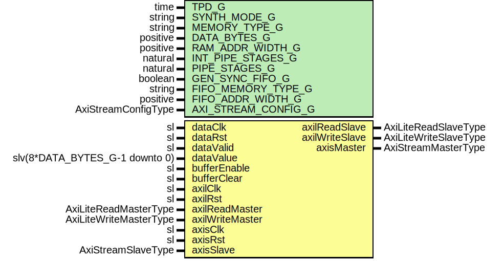

# Entity: AxiStreamRingBuffer

- **File**: AxiStreamRingBuffer.vhd
## Diagram

## Description

-----------------------------------------------------------------------------
 Company    : SLAC National Accelerator Laboratory
-----------------------------------------------------------------------------
 Description: Wrapper for simple BRAM based ring buffer with AXI Stream interface
-----------------------------------------------------------------------------
 This file is part of 'SLAC Firmware Standard Library'.
 It is subject to the license terms in the LICENSE.txt file found in the
 top-level directory of this distribution and at:
    https://confluence.slac.stanford.edu/display/ppareg/LICENSE.html.
 No part of 'SLAC Firmware Standard Library', including this file,
 may be copied, modified, propagated, or distributed except according to
 the terms contained in the LICENSE.txt file.
-----------------------------------------------------------------------------
## Generics

| Generic name        | Type                | Value      | Description                |
| ------------------- | ------------------- | ---------- | -------------------------- |
| TPD_G               | time                | 1 ns       |                            |
| SYNTH_MODE_G        | string              | "inferred" |                            |
| MEMORY_TYPE_G       | string              | "block"    |                            |
| DATA_BYTES_G        | positive            | 16         |                            |
| RAM_ADDR_WIDTH_G    | positive            | 9          |                            |
| INT_PIPE_STAGES_G   | natural             | 1          | AXI Stream Configurations  |
| PIPE_STAGES_G       | natural             | 1          |                            |
| GEN_SYNC_FIFO_G     | boolean             | false      |                            |
| FIFO_MEMORY_TYPE_G  | string              | "block"    |                            |
| FIFO_ADDR_WIDTH_G   | positive            | 9          |                            |
| AXI_STREAM_CONFIG_G | AxiStreamConfigType |            |                            |
## Ports

| Port name       | Direction | Type                           | Description                                   |
| --------------- | --------- | ------------------------------ | --------------------------------------------- |
| dataClk         | in        | sl                             | Data to store in ring buffer (dataClk domain) |
| dataRst         | in        | sl                             |                                               |
| dataValid       | in        | sl                             |                                               |
| dataValue       | in        | slv(8*DATA_BYTES_G-1 downto 0) |                                               |
| bufferEnable    | in        | sl                             |                                               |
| bufferClear     | in        | sl                             |                                               |
| axilClk         | in        | sl                             | AXI-Lite interface (axilClk domain)           |
| axilRst         | in        | sl                             |                                               |
| axilReadMaster  | in        | AxiLiteReadMasterType          |                                               |
| axilReadSlave   | out       | AxiLiteReadSlaveType           |                                               |
| axilWriteMaster | in        | AxiLiteWriteMasterType         |                                               |
| axilWriteSlave  | out       | AxiLiteWriteSlaveType          |                                               |
| axisClk         | in        | sl                             | AXI-Stream Interface (axisClk domain)         |
| axisRst         | in        | sl                             |                                               |
| axisMaster      | out       | AxiStreamMasterType            |                                               |
| axisSlave       | in        | AxiStreamSlaveType             |                                               |
## Signals

| Name             | Type                             | Description |
| ---------------- | -------------------------------- | ----------- |
| dataR            | DataRegType                      |             |
| dataRin          | DataRegType                      |             |
| bufferEnableSync | sl                               |             |
| bufferClearSync  | sl                               |             |
| axilR            | AxilRegType                      |             |
| axilRin          | AxilRegType                      |             |
| ramRdData        | slv(8*DATA_BYTES_G-1 downto 0)   |             |
| firstAddr        | slv(RAM_ADDR_WIDTH_G-1 downto 0) |             |
| bufferLength     | slv(RAM_ADDR_WIDTH_G-1 downto 0) |             |
| extBufferEnable  | sl                               |             |
| extBufferClear   | sl                               |             |
| readReq          | sl                               |             |
| cleared          | sl                               |             |
| armed            | sl                               |             |
| txSlave          | AxiStreamSlaveType               |             |
## Constants

| Name            | Type                | Value                                                                                                                                                                                                                                                                                                                                                                                                                                                                                                                                                                                                                                                                                                                                                                                                                                                                                                | Description |
| --------------- | ------------------- | ---------------------------------------------------------------------------------------------------------------------------------------------------------------------------------------------------------------------------------------------------------------------------------------------------------------------------------------------------------------------------------------------------------------------------------------------------------------------------------------------------------------------------------------------------------------------------------------------------------------------------------------------------------------------------------------------------------------------------------------------------------------------------------------------------------------------------------------------------------------------------------------------------- | ----------- |
| AXIS_CONFIG_C   | AxiStreamConfigType |  ssiAxiStreamConfig(       dataBytes => DATA_BYTES_G,        tKeepMode => TKEEP_FIXED_C,        tUserMode => TUSER_FIRST_LAST_C,        tDestBits => 0,        tUserBits => 2,        tIdBits   => 0)                                                                                                                                                                                                                                                                                                                                                                                                                                                                                                                 |             |
| DATA_REG_INIT_C | DataRegType         |  (       enable       => '0',        cleared      => '1',               -- Only set HIGH after reset       armed        => '0',        ramWrEn      => '0',        readReq      => '0',        ramWrData    => (others => '0'),        bufferLength => (others => '0'),        firstAddr    => (others => '0'),        nextAddr     => (others => '0'))                                                                                                                                                                                                                                                      |             |
| AXIL_REG_INIT_C | AxilRegType         |  (       trigCnt        => (others => '0'),        continuous     => '0',        bufferEnable   => '0',        bufferClear    => '0',        wordCnt        => (others => '0'),        ramRdAddr      => (others => '0'),        rdEn           => "000",        axilReadSlave  => AXI_LITE_READ_SLAVE_INIT_C,        axilWriteSlave => AXI_LITE_WRITE_SLAVE_INIT_C,        txMaster       => axiStreamMasterInit(AXIS_CONFIG_C),        dataState      => IDLE_S,        trigState      => IDLE_S) |             |
## Types

| Name          | Type                                                                                                                                             | Description                                                                                   |
| ------------- | ------------------------------------------------------------------------------------------------------------------------------------------------ | --------------------------------------------------------------------------------------------- |
| DataRegType   |                                                                                                                                                  | ----------------------------  Stream clock domain signals ----------------------------        |
| DataStateType | ( IDLE_S,  MOVE_S)                                                                                            | ------------------------------  AXI-Lite clock domain signals ------------------------------  |
| TrigStateType | ( IDLE_S,  CLEAR_S,  ARMED_S,  WAIT_S)  |                                                                                               |
| AxilRegType   |                                                                                                                                                  |                                                                                               |
## Processes
- dataComb: ( bufferClear, bufferClearSync, bufferEnable,
                       bufferEnableSync, dataR, dataRst, dataValid, dataValue )
**Description**
------------------------  Main AXI-Stream process ------------------------ 
- dataSeq: ( dataClk )
- axiComb: ( armed, axilR, axilReadMaster, axilRst, axilWriteMaster,
                      bufferLength, cleared, extBufferClear, extBufferEnable,
                      firstAddr, ramRdData, readReq, txSlave )
**Description**
----------------------  Main AXI-Lite process ---------------------- 
- axiSeq: ( axilClk )
## Instantiations

- U_SyncVec_dataClk: surf.SynchronizerVector
**Description**
------------------------------------------------
 Synchronize AXI registers to data clock dataClk
------------------------------------------------

- U_Sync_ReadReq: surf.SynchronizerFifo
**Description**
---------------------------------------------------
 Synchronize write address across to AXI-Lite clock
---------------------------------------------------

- U_SyncVec_axilClk: surf.SynchronizerVector
- TX_FIFO: surf.AxiStreamFifoV2
