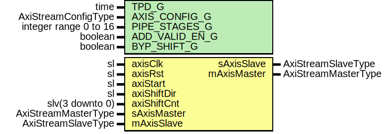

# Entity: AxiStreamShift

## Diagram

## Description

Company    : SLAC National Accelerator Laboratory
Description:
Block to shift data bytes within an AXI stream. Both left and right shifting
are allowed. This block will move a packet at a time. Transfer of a new packet
will pause until a new shift command is provided.
This file is part of 'SLAC Firmware Standard Library'.
It is subject to the license terms in the LICENSE.txt file found in the
top-level directory of this distribution and at:
   https://confluence.slac.stanford.edu/display/ppareg/LICENSE.html.
No part of 'SLAC Firmware Standard Library', including this file,
may be copied, modified, propagated, or distributed except according to
the terms contained in the LICENSE.txt file.
## Generics

| Generic name   | Type                  | Value | Description |
| -------------- | --------------------- | ----- | ----------- |
| TPD_G          | time                  | 1 ns  |             |
| AXIS_CONFIG_G  | AxiStreamConfigType   |       |             |
| PIPE_STAGES_G  | integer range 0 to 16 | 0     |             |
| ADD_VALID_EN_G | boolean               | false |             |
| BYP_SHIFT_G    | boolean               | false |             |
## Ports

| Port name   | Direction | Type                | Description           |
| ----------- | --------- | ------------------- | --------------------- |
| axisClk     | in        | sl                  | Clock and reset       |
| axisRst     | in        | sl                  |                       |
| axiStart    | in        | sl                  | Start control         |
| axiShiftDir | in        | sl                  | 0 = left (lsb to msb) |
| axiShiftCnt | in        | slv(3 downto 0)     |                       |
| sAxisMaster | in        | AxiStreamMasterType | Slave                 |
| sAxisSlave  | out       | AxiStreamSlaveType  |                       |
| mAxisMaster | out       | AxiStreamMasterType | Master                |
| mAxisSlave  | in        | AxiStreamSlaveType  |                       |
## Signals

| Name           | Type                | Description |
| -------------- | ------------------- | ----------- |
| r              | RegType             |             |
| rin            | RegType             |             |
| pipeAxisMaster | AxiStreamMasterType |             |
| pipeAxisSlave  | AxiStreamSlaveType  |             |
## Constants

| Name       | Type    | Value                                                                                                                                                                                                                                                                                                                                                                                                                              | Description |
| ---------- | ------- | ---------------------------------------------------------------------------------------------------------------------------------------------------------------------------------------------------------------------------------------------------------------------------------------------------------------------------------------------------------------------------------------------------------------------------------- | ----------- |
| REG_INIT_C | RegType |  (       state      => S_IDLE_C,        shiftDir   => '0',        shiftBytes => (others => '0'),        slave      => AXI_STREAM_SLAVE_INIT_C,        master     => AXI_STREAM_MASTER_INIT_C,        delay      => AXI_STREAM_MASTER_INIT_C       ) |             |
## Types

| Name      | Type                                                                                                                                                    | Description |
| --------- | ------------------------------------------------------------------------------------------------------------------------------------------------------- | ----------- |
| StateType | (S_IDLE_C,  S_FIRST_C,  S_SHIFT_C,  S_LAST_C)  |             |
| RegType   |                                                                                                                                                         |             |
## Functions
- shiftData (shiftBytes : in    slv(3 downto 0);  shiftDir   : in    sl;  shiftFirst : in    boolean;  mInput     : in    AxiStreamMasterType;  mDelay     : in    AxiStreamMasterType;  mOut       : inout AxiStreamMasterType)  return ()
**Description**
Set shift ranges
