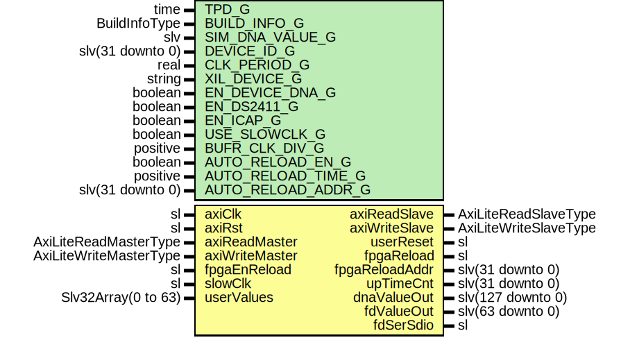

# Entity: AxiVersion

- **File**: AxiVersion.vhd
## Diagram

## Description

Company    : SLAC National Accelerator Laboratory
Description: Creates AXI accessible registers containing configuration
information.
This file is part of 'SLAC Firmware Standard Library'.
It is subject to the license terms in the LICENSE.txt file found in the
top-level directory of this distribution and at:
   https://confluence.slac.stanford.edu/display/ppareg/LICENSE.html.
No part of 'SLAC Firmware Standard Library', including this file,
may be copied, modified, propagated, or distributed except according to
the terms contained in the LICENSE.txt file.
## Generics

| Generic name       | Type             | Value                       | Description                      |
| ------------------ | ---------------- | --------------------------- | -------------------------------- |
| TPD_G              | time             | 1 ns                        |                                  |
| BUILD_INFO_G       | BuildInfoType    |                             |                                  |
| SIM_DNA_VALUE_G    | slv              | X"000000000000000000000000" |                                  |
| DEVICE_ID_G        | slv(31 downto 0) | (others => '0')             |                                  |
| CLK_PERIOD_G       | real             | 8.0E-9                      | units of seconds                 |
| XIL_DEVICE_G       | string           | "7SERIES"                   | Either "7SERIES" or "ULTRASCALE" |
| EN_DEVICE_DNA_G    | boolean          | false                       |                                  |
| EN_DS2411_G        | boolean          | false                       |                                  |
| EN_ICAP_G          | boolean          | false                       |                                  |
| USE_SLOWCLK_G      | boolean          | false                       |                                  |
| BUFR_CLK_DIV_G     | positive         | 8                           |                                  |
| AUTO_RELOAD_EN_G   | boolean          | false                       |                                  |
| AUTO_RELOAD_TIME_G | positive         | 10                          | units of seconds                 |
| AUTO_RELOAD_ADDR_G | slv(31 downto 0) | (others => '0')             |                                  |
## Ports

| Port name      | Direction | Type                   | Description                        |
| -------------- | --------- | ---------------------- | ---------------------------------- |
| axiClk         | in        | sl                     | AXI-Lite Interface                 |
| axiRst         | in        | sl                     |                                    |
| axiReadMaster  | in        | AxiLiteReadMasterType  |                                    |
| axiReadSlave   | out       | AxiLiteReadSlaveType   |                                    |
| axiWriteMaster | in        | AxiLiteWriteMasterType |                                    |
| axiWriteSlave  | out       | AxiLiteWriteSlaveType  |                                    |
| userReset      | out       | sl                     | Optional: User Reset               |
| fpgaEnReload   | in        | sl                     | Optional: FPGA Reloading Interface |
| fpgaReload     | out       | sl                     |                                    |
| fpgaReloadAddr | out       | slv(31 downto 0)       |                                    |
| upTimeCnt      | out       | slv(31 downto 0)       |                                    |
| slowClk        | in        | sl                     | Optional: Serial Number outputs    |
| dnaValueOut    | out       | slv(127 downto 0)      |                                    |
| fdValueOut     | out       | slv(63 downto 0)       |                                    |
| userValues     | in        | Slv32Array(0 to 63)    | Optional: user values              |
| fdSerSdio      | inout     | sl                     | Optional: DS2411 interface         |
## Signals

| Name     | Type              | Description |
| -------- | ----------------- | ----------- |
| r        | RegType           |             |
| rin      | RegType           |             |
| dnaValue | slv(127 downto 0) |             |
| fdValue  | slv(63 downto 0)  |             |
## Constants

| Name               | Type                | Value                                                                                                                                                                                                                                                                                                                                                                                                                                                                                                                                                                                                                                                                                                                      | Description |
| ------------------ | ------------------- | -------------------------------------------------------------------------------------------------------------------------------------------------------------------------------------------------------------------------------------------------------------------------------------------------------------------------------------------------------------------------------------------------------------------------------------------------------------------------------------------------------------------------------------------------------------------------------------------------------------------------------------------------------------------------------------------------------------------------- | ----------- |
| TIMEOUT_1HZ_C      | natural             |  (getTimeRatio(1.0,  CLK_PERIOD_G) -1)                                                                                                                                                                                                                                                                                                                                                                                                                                                                                                                                                                                                                                                  |             |
| COUNTER_ZERO_C     | slv(31 downto 0)    |  X"00000000"                                                                                                                                                                                                                                                                                                                                                                                                                                                                                                                                                                                                                                                                                                               |             |
| BUILD_INFO_C       | BuildInfoRetType    |  toBuildInfo(BUILD_INFO_G)                                                                                                                                                                                                                                                                                                                                                                                                                                                                                                                                                                                                                                                                                                 |             |
| BUILD_STRING_ROM_C | Slv32Array(0 to 63) |  BUILD_INFO_C.buildString                                                                                                                                                                                                                                                                                                                                                                                                                                                                                                                                                                                                                                                                                                  |             |
| REG_INIT_C         | RegType             |  (       upTimeCnt      => (others => '0'),        timer          => 0,        scratchPad     => (others => '0'),        reloadTimer    => 0,        userReset      => '0',        fpgaReload     => '0',        haltReload     => '0',        fpgaReloadAddr => AUTO_RELOAD_ADDR_G,        axiReadSlave   => AXI_LITE_READ_SLAVE_INIT_C,        axiWriteSlave  => AXI_LITE_WRITE_SLAVE_INIT_C) |             |
## Types

| Name    | Type | Description |
| ------- | ---- | ----------- |
| RegType |      |             |
## Processes
- comb: ( axiReadMaster, axiRst, axiWriteMaster, dnaValue, fdValue,
                   fpgaEnReload, r, userValues )
- seq: ( axiClk )
