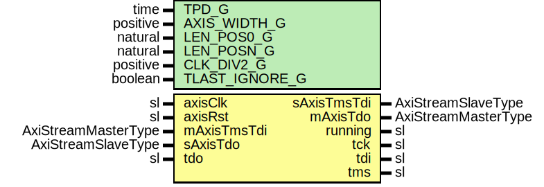

# Entity: AxisToJtagCore

- **File**: AxisToJtagCore.vhd
## Diagram

## Description

-----------------------------------------------------------------------------
 Title      : JTAG Support
-----------------------------------------------------------------------------
 Company    : SLAC National Accelerator Laboratory
-----------------------------------------------------------------------------
 Description: Axi Stream to JTAG Interface/Adapter
-----------------------------------------------------------------------------
 This file is part of 'SLAC Firmware Standard Library'.
 It is subject to the license terms in the LICENSE.txt file found in the
 top-level directory of this distribution and at:
    https://confluence.slac.stanford.edu/display/ppareg/LICENSE.html.
 No part of 'SLAC Firmware Standard Library', including this file,
 may be copied, modified, propagated, or distributed except according to
 the terms contained in the LICENSE.txt file.
-----------------------------------------------------------------------------
 Convert an AXI Stream into JTAG and return the TDO reply as an AXI Stream.

 The input stream must be formatted as follows:

   A stream of words of (AXIS_WIDTH_G * 8) bits each.
   1. The first word specifies the *total* number of bits to shift minus one
      (e.g., a value of indicates 1 bit to shift).
   2. This first word is followed by a sequence of words that provide
      TMS and TDI bits:

      total_number_bits_minus_one
      first_8AXIS_WIDTH_G_TMS_bits
      first_8AXIS_WIDTH_G_TDI_bits
      2nd___8AXIS_WIDTH_G_TMS_bits
      2nd___8AXIS_WIDTH_G_TDI_bits
      3rd___8AXIS_WIDTH_G_TMS_bits
      3rd___8AXIS_WIDTH_G_TDI_bits
      Nth___8AXIS_WIDTH_G_TMS_bits
      Nth___8AXIS_WIDTH_G_TDI_bits

 If the total number of bits is not word aligned then only the remaining
 bits are shifted.

 Bits are shifted in little-endian format (LSB shifted out first)

 The returned Stream ships the (same number) of TDO bits

      first_8AXIS_WIDTH_G_TDO_bits
      2nd___8AXIS_WIDTH_G_TDO_bits
      3rd___8AXIS_WIDTH_G_TDO_bits
      Nth___8AXIS_WIDTH_G_TDO_bits

 TDO bits are shifted in little-endian format (LSB is the 'oldest' bit).
 In the last word, the 'remaining' bits are right-adjusted.

 E.g., AXIS_WIDTH_G is 32 and the total number of bits is 33 then:

 Output:
         0x00000020       -- length: 33 - 1 = 32
         0x76543210       -- first TMS word; bit sequence is 0,0,0,0,1,0,0,0,0,1,0,0,... (lsb first)
         0xfedcba98       -- first TDI word; bit sequence is 0,0,0,1,1,0,0,1,0,1,0,1,... (lsb first)
         0xfffffffe       -- last TMS bit;   bit sequence is 0
         0x00000001       -- last TDI bit;   bit sequence is 1

 Input:
         0x33221100       -- first TDO word (first 32 bits; first 8 bits are 0; first bits in lsB)
         0x00000001       -- last TDO bit   (right-aligned); last bit is '1'

 TLAST Handling:
   - Input Stream:  TLAST must be asserted when the last TDI word is transmitted.
                    If it is detected earlier then processing will be aborted (and
                    the return stream truncated as well). If TLAST is asserted
                    after the announced number of bits then the excess words are
                    discarded.
                    If the TLAST_IGNORE_G generic is true the the behavior is
                    changed and no data are discarded if TLAST is missing (an early
                    TLAST still leads to truncated data).
                    This TLAST_IGNORE_G allows the core to be used with implicit
                    framing by the 'nbits' word.
   - Output Stream: TLAST is asserted during transmission of the last TDO word.

 TKEEP/TSTROBE/TUSR/TDEST/TID: unused; not generated or inspected.

## Generics

| Generic name   | Type     | Value | Description                           |
| -------------- | -------- | ----- | ------------------------------------- |
| TPD_G          | time     | 1 ns  |                                       |
| AXIS_WIDTH_G   | positive | 4     |  bytes                                |
| LEN_POS0_G     | natural  | 0     |                                       |
| LEN_POSN_G     | natural  | 17    |                                       |
| CLK_DIV2_G     | positive | 8     |  half-period of TCK in axisClk cycles |
| TLAST_IGNORE_G | boolean  | false |  don't wait for TLAST on input        |
## Ports

| Port name   | Direction | Type                | Description |
| ----------- | --------- | ------------------- | ----------- |
| axisClk     | in        | sl                  |             |
| axisRst     | in        | sl                  |             |
| mAxisTmsTdi | in        | AxiStreamMasterType |             |
| sAxisTmsTdi | out       | AxiStreamSlaveType  |             |
| mAxisTdo    | out       | AxiStreamMasterType |             |
| sAxisTdo    | in        | AxiStreamSlaveType  |             |
| running     | out       | sl                  |             |
| tck         | out       | sl                  |             |
| tdi         | out       | sl                  |             |
| tms         | out       | sl                  |             |
| tdo         | in        | sl                  |             |
## Signals

| Name        | Type                        | Description |
| ----------- | --------------------------- | ----------- |
| tdoData     | slv(AXIS_BW_C - 1 downto 0) |             |
| r           | RegType                     |             |
| rin         | RegType                     |             |
| tdiReady    | sl                          |             |
| tdoValidLoc | sl                          |             |
| tdoValid    | sl                          |             |
| tdoReady    | sl                          |             |
## Constants

| Name       | Type     | Value                                                                                                                                                                                                                                                                                                                                                                                                                                                                                                                                                                                                                                                                                                                                                                                                                                                                                                                                                                                                                                                           | Description |
| ---------- | -------- | --------------------------------------------------------------------------------------------------------------------------------------------------------------------------------------------------------------------------------------------------------------------------------------------------------------------------------------------------------------------------------------------------------------------------------------------------------------------------------------------------------------------------------------------------------------------------------------------------------------------------------------------------------------------------------------------------------------------------------------------------------------------------------------------------------------------------------------------------------------------------------------------------------------------------------------------------------------------------------------------------------------------------------------------------------------- | ----------- |
| AXIS_BW_C  | positive |  8*AXIS_WIDTH_G                                                                                                                                                                                                                                                                                                                                                                                                                                                                                                                                                                                                                                                                                                                                                                                                                                                                                                                                                                                                                                                 |             |
| REG_INIT_C | RegType  |  (       state      => IDLE_S,        tdi        => (others => '0'),        tms        => (others => '0'),        tdo        => (others => '0'),        nBits      => 0,        nBitsTot   => (others => '0'),        tdiValid   => '0',        sReady     => '1',        tdoValid   => '0',        tdoPass    => '1',        last       => false,        tLastSeen  => false,        iCnt       => (others => '0'),        oCnt       => (others => '0'),        tLast      => '0',        running    => '0'    ) |             |
## Types

| Name      | Type                                                                                                                                                                                                                                             | Description |
| --------- | ------------------------------------------------------------------------------------------------------------------------------------------------------------------------------------------------------------------------------------------------ | ----------- |
| StateType | (IDLE_S,  GET_TMS_S,  GET_TDI_S,  SHIFT_S,  ALIGN_S,  DISCARD_S)  |             |
| RegType   |                                                                                                                                                                                                                                                  |             |
## Processes
- P_COMB: ( r, tdiReady, tdoValid, tdoData, tdoValidLoc, tdoReady, mAxisTmsTdi, sAxisTdo )
- P_SEQ: ( axisClk )
## Instantiations

- U_Jtag: surf.JtagSerDesCore
