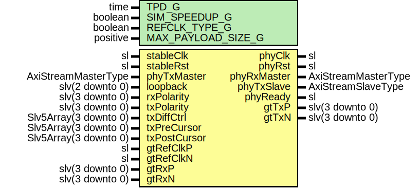

# Entity: Caui4GtyIpWrapper

- **File**: Caui4GtyIpWrapper.vhd
## Diagram

## Description

-----------------------------------------------------------------------------
 Company    : SLAC National Accelerator Laboratory
-----------------------------------------------------------------------------
 Description:
-----------------------------------------------------------------------------
 This file is part of 'SLAC Firmware Standard Library'.
 It is subject to the license terms in the LICENSE.txt file found in the
 top-level directory of this distribution and at:
    https://confluence.slac.stanford.edu/display/ppareg/LICENSE.html.
 No part of 'SLAC Firmware Standard Library', including this file,
 may be copied, modified, propagated, or distributed except according to
 the terms contained in the LICENSE.txt file.
-----------------------------------------------------------------------------
## Generics

| Generic name       | Type     | Value | Description                                 |
| ------------------ | -------- | ----- | ------------------------------------------- |
| TPD_G              | time     | 1 ns  |                                             |
| SIM_SPEEDUP_G      | boolean  | false |                                             |
| REFCLK_TYPE_G      | boolean  | true  |  false = 156.25 MHz, true = 161.1328125 MHz |
| MAX_PAYLOAD_SIZE_G | positive | 8192  |                                             |
## Ports

| Port name    | Direction | Type                  | Description           |
| ------------ | --------- | --------------------- | --------------------- |
| stableClk    | in        | sl                    |  156.25 MHz           |
| stableRst    | in        | sl                    |                       |
| phyClk       | out       | sl                    | PHY Clock and Reset   |
| phyRst       | out       | sl                    |                       |
| phyRxMaster  | out       | AxiStreamMasterType   | Rx PHY Interface      |
| phyTxMaster  | in        | AxiStreamMasterType   | Tx PHY Interface      |
| phyTxSlave   | out       | AxiStreamSlaveType    |                       |
| phyReady     | out       | sl                    | Misc Debug Interfaces |
| loopback     | in        | slv(2 downto 0)       |                       |
| rxPolarity   | in        | slv(3 downto 0)       |                       |
| txPolarity   | in        | slv(3 downto 0)       |                       |
| txDiffCtrl   | in        | Slv5Array(3 downto 0) |                       |
| txPreCursor  | in        | Slv5Array(3 downto 0) |                       |
| txPostCursor | in        | Slv5Array(3 downto 0) |                       |
| gtRefClkP    | in        | sl                    | GT FPGA Ports         |
| gtRefClkN    | in        | sl                    |                       |
| gtRxP        | in        | slv(3 downto 0)       |                       |
| gtRxN        | in        | slv(3 downto 0)       |                       |
| gtTxP        | out       | slv(3 downto 0)       |                       |
| gtTxN        | out       | slv(3 downto 0)       |                       |
## Signals

| Name                | Type                | Description |
| ------------------- | ------------------- | ----------- |
| r                   | RegType             |             |
| rin                 | RegType             |             |
| txusrclk2           | sl                  |             |
| usr_tx_reset        | sl                  |             |
| usr_rx_reset        | sl                  |             |
| stat_rx_aligned     | sl                  |             |
| stat_rx_aligned_err | sl                  |             |
| phyClock            | sl                  |             |
| phyReset            | sl                  |             |
| gtLoopback          | slv(11 downto 0)    |             |
| gtTxdiffctrl        | slv(19 downto 0)    |             |
| gtTxPreCursor       | slv(19 downto 0)    |             |
| gtTxPostCursor      | slv(19 downto 0)    |             |
| stableReset         | sl                  |             |
| rxAxis              | AxiStreamMasterType |             |
| rxMaster            | AxiStreamMasterType |             |
| txMaster            | AxiStreamMasterType |             |
| txSlave             | AxiStreamSlaveType  |             |
## Constants

| Name                 | Type     | Value                                                                                                                                                                                                                                                                                                       | Description |
| -------------------- | -------- | ----------------------------------------------------------------------------------------------------------------------------------------------------------------------------------------------------------------------------------------------------------------------------------------------------------- | ----------- |
| TX_FIFO_ADDR_WIDTH_C | positive |  log2(MAX_PAYLOAD_SIZE_G/64)+1                                                                                                                                                                                                                                                                              |             |
| REG_INIT_C           | RegType  |  (       phyRdy          => '0',        ctl_rx_enable   => '0',        ctl_tx_enable   => '0',        ctl_tx_send_rfi => '0',        state           => INIT_S) |             |
## Types

| Name      | Type                                                                                               | Description |
| --------- | -------------------------------------------------------------------------------------------------- | ----------- |
| StateType | ( INIT_S,  WAIT_S,  DONE_S)  |             |
| RegType   |                                                                                                    |             |
## Processes
- RX_AXIS: ( txusrclk2 )
- comb: ( r, stat_rx_aligned, stat_rx_aligned_err, usr_rx_reset )
- seq: ( txusrclk2 )
## Instantiations

- U_PwrUpRst: surf.PwrUpRst
- U_phyClk: surf.ClockManagerUltraScale
- U_RX_FIFO: surf.AxiStreamFifoV2
- U_TX_FIFO: surf.AxiStreamFifoV2
- U_SyncBits: surf.Synchronizer
