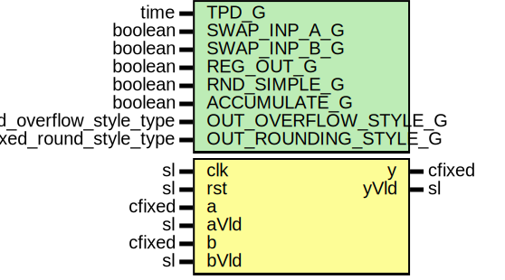

# Entity: cfixedMult

- **File**: CfixedMult.vhd
## Diagram

## Description

-----------------------------------------------------------------------------
 Company    : SLAC National Accelerator Laboratory
-----------------------------------------------------------------------------
 Description: complex multiplier add/accumulator.  Will use 4 real multipliers
              (27x18 DSP48).  Supports inputs up to 27x18.
-----------------------------------------------------------------------------
 This file is part of 'SLAC Firmware Standard Library'.
 It is subject to the license terms in the LICENSE.txt file found in the
 top-level directory of this distribution and at:
    https://confluence.slac.stanford.edu/display/ppareg/LICENSE.html.
 No part of 'SLAC Firmware Standard Library', including this file,
 may be copied, modified, propagated, or distributed except according to
 the terms contained in the LICENSE.txt file.
-----------------------------------------------------------------------------
 complex multiply (accumulater)
 Uses 4 real multipliers (18x27 for DSP48)

 p(n) = a(n-4)*b(n-4)                         (ACCUMULATE_G = false, RND_SIMPLE_G = false)
 p(n) = a(n-4)*b(n-4) + RND_SIMPLE_C          (ACCUMULATE_G = false, RND_SIMPLE_G = true)

 p(n) = a(n-4)*b(n-4) + p(n-1)                (ACCUMULATE_G = true, RND_SIMPLE_G = false)
 p(n) = a(n-4)*b(n-4) + RND_SIMPLE_C + p(n-1) (ACCUMULATE_G = true, RND_SIMPLE_G = true)

 optionally add one more delay register for output y
    (move data out of preg into fabric)

 y(n) = p(n)     ( REG_OUT_G = false )
 y(n) = p(n-1)   ( REG_OUT_G = true )

 Defaults to wrap and trucnated output for size(y)
## Generics

| Generic name         | Type                      | Value          | Description |
| -------------------- | ------------------------- | -------------- | ----------- |
| TPD_G                | time                      | 1 ns           |             |
| SWAP_INP_A_G         | boolean                   | false          |             |
| SWAP_INP_B_G         | boolean                   | false          |             |
| REG_OUT_G            | boolean                   | false          |             |
| RND_SIMPLE_G         | boolean                   | false          |             |
| ACCUMULATE_G         | boolean                   | false          |             |
| OUT_OVERFLOW_STYLE_G | fixed_overflow_style_type | fixed_wrap     |             |
| OUT_ROUNDING_STYLE_G | fixed_round_style_type    | fixed_truncate |             |
## Ports

| Port name | Direction | Type   | Description |
| --------- | --------- | ------ | ----------- |
| clk       | in        | sl     |             |
| rst       | in        | sl     |             |
| a         | in        | cfixed |             |
| aVld      | in        | sl     |             |
| b         | in        | cfixed |             |
| bVld      | in        | sl     |             |
| y         | out       | cfixed |             |
| yVld      | out       | sl     |             |
## Signals

| Name | Type                                                                                                                  | Description |
| ---- | --------------------------------------------------------------------------------------------------------------------- | ----------- |
| c    | cfixed( re(C_HIGH_BIT_C downto C_LOW_BIT_C),  im(C_HIGH_BIT_C downto C_LOW_BIT_C)) |             |
| cVld | sl                                                                                                                    |             |
| aInt | cfixed(re(a.re'range),  im(a.im'range))                                            |             |
| bInt | cfixed(re(b.re'range),  im(b.im'range))                                            |             |
## Constants

| Name         | Type    | Value                      | Description |
| ------------ | ------- | -------------------------- | ----------- |
| C_HIGH_BIT_C | integer |  a.re'high + b.re'high + 1 |             |
| C_LOW_BIT_C  | integer |  a.re'low  + b.re'low      |             |
## Instantiations

- U_MULT_ADD: surf.CfixedMultAdd
