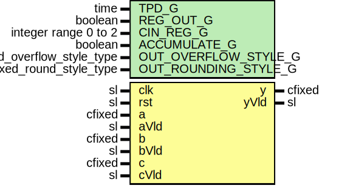

# Entity: cfixedMultAdd

- **File**: CfixedMultAdd.vhd
## Diagram

## Description

Company    : SLAC National Accelerator Laboratory
Description: complex multiplier add/accumulator.  Will use 4 real multipliers
             (27x18 DSP48).  Supports inputs up to 27x18.
This file is part of 'SLAC Firmware Standard Library'.
It is subject to the license terms in the LICENSE.txt file found in the
top-level directory of this distribution and at:
   https://confluence.slac.stanford.edu/display/ppareg/LICENSE.html.
No part of 'SLAC Firmware Standard Library', including this file,
may be copied, modified, propagated, or distributed except according to
the terms contained in the LICENSE.txt file.
complex multiply adder/accumulater
Uses 4 real multipliers (18x27 for DSP48)
p(n) = a(n-4)*b(n-4) + c(n-2)          (complex, CIN_REG_G = 0, ACCUMULATE_G = false)
p(n) = a(n-4)*b(n-4) + c(n-3)          (complex, CIN_REG_G = 1, ACCUMULATE_G = false)
p(n) = a(n-4)*b(n-4) + c(n-4)          (complex, CIN_REG_G = 2, ACCUMULATE_G = false)
p(n) = a(n-4)*b(n-4) + c(n-2) + p(n-1) (complex, CIN_REG_G = 0, ACCUMULATE_G = true)
p(n) = a(n-4)*b(n-4) + c(n-3) + p(n-1) (complex, CIN_REG_G = 1, ACCUMULATE_G = true)
p(n) = a(n-4)*b(n-4) + c(n-4) + p(n-1) (complex, CIN_REG_G = 2, ACCUMULATE_G = true)
optionally add one more delay register for output y
   (move data out of preg into fabric)
y(n) = p(n)     ( REG_OUT_G = false )
y(n) = p(n-1)   ( REG_OUT_G = true )
Defaults to wrap and trucnated output for size(y)
## Generics

| Generic name         | Type                      | Value          | Description |
| -------------------- | ------------------------- | -------------- | ----------- |
| TPD_G                | time                      | 1 ns           |             |
| REG_OUT_G            | boolean                   | false          |             |
| CIN_REG_G            | integer range 0 to 2      | 2              |             |
| ACCUMULATE_G         | boolean                   | false          |             |
| OUT_OVERFLOW_STYLE_G | fixed_overflow_style_type | fixed_wrap     |             |
| OUT_ROUNDING_STYLE_G | fixed_round_style_type    | fixed_truncate |             |
## Ports

| Port name | Direction | Type   | Description |
| --------- | --------- | ------ | ----------- |
| clk       | in        | sl     |             |
| rst       | in        | sl     |             |
| a         | in        | cfixed |             |
| aVld      | in        | sl     |             |
| b         | in        | cfixed |             |
| bVld      | in        | sl     |             |
| c         | in        | cfixed |             |
| cVld      | in        | sl     |             |
| y         | out       | cfixed | outputs     |
| yVld      | out       | sl     |             |
## Signals

| Name | Type    | Description |
| ---- | ------- | ----------- |
| r    | RegType |             |
| rin  | RegType |             |
## Constants

| Name                 | Type                      | Value                                                                                                                                                                                                                                                                                                                                                                                                                                                                                                                                                                                                                                                                                                                                                                                                                                                                                                                                                                 | Description             |
| -------------------- | ------------------------- | --------------------------------------------------------------------------------------------------------------------------------------------------------------------------------------------------------------------------------------------------------------------------------------------------------------------------------------------------------------------------------------------------------------------------------------------------------------------------------------------------------------------------------------------------------------------------------------------------------------------------------------------------------------------------------------------------------------------------------------------------------------------------------------------------------------------------------------------------------------------------------------------------------------------------------------------------------------------- | ----------------------- |
| DELAY_C              | natural                   |  4 + ite(REG_OUT_G,  1,  0)                                                                                                                                                                                                                                                                                                                                                                                                                                                                                                                                                                                                                                                                                                                                                                                                                                                                     |                         |
| M_LOW_C              | integer                   |  a.re'low + b.re'low                                                                                                                                                                                                                                                                                                                                                                                                                                                                                                                                                                                                                                                                                                                                                                                                                                                                                                                                                  |                         |
| M_HIGH_C             | integer                   |  a.re'high + b.re'high + 1                                                                                                                                                                                                                                                                                                                                                                                                                                                                                                                                                                                                                                                                                                                                                                                                                                                                                                                                            |                         |
| P_W_C                | integer                   |  48                                                                                                                                                                                                                                                                                                                                                                                                                                                                                                                                                                                                                                                                                                                                                                                                                                                                                                                                                                   |                         |
| P_LOW_C              | integer                   |  a.re'low + b.re'low                                                                                                                                                                                                                                                                                                                                                                                                                                                                                                                                                                                                                                                                                                                                                                                                                                                                                                                                                  |                         |
| P_HIGH_C             | integer                   |  P_W_C + P_LOW_C - 1                                                                                                                                                                                                                                                                                                                                                                                                                                                                                                                                                                                                                                                                                                                                                                                                                                                                                                                                                  |                         |
| INT_OVERFLOW_STYLE_C | fixed_overflow_style_type |  fixed_wrap                                                                                                                                                                                                                                                                                                                                                                                                                                                                                                                                                                                                                                                                                                                                                                                                                                                                                                                                                           | For resizing into preg: |
| INT_ROUNDING_STYLE_C | fixed_round_style_type    |  fixed_truncate                                                                                                                                                                                                                                                                                                                                                                                                                                                                                                                                                                                                                                                                                                                                                                                                                                                                                                                                                       |                         |
| REG_INIT_C           | RegType                   |  (       areg  => (others => (others => (others => '0'))),        breg  => (others => (others => (others => '0'))),        creg  => (others => (others => (others => '0'))),        m_rr  => (others => '0'),        m_ii  => (others => '0'),        m_ri  => (others => '0'),        m_ir  => (others => '0'),        p_rr  => (others => '0'),        p_ii  => (others => '0'),        p_ri  => (others => '0'),        p_ir  => (others => '0'),        y     => (others => (others => '0')),        yVld => (others => '0')) |                         |
## Types

| Name    | Type | Description |
| ------- | ---- | ----------- |
| RegType |      |             |
## Processes
- comb: ( a, b, c, aVld, bVld, cVld, r )
- seq: ( clk )
