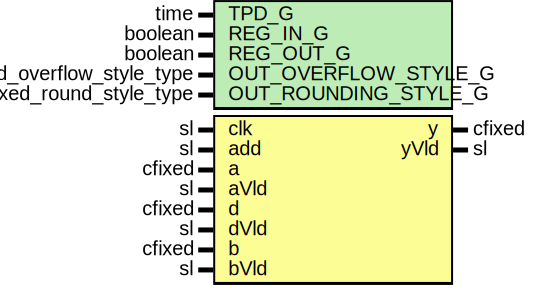

# Entity: CfixedPreAddMult

- **File**: CfixedPreAddMult.vhd
## Diagram

## Description

Company    : SLAC National Accelerator Laboratory
Description: pre-add/sub complex multiply.  (A +/- B) * D runtime configurable
             add/sub selection. Supports inputs up to 27x18.
This file is part of 'SLAC Firmware Standard Library'.
It is subject to the license terms in the LICENSE.txt file found in the
top-level directory of this distribution and at:
   https://confluence.slac.stanford.edu/display/ppareg/LICENSE.html.
No part of 'SLAC Firmware Standard Library', including this file,
may be copied, modified, propagated, or distributed except according to
the terms contained in the LICENSE.txt file.
 pre add complex multiply (A + D) * B
 inferres 4 DSP slices when using REG_IN_G = ture, delay is 5
## Generics

| Generic name         | Type                      | Value          | Description |
| -------------------- | ------------------------- | -------------- | ----------- |
| TPD_G                | time                      | 1 ns           |             |
| REG_IN_G             | boolean                   | true           |             |
| REG_OUT_G            | boolean                   | false          |             |
| OUT_OVERFLOW_STYLE_G | fixed_overflow_style_type | fixed_wrap     |             |
| OUT_ROUNDING_STYLE_G | fixed_round_style_type    | fixed_truncate |             |
## Ports

| Port name | Direction | Type   | Description     |
| --------- | --------- | ------ | --------------- |
| clk       | in        | sl     |                 |
| add       | in        | sl     | control add/sub |
| a         | in        | cfixed | inputs          |
| aVld      | in        | sl     |                 |
| d         | in        | cfixed |                 |
| dVld      | in        | sl     |                 |
| b         | in        | cfixed |                 |
| bVld      | in        | sl     |                 |
| y         | out       | cfixed |                 |
| yVld      | out       | sl     |                 |
## Signals

| Name | Type    | Description |
| ---- | ------- | ----------- |
| r    | RegType |             |
| rin  | RegType |             |
## Constants

| Name                 | Type                      | Value                                                                                                                                                                                                                                                                                                                                                                                                                                                                                                                                                                                                                                                                                                                                                                                                                                                                                                                                                                                                                                                                                                                                                                                              | Description                  |
| -------------------- | ------------------------- | -------------------------------------------------------------------------------------------------------------------------------------------------------------------------------------------------------------------------------------------------------------------------------------------------------------------------------------------------------------------------------------------------------------------------------------------------------------------------------------------------------------------------------------------------------------------------------------------------------------------------------------------------------------------------------------------------------------------------------------------------------------------------------------------------------------------------------------------------------------------------------------------------------------------------------------------------------------------------------------------------------------------------------------------------------------------------------------------------------------------------------------------------------------------------------------------------- | ---------------------------- |
| DELAY_C              | integer                   |  4 + ite(REG_IN_G,  1,  0) + ite(REG_OUT_G,  1,  0)                                                                                                                                                                                                                                                                                                                                                                                                                                                                                                                                                                                                                                                                                                                                                                                                                                                                                                                                                                                                    |                              |
| REG_DEPTH_C          | integer                   |  3                                                                                                                                                                                                                                                                                                                                                                                                                                                                                                                                                                                                                                                                                                                                                                                                                                                                                                                                                                                                                                                                                                                                                                                                 |                              |
| AD_W_C               | integer                   |  27                                                                                                                                                                                                                                                                                                                                                                                                                                                                                                                                                                                                                                                                                                                                                                                                                                                                                                                                                                                                                                                                                                                                                                                                | 27 x 18 multiplier for DSP48 |
| AD_LOW_C             | integer                   |  minimum(a.re'low,  d.re'low)                                                                                                                                                                                                                                                                                                                                                                                                                                                                                                                                                                                                                                                                                                                                                                                                                                                                                                                                                                                                                                                                                                                                   |                              |
| AD_HIGH_C            | integer                   |  maximum(a.re'high,  d.re'high) + 1                                                                                                                                                                                                                                                                                                                                                                                                                                                                                                                                                                                                                                                                                                                                                                                                                                                                                                                                                                                                                                                                                                                             |                              |
| AD_HIGH_CLIP_C       | integer                   |  minimum(AD_W_C + AD_LOW_C - 1,  AD_HIGH_C)                                                                                                                                                                                                                                                                                                                                                                                                                                                                                                                                                                                                                                                                                                                                                                                                                                                                                                                                                                                                                                                                                                                     |                              |
| M_LOW_C              | integer                   |  AD_LOW_C + b.re'low                                                                                                                                                                                                                                                                                                                                                                                                                                                                                                                                                                                                                                                                                                                                                                                                                                                                                                                                                                                                                                                                                                                                                                               |                              |
| M_HIGH_C             | integer                   |  AD_HIGH_CLIP_C + b.re'high + 1                                                                                                                                                                                                                                                                                                                                                                                                                                                                                                                                                                                                                                                                                                                                                                                                                                                                                                                                                                                                                                                                                                                                                                    |                              |
| P_W_C                | integer                   |  48                                                                                                                                                                                                                                                                                                                                                                                                                                                                                                                                                                                                                                                                                                                                                                                                                                                                                                                                                                                                                                                                                                                                                                                                |                              |
| P_LOW_C              | integer                   |  AD_LOW_C + b.re'low                                                                                                                                                                                                                                                                                                                                                                                                                                                                                                                                                                                                                                                                                                                                                                                                                                                                                                                                                                                                                                                                                                                                                                               |                              |
| P_HIGH_C             | integer                   |  P_W_C + P_LOW_C - 1                                                                                                                                                                                                                                                                                                                                                                                                                                                                                                                                                                                                                                                                                                                                                                                                                                                                                                                                                                                                                                                                                                                                                                               |                              |
| INT_OVERFLOW_STYLE_C | fixed_overflow_style_type |  fixed_wrap                                                                                                                                                                                                                                                                                                                                                                                                                                                                                                                                                                                                                                                                                                                                                                                                                                                                                                                                                                                                                                                                                                                                                                                        | For resizing into preg:      |
| INT_ROUNDING_STYLE_C | fixed_round_style_type    |  fixed_truncate                                                                                                                                                                                                                                                                                                                                                                                                                                                                                                                                                                                                                                                                                                                                                                                                                                                                                                                                                                                                                                                                                                                                                                                    |                              |
| REG_INIT_C           | RegType                   |  (       areg   => (others => (others => (others => '0'))),        breg   => (others => (others => (others => '0'))),        dreg   => (others => (others => (others => '0'))),        adreg  => (others => (others => (others => '0'))),        add_r  => '0',        add_rr => '0',        vld    => (others => '0'),        m_rr   => (others => '0'),        m_ii   => (others => '0'),        m_ri   => (others => '0'),        m_ir   => (others => '0'),        p_rr   => (others => '0'),        p_ii   => (others => '0'),        p_ri   => (others => '0'),        p_ir   => (others => '0'),        y      => (others => (others => '0'))) |                              |
## Types

| Name    | Type | Description |
| ------- | ---- | ----------- |
| RegType |      |             |
## Processes
- comb: ( add, a, b, d, aVld, bVld, dVld, r )
- seq: ( clk )
