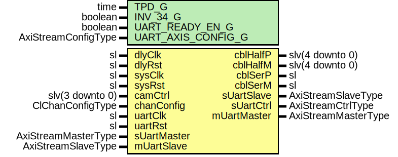

# Entity: ClinkCtrl

- **File**: ClinkCtrl.vhd
## Diagram

## Description

Company    : SLAC National Accelerator Laboratory
Description:
CameraLink control interface.
This file is part of 'SLAC Firmware Standard Library'.
It is subject to the license terms in the LICENSE.txt file found in the
top-level directory of this distribution and at:
   https://confluence.slac.stanford.edu/display/ppareg/LICENSE.html.
No part of 'SLAC Firmware Standard Library', including this file,
may be copied, modified, propagated, or distributed except according to
the terms contained in the LICENSE.txt file.
## Generics

| Generic name       | Type                | Value | Description |
| ------------------ | ------------------- | ----- | ----------- |
| TPD_G              | time                | 1 ns  |             |
| INV_34_G           | boolean             | false |             |
| UART_READY_EN_G    | boolean             | true  |             |
| UART_AXIS_CONFIG_G | AxiStreamConfigType |       |             |
## Ports

| Port name   | Direction | Type                | Description                                       |
| ----------- | --------- | ------------------- | ------------------------------------------------- |
| cblHalfP    | inout     | slv(4 downto 0)     | 15, 17,  5,  6, 3                                 |
| cblHalfM    | inout     | slv(4 downto 0)     |  2,  4, 18, 19, 16                                |
| cblSerP     | out       | sl                  | 20                                                |
| cblSerM     | out       | sl                  | 7                                                 |
| dlyClk      | in        | sl                  | Delay clock and reset, 200Mhz                     |
| dlyRst      | in        | sl                  |                                                   |
| sysClk      | in        | sl                  | System clock and reset, must be 100Mhz or greater |
| sysRst      | in        | sl                  |                                                   |
| camCtrl     | in        | slv(3 downto 0)     | Camera Control Bits                               |
| chanConfig  | in        | ClChanConfigType    | Config                                            |
| uartClk     | in        | sl                  | UART data                                         |
| uartRst     | in        | sl                  |                                                   |
| sUartMaster | in        | AxiStreamMasterType |                                                   |
| sUartSlave  | out       | AxiStreamSlaveType  |                                                   |
| sUartCtrl   | out       | AxiStreamCtrlType   |                                                   |
| mUartMaster | out       | AxiStreamMasterType |                                                   |
| mUartSlave  | in        | AxiStreamSlaveType  |                                                   |
## Signals

| Name      | Type            | Description |
| --------- | --------------- | ----------- |
| intCtrl   | slv(3 downto 0) |             |
| cblOut    | slv(4 downto 0) |             |
| cblIn     | slv(4 downto 0) |             |
| cblDirIn  | slv(4 downto 0) |             |
| cblSerOut | sl              |             |
## Processes
- unnamed: ( camCtrl, chanConfig )
**Description**
Camera control bits

## Instantiations

- U_SerOut: OBUFDS
- U_Uart: surf.ClinkUart
**Description**
UART

