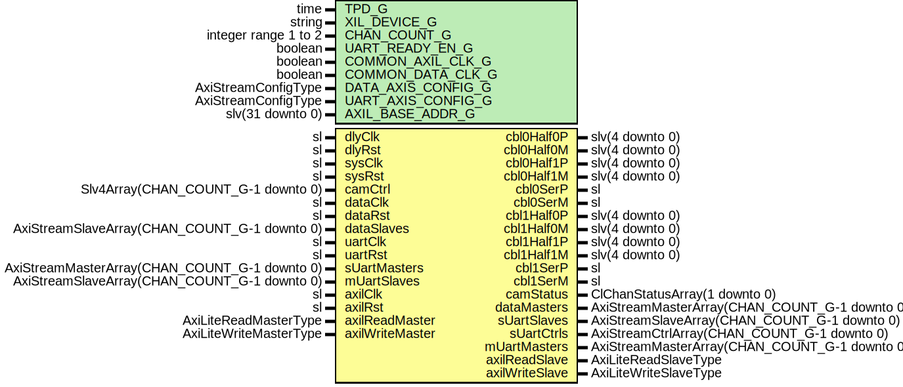

# Entity: ClinkTop

- **File**: ClinkTop.vhd
## Diagram

## Description

-----------------------------------------------------------------------------
 Company    : SLAC National Accelerator Laboratory
-----------------------------------------------------------------------------
 Description:
 CameraLink Top Level
-----------------------------------------------------------------------------
 This file is part of 'SLAC Firmware Standard Library'.
 It is subject to the license terms in the LICENSE.txt file found in the
 top-level directory of this distribution and at:
    https://confluence.slac.stanford.edu/display/ppareg/LICENSE.html.
 No part of 'SLAC Firmware Standard Library', including this file,
 may be copied, modified, propagated, or distributed except according to
 the terms contained in the LICENSE.txt file.
-----------------------------------------------------------------------------
## Generics

| Generic name       | Type                 | Value     | Description             |
| ------------------ | -------------------- | --------- | ----------------------- |
| TPD_G              | time                 | 1 ns      |                         |
| XIL_DEVICE_G       | string               | "7SERIES" |                         |
| CHAN_COUNT_G       | integer range 1 to 2 | 1         |                         |
| UART_READY_EN_G    | boolean              | true      |                         |
| COMMON_AXIL_CLK_G  | boolean              | false     |  true if axilClk=sysClk |
| COMMON_DATA_CLK_G  | boolean              | false     |  true if dataClk=sysClk |
| DATA_AXIS_CONFIG_G | AxiStreamConfigType  |           |                         |
| UART_AXIS_CONFIG_G | AxiStreamConfigType  |           |                         |
| AXIL_BASE_ADDR_G   | slv(31 downto 0)     |           |                         |
## Ports

| Port name       | Direction | Type                                          | Description                         |
| --------------- | --------- | --------------------------------------------- | ----------------------------------- |
| cbl0Half0P      | inout     | slv(4 downto 0)                               |  15, 17,  5,  6,  3                 |
| cbl0Half0M      | inout     | slv(4 downto 0)                               |   2,  4, 18, 19, 16                 |
| cbl0Half1P      | inout     | slv(4 downto 0)                               |   8, 10, 11, 12,  9                 |
| cbl0Half1M      | inout     | slv(4 downto 0)                               |  21, 23, 24, 25, 22                 |
| cbl0SerP        | out       | sl                                            |  20                                 |
| cbl0SerM        | out       | sl                                            |  7                                  |
| cbl1Half0P      | inout     | slv(4 downto 0)                               |   2,  4,  5,  6, 3                  |
| cbl1Half0M      | inout     | slv(4 downto 0)                               |  15, 17, 18, 19 16                  |
| cbl1Half1P      | inout     | slv(4 downto 0)                               |   8, 10, 11, 12,  9                 |
| cbl1Half1M      | inout     | slv(4 downto 0)                               |  21, 23, 24, 25, 22                 |
| cbl1SerP        | out       | sl                                            |  20                                 |
| cbl1SerM        | out       | sl                                            |  7                                  |
| dlyClk          | in        | sl                                            | Delay clock and reset, 200Mhz       |
| dlyRst          | in        | sl                                            |                                     |
| sysClk          | in        | sl                                            | System clock and reset, > 100 Mhz   |
| sysRst          | in        | sl                                            |                                     |
| camCtrl         | in        | Slv4Array(CHAN_COUNT_G-1 downto 0)            | Camera Control Bits & status, async |
| camStatus       | out       | ClChanStatusArray(1 downto 0)                 |                                     |
| dataClk         | in        | sl                                            | Camera data                         |
| dataRst         | in        | sl                                            |                                     |
| dataMasters     | out       | AxiStreamMasterArray(CHAN_COUNT_G-1 downto 0) |                                     |
| dataSlaves      | in        | AxiStreamSlaveArray(CHAN_COUNT_G-1 downto 0)  |                                     |
| uartClk         | in        | sl                                            | UART data                           |
| uartRst         | in        | sl                                            |                                     |
| sUartMasters    | in        | AxiStreamMasterArray(CHAN_COUNT_G-1 downto 0) |                                     |
| sUartSlaves     | out       | AxiStreamSlaveArray(CHAN_COUNT_G-1 downto 0)  |                                     |
| sUartCtrls      | out       | AxiStreamCtrlArray(CHAN_COUNT_G-1 downto 0)   |                                     |
| mUartMasters    | out       | AxiStreamMasterArray(CHAN_COUNT_G-1 downto 0) |                                     |
| mUartSlaves     | in        | AxiStreamSlaveArray(CHAN_COUNT_G-1 downto 0)  |                                     |
| axilClk         | in        | sl                                            | Axi-Lite Interface                  |
| axilRst         | in        | sl                                            |                                     |
| axilReadMaster  | in        | AxiLiteReadMasterType                         |                                     |
| axilReadSlave   | out       | AxiLiteReadSlaveType                          |                                     |
| axilWriteMaster | in        | AxiLiteWriteMasterType                        |                                     |
| axilWriteSlave  | out       | AxiLiteWriteSlaveType                         |                                     |
## Signals

| Name             | Type                                                   | Description |
| ---------------- | ------------------------------------------------------ | ----------- |
| intReadMaster    | AxiLiteReadMasterType                                  |             |
| intReadSlave     | AxiLiteReadSlaveType                                   |             |
| intWriteMaster   | AxiLiteWriteMasterType                                 |             |
| intWriteSlave    | AxiLiteWriteSlaveType                                  |             |
| axilWriteMasters | AxiLiteWriteMasterArray(NUM_AXIL_MASTERS_C-1 downto 0) |             |
| axilWriteSlaves  | AxiLiteWriteSlaveArray(NUM_AXIL_MASTERS_C-1 downto 0)  |             |
| axilReadMasters  | AxiLiteReadMasterArray(NUM_AXIL_MASTERS_C-1 downto 0)  |             |
| axilReadSlaves   | AxiLiteReadSlaveArray(NUM_AXIL_MASTERS_C-1 downto 0)   |             |
| chanConfig       | ClChanConfigArray(1 downto 0)                          |             |
| linkConfig       | ClLinkConfigType                                       |             |
| chanStatus       | ClChanStatusArray(1 downto 0)                          |             |
| linkStatus       | ClLinkStatusArray(2 downto 0)                          |             |
| parData          | Slv28Array(2 downto 0)                                 |             |
| parValid         | slv(2 downto 0)                                        |             |
| frameReady       | slv(1 downto 0)                                        |             |
## Constants

| Name               | Type                                                            | Value                                                                                                                                                                       | Description |
| ------------------ | --------------------------------------------------------------- | --------------------------------------------------------------------------------------------------------------------------------------------------------------------------- | ----------- |
| NUM_AXIL_MASTERS_C | natural                                                         |  4                                                                                                                                                                          |             |
| MAIN_INDEX_C       | natural                                                         |  0                                                                                                                                                                          |             |
| DRP0_INDEX_C       | natural                                                         |  1                                                                                                                                                                          |             |
| DRP1_INDEX_C       | natural                                                         |  2                                                                                                                                                                          |             |
| DRP2_INDEX_C       | natural                                                         |  3                                                                                                                                                                          |             |
| XBAR_CONFIG_C      | AxiLiteCrossbarMasterConfigArray(NUM_AXIL_MASTERS_C-1 downto 0) |  genAxiLiteConfig(NUM_AXIL_MASTERS_C,  AXIL_BASE_ADDR_G,  14,  12) |             |
## Instantiations

- U_IdelayCtrl: IDELAYCTRL
**Description**
-------------------
 IDELAYCTRL Modules
-------------------

- U_AxilAsync: surf.AxiLiteAsync
**Description**
 1-bit input: Active high reset input
--------------------------
 AXI-Lite Clock Transition
--------------------------

- U_XBAR: surf.AxiLiteCrossbar
**Description**
------------------------
 AXI-Lite: Crossbar Core
------------------------

- U_ClinkReg: surf.ClinkReg
**Description**
-------------------------
 AXI-Lite Register Module
-------------------------

- U_Cbl0Half0: surf.ClinkCtrl
**Description**
-------------------------------------------------------
 Connector 0, Half 0, Control for Base,Medium,Full,Deca
-------------------------------------------------------

- U_Cbl0Half1: surf.ClinkData
**Description**
------------------------------------------------------
 Connector 0, Half 1, Data X for Base,Medium,Full,Deca
------------------------------------------------------

- U_Cbl1Half1: surf.ClinkData
**Description**
-----------------------------------------------------------------
 Connector 1, Half 1, Data X for Base, Data Y for Med, Full, Deca
-----------------------------------------------------------------

- U_Framer0: surf.ClinkFraming
**Description**
----------------
 Data Processing
----------------

