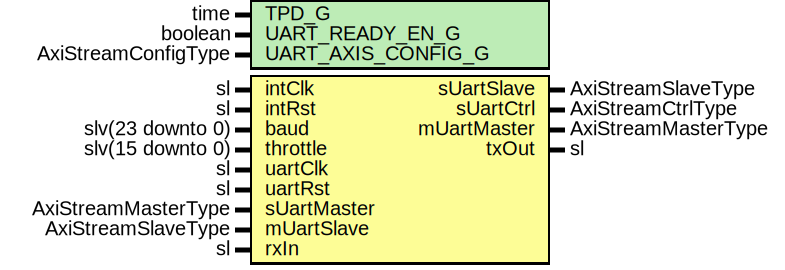

# Entity: ClinkUart

- **File**: ClinkUart.vhd
## Diagram

## Description

-----------------------------------------------------------------------------
 Company    : SLAC National Accelerator Laboratory
-----------------------------------------------------------------------------
 Description:
 CameraLink UART RX/TX
-----------------------------------------------------------------------------
 This file is part of 'SLAC Firmware Standard Library'.
 It is subject to the license terms in the LICENSE.txt file found in the
 top-level directory of this distribution and at:
    https://confluence.slac.stanford.edu/display/ppareg/LICENSE.html.
 No part of 'SLAC Firmware Standard Library', including this file,
 may be copied, modified, propagated, or distributed except according to
 the terms contained in the LICENSE.txt file.
-----------------------------------------------------------------------------
## Generics

| Generic name       | Type                | Value | Description |
| ------------------ | ------------------- | ----- | ----------- |
| TPD_G              | time                | 1 ns  |             |
| UART_READY_EN_G    | boolean             | true  |             |
| UART_AXIS_CONFIG_G | AxiStreamConfigType |       |             |
## Ports

| Port name   | Direction | Type                | Description                |
| ----------- | --------- | ------------------- | -------------------------- |
| intClk      | in        | sl                  | Clock and reset, 200Mhz    |
| intRst      | in        | sl                  |                            |
| baud        | in        | slv(23 downto 0)    |  Baud rate (units of bps)  |
| throttle    | in        | slv(15 downto 0)    |  TX Throttle (units of us) |
| uartClk     | in        | sl                  | Data In/Out                |
| uartRst     | in        | sl                  |                            |
| sUartMaster | in        | AxiStreamMasterType |                            |
| sUartSlave  | out       | AxiStreamSlaveType  |                            |
| sUartCtrl   | out       | AxiStreamCtrlType   |                            |
| mUartMaster | out       | AxiStreamMasterType |                            |
| mUartSlave  | in        | AxiStreamSlaveType  |                            |
| rxIn        | in        | sl                  | Serial data                |
| txOut       | out       | sl                  |                            |
## Signals

| Name      | Type                             | Description |
| --------- | -------------------------------- | ----------- |
| r         | RegType                          |             |
| rin       | Regtype                          |             |
| rdData    | slv(7 downto 0)                  |             |
| rdValid   | sl                               |             |
| txMasters | AxiStreamMasterArray(1 downto 0) |             |
| txSlaves  | AxiStreamSlaveArray(1 downto 0)  |             |
| rxMaster  | AxiStreamMasterType              |             |
## Constants

| Name         | Type                | Value                                                                                   | Description |
| ------------ | ------------------- | --------------------------------------------------------------------------------------- | ----------- |
| INT_FREQ_C   | integer             |  200000000                                                                              |             |
| INT_CONFIG_C | AxiStreamConfigType |  ssiAxiStreamConfig(dataBytes => 4,  tDestBits => 0) |             |
| REG_INIT_C   | RegType             |  (       count     => 0,        baudClkEn => '0')    |             |
## Types

| Name    | Type | Description |
| ------- | ---- | ----------- |
| RegType |      |             |
## Processes
- comb: ( baud, intRst, r )
- seq: ( intClk )
- unnamed: ( rdData, rdValid )
**Description**
 [in] 
## Instantiations

- U_TxFifo: surf.AxiStreamFifoV2
**Description**
-----------------------------------------------------------------------------------------------
 Transmit FIFO
-----------------------------------------------------------------------------------------------

- U_TxThrottle: surf.ClinkUartThrottle
- U_UartTx_1: surf.UartTx
**Description**
-----------------------------------------------------------------------------------------------
 UART transmitter
-----------------------------------------------------------------------------------------------

- U_UartRx_1: surf.UartRx
**Description**
 [out]
-----------------------------------------------------------------------------------------------
 UART Receiver
-----------------------------------------------------------------------------------------------

- U_RxFifo: surf.AxiStreamFifoV2
**Description**
-----------------------------------------------------------------------------------------------
 Receive FIFO
-----------------------------------------------------------------------------------------------

