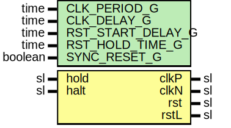

# Entity: ClkRst

## Diagram

## Description

Company    : SLAC National Accelerator Laboratory
Description: Provides a clocks and reset signal to UUT in simulation.
             Assumes active high reset.
This file is part of 'SLAC Firmware Standard Library'.
It is subject to the license terms in the LICENSE.txt file found in the
top-level directory of this distribution and at:
   https://confluence.slac.stanford.edu/display/ppareg/LICENSE.html.
No part of 'SLAC Firmware Standard Library', including this file,
may be copied, modified, propagated, or distributed except according to
the terms contained in the LICENSE.txt file.
## Generics

| Generic name      | Type    | Value | Description                                           |
| ----------------- | ------- | ----- | ----------------------------------------------------- |
| CLK_PERIOD_G      | time    | 10 ns |                                                       |
| CLK_DELAY_G       | time    | 0 ns  |                                                       |
| RST_START_DELAY_G | time    | 1 ns  | Wait this long into simulation before asserting reset |
| RST_HOLD_TIME_G   | time    | 6 us  | Hold reset for this long                              |
| SYNC_RESET_G      | boolean | false |                                                       |
## Ports

| Port name | Direction | Type | Description    |
| --------- | --------- | ---- | -------------- |
| hold      | in        | sl   |                |
| halt      | in        | sl   |                |
| clkP      | out       | sl   |                |
| clkN      | out       | sl   | Inverted clock |
| rst       | out       | sl   |                |
| rstL      | out       | sl   |                |
## Signals

| Name  | Type | Description |
| ----- | ---- | ----------- |
| clkFb | sl   |             |
| rstFb | sl   |             |
## Constants

| Name       | Type | Value                    | Description |
| ---------- | ---- | ------------------------ | ----------- |
| CLK_HIGH_C | time |  CLK_PERIOD_G/2.0        |             |
| CLK_LOW_C  | time |  CLK_PERIOD_G-CLK_HIGH_C |             |
## Processes
- unnamed: (  )
- unnamed: (  )
