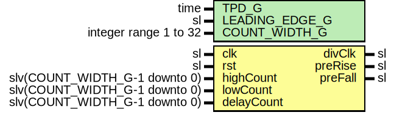

# Entity: ClockDivider

- **File**: ClockDivider.vhd
## Diagram

## Description

-----------------------------------------------------------------------------
 Company    : SLAC National Accelerator Laboratory
-----------------------------------------------------------------------------
 Description: A clock divider with programmable duty cycle and phase delay.
-----------------------------------------------------------------------------
 This file is part of 'SLAC Firmware Standard Library'.
 It is subject to the license terms in the LICENSE.txt file found in the
 top-level directory of this distribution and at:
    https://confluence.slac.stanford.edu/display/ppareg/LICENSE.html.
 No part of 'SLAC Firmware Standard Library', including this file,
 may be copied, modified, propagated, or distributed except according to
 the terms contained in the LICENSE.txt file.
-----------------------------------------------------------------------------
## Generics

| Generic name   | Type                  | Value | Description |
| -------------- | --------------------- | ----- | ----------- |
| TPD_G          | time                  | 1 ns  |             |
| LEADING_EDGE_G | sl                    | '1'   |             |
| COUNT_WIDTH_G  | integer range 1 to 32 | 16    |             |
## Ports

| Port name  | Direction | Type                          | Description |
| ---------- | --------- | ----------------------------- | ----------- |
| clk        | in        | sl                            |             |
| rst        | in        | sl                            |             |
| highCount  | in        | slv(COUNT_WIDTH_G-1 downto 0) |             |
| lowCount   | in        | slv(COUNT_WIDTH_G-1 downto 0) |             |
| delayCount | in        | slv(COUNT_WIDTH_G-1 downto 0) |             |
| divClk     | out       | sl                            |             |
| preRise    | out       | sl                            |             |
| preFall    | out       | sl                            |             |
## Signals

| Name | Type    | Description |
| ---- | ------- | ----------- |
| r    | RegType |             |
| rin  | RegType |             |
## Constants

| Name       | Type    | Value                                                                                                                                                                                                                                                                                           | Description |
| ---------- | ------- | ----------------------------------------------------------------------------------------------------------------------------------------------------------------------------------------------------------------------------------------------------------------------------------------------- | ----------- |
| REG_INIT_C | RegType |  (       state   => DELAY_S,        divClk  => not LEADING_EDGE_G,        preRise => '0',        preFall => '0',        counter => (others => '0')) |             |
## Types

| Name      | Type                                                    | Description |
| --------- | ------------------------------------------------------- | ----------- |
| StateType | (DELAY_S,  CLOCK_S)  |             |
| RegType   |                                                         |             |
## Processes
- comb: ( delayCount, highCount, lowCount, r, rst )
- seq: ( clk )
