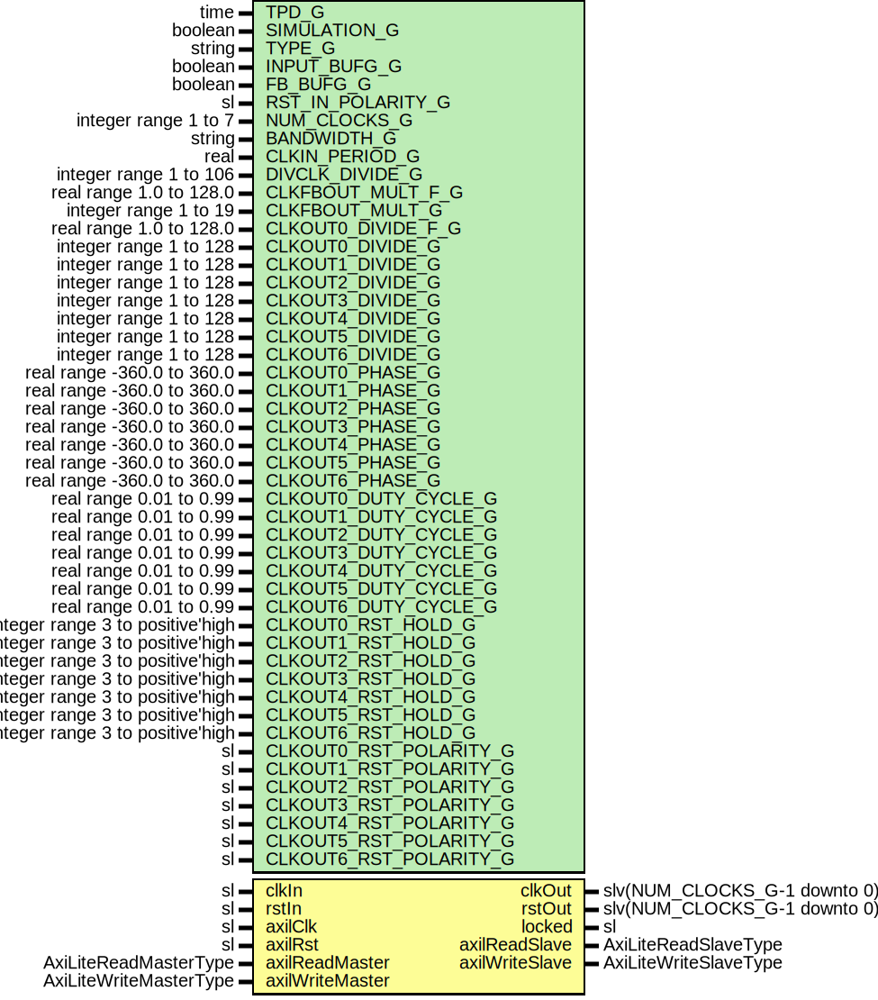

# Entity: ClockManagerUltraScale

- **File**: ClockManagerUltraScale.vhd
## Diagram

## Description

Company    : SLAC National Accelerator Laboratory
Description: A wrapper over MMCM/PLL to avoid coregen use.
This file is part of 'SLAC Firmware Standard Library'.
It is subject to the license terms in the LICENSE.txt file found in the
top-level directory of this distribution and at:
   https://confluence.slac.stanford.edu/display/ppareg/LICENSE.html.
No part of 'SLAC Firmware Standard Library', including this file,
may be copied, modified, propagated, or distributed except according to
the terms contained in the LICENSE.txt file.
## Generics

| Generic name           | Type                             | Value       | Description           |
| ---------------------- | -------------------------------- | ----------- | --------------------- |
| TPD_G                  | time                             | 1 ns        |                       |
| SIMULATION_G           | boolean                          | false       |                       |
| TYPE_G                 | string                           | "MMCM"      | or "PLL"              |
| INPUT_BUFG_G           | boolean                          | true        |                       |
| FB_BUFG_G              | boolean                          | true        |                       |
| RST_IN_POLARITY_G      | sl                               | '1'         | '0' for active low    |
| NUM_CLOCKS_G           | integer range 1 to 7             |             |                       |
| BANDWIDTH_G            | string                           | "OPTIMIZED" | MMCM attributes       |
| CLKIN_PERIOD_G         | real                             | 10.0        | Input period in ns ); |
| DIVCLK_DIVIDE_G        | integer range 1 to 106           | 1           |                       |
| CLKFBOUT_MULT_F_G      | real range 1.0 to 128.0          | 1.0         |                       |
| CLKFBOUT_MULT_G        | integer range 1 to 19            | 5           |                       |
| CLKOUT0_DIVIDE_F_G     | real range 1.0 to 128.0          | 1.0         |                       |
| CLKOUT0_DIVIDE_G       | integer range 1 to 128           | 1           |                       |
| CLKOUT1_DIVIDE_G       | integer range 1 to 128           | 1           |                       |
| CLKOUT2_DIVIDE_G       | integer range 1 to 128           | 1           |                       |
| CLKOUT3_DIVIDE_G       | integer range 1 to 128           | 1           |                       |
| CLKOUT4_DIVIDE_G       | integer range 1 to 128           | 1           |                       |
| CLKOUT5_DIVIDE_G       | integer range 1 to 128           | 1           |                       |
| CLKOUT6_DIVIDE_G       | integer range 1 to 128           | 1           |                       |
| CLKOUT0_PHASE_G        | real range -360.0 to 360.0       | 0.0         |                       |
| CLKOUT1_PHASE_G        | real range -360.0 to 360.0       | 0.0         |                       |
| CLKOUT2_PHASE_G        | real range -360.0 to 360.0       | 0.0         |                       |
| CLKOUT3_PHASE_G        | real range -360.0 to 360.0       | 0.0         |                       |
| CLKOUT4_PHASE_G        | real range -360.0 to 360.0       | 0.0         |                       |
| CLKOUT5_PHASE_G        | real range -360.0 to 360.0       | 0.0         |                       |
| CLKOUT6_PHASE_G        | real range -360.0 to 360.0       | 0.0         |                       |
| CLKOUT0_DUTY_CYCLE_G   | real range 0.01 to 0.99          | 0.5         |                       |
| CLKOUT1_DUTY_CYCLE_G   | real range 0.01 to 0.99          | 0.5         |                       |
| CLKOUT2_DUTY_CYCLE_G   | real range 0.01 to 0.99          | 0.5         |                       |
| CLKOUT3_DUTY_CYCLE_G   | real range 0.01 to 0.99          | 0.5         |                       |
| CLKOUT4_DUTY_CYCLE_G   | real range 0.01 to 0.99          | 0.5         |                       |
| CLKOUT5_DUTY_CYCLE_G   | real range 0.01 to 0.99          | 0.5         |                       |
| CLKOUT6_DUTY_CYCLE_G   | real range 0.01 to 0.99          | 0.5         |                       |
| CLKOUT0_RST_HOLD_G     | integer range 3 to positive'high | 3           |                       |
| CLKOUT1_RST_HOLD_G     | integer range 3 to positive'high | 3           |                       |
| CLKOUT2_RST_HOLD_G     | integer range 3 to positive'high | 3           |                       |
| CLKOUT3_RST_HOLD_G     | integer range 3 to positive'high | 3           |                       |
| CLKOUT4_RST_HOLD_G     | integer range 3 to positive'high | 3           |                       |
| CLKOUT5_RST_HOLD_G     | integer range 3 to positive'high | 3           |                       |
| CLKOUT6_RST_HOLD_G     | integer range 3 to positive'high | 3           |                       |
| CLKOUT0_RST_POLARITY_G | sl                               | '1'         |                       |
| CLKOUT1_RST_POLARITY_G | sl                               | '1'         |                       |
| CLKOUT2_RST_POLARITY_G | sl                               | '1'         |                       |
| CLKOUT3_RST_POLARITY_G | sl                               | '1'         |                       |
| CLKOUT4_RST_POLARITY_G | sl                               | '1'         |                       |
| CLKOUT5_RST_POLARITY_G | sl                               | '1'         |                       |
| CLKOUT6_RST_POLARITY_G | sl                               | '1'         |                       |
## Ports

| Port name       | Direction | Type                         | Description        |
| --------------- | --------- | ---------------------------- | ------------------ |
| clkIn           | in        | sl                           |                    |
| rstIn           | in        | sl                           |                    |
| clkOut          | out       | slv(NUM_CLOCKS_G-1 downto 0) |                    |
| rstOut          | out       | slv(NUM_CLOCKS_G-1 downto 0) |                    |
| locked          | out       | sl                           |                    |
| axilClk         | in        | sl                           | AXI-Lite Interface |
| axilRst         | in        | sl                           |                    |
| axilReadMaster  | in        | AxiLiteReadMasterType        |                    |
| axilReadSlave   | out       | AxiLiteReadSlaveType         |                    |
| axilWriteMaster | in        | AxiLiteWriteMasterType       |                    |
| axilWriteSlave  | out       | AxiLiteWriteSlaveType        |                    |
## Signals

| Name       | Type             | Description |
| ---------- | ---------------- | ----------- |
| rstInLoc   | sl               |             |
| clkInLoc   | sl               |             |
| lockedLoc  | sl               |             |
| clkOutMmcm | slv(6 downto 0)  |             |
| clkOutLoc  | slv(6 downto 0)  |             |
| clkFbOut   | sl               |             |
| clkFbIn    | sl               |             |
| drpRdy     | sl               |             |
| drpEn      | sl               |             |
| drpWe      | sl               |             |
| drpAddr    | slv(6 downto 0)  |             |
| drpDi      | slv(15 downto 0) |             |
| drpDo      | slv(15 downto 0) |             |
## Constants

| Name               | Type                 | Value                                                                                                                                                                                                                                                                                                                                                                                                          | Description |
| ------------------ | -------------------- | -------------------------------------------------------------------------------------------------------------------------------------------------------------------------------------------------------------------------------------------------------------------------------------------------------------------------------------------------------------------------------------------------------------- | ----------- |
| RST_HOLD_C         | IntegerArray(0 to 6) |  (       CLKOUT0_RST_HOLD_G,  CLKOUT1_RST_HOLD_G,  CLKOUT2_RST_HOLD_G,  CLKOUT3_RST_HOLD_G,        CLKOUT4_RST_HOLD_G,  CLKOUT5_RST_HOLD_G,  CLKOUT6_RST_HOLD_G)                             |             |
| RST_POLARITY_C     | slv(0 to 6)          |  (       CLKOUT0_RST_POLARITY_G,  CLKOUT1_RST_POLARITY_G,  CLKOUT2_RST_POLARITY_G,  CLKOUT3_RST_POLARITY_G,        CLKOUT4_RST_POLARITY_G,  CLKOUT5_RST_POLARITY_G,  CLKOUT6_RST_POLARITY_G) |             |
| CLKOUT0_DIVIDE_F_C | real                 |  ite(CLKOUT0_DIVIDE_F_G = 1.0,  real(CLKOUT0_DIVIDE_G),  CLKOUT0_DIVIDE_F_G)                                                                                                                                                                                                                                                             |             |
| CLKFBOUT_MULT_F_C  | real                 |  ite(CLKFBOUT_MULT_F_G = 1.0,  real(CLKFBOUT_MULT_G),  CLKFBOUT_MULT_F_G)                                                                                                                                                                                                                                                                |             |
## Instantiations

- U_AxiLiteToDrp: surf.AxiLiteToDrp
