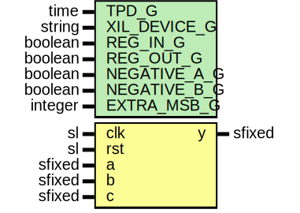

# Entity: csa3

- **File**: Csa3.vhd
## Diagram

## Description

Company    : SLAC National Accelerator Laboratory
Description: 3 input add/sub module y = +/- a +/- b + c
This file is part of 'SLAC Firmware Standard Library'.
It is subject to the license terms in the LICENSE.txt file found in the
top-level directory of this distribution and at:
   https://confluence.slac.stanford.edu/display/ppareg/LICENSE.html.
No part of 'SLAC Firmware Standard Library', including this file,
may be copied, modified, propagated, or distributed except according to
the terms contained in the LICENSE.txt file.
Manually instantie LUT6_2 and CARRY8 blocks for optimized 3 input adder
See UG579 p. 62 == 3:2 compressor followed by 2 input adder
see https://www.element14.com/community/groups/fpga-group/blog/2018/10/23/the-art-of-fpga-design-post-16
## Generics

| Generic name | Type    | Value             | Description |
| ------------ | ------- | ----------------- | ----------- |
| TPD_G        | time    | 1 ns              |             |
| XIL_DEVICE_G | string  | "ULTRASCALE_PLUS" |             |
| REG_IN_G     | boolean | false             |             |
| REG_OUT_G    | boolean | true              |             |
| NEGATIVE_A_G | boolean | false             |             |
| NEGATIVE_B_G | boolean | false             |             |
| EXTRA_MSB_G  | integer | 2                 |             |
## Ports

| Port name | Direction | Type   | Description |
| --------- | --------- | ------ | ----------- |
| clk       | in        | sl     |             |
| rst       | in        | sl     |             |
| a         | in        | sfixed |             |
| b         | in        | sfixed |             |
| c         | in        | sfixed |             |
| y         | out       | sfixed |             |
## Signals

| Name   | Type                                           | Description |
| ------ | ---------------------------------------------- | ----------- |
| r      | RegType                                        |             |
| rin    | RegType                                        |             |
| inputA | sfixed(HIGH_BIT_C downto LOW_BIT_C)            |             |
| inputB | sfixed(HIGH_BIT_C downto LOW_BIT_C)            |             |
| inputC | sfixed(HIGH_BIT_C downto LOW_BIT_C)            |             |
| sum    | sfixed(HIGH_BIT_C downto LOW_BIT_C)            |             |
| O5     | signed(HIGH_BIT_C-MED_BIT_C+1 downto 0)        |             |
| O6     | signed(HIGH_BIT_C-MED_BIT_C downto 0)          |             |
| CY     | slv((HIGH_BIT_C-MED_BIT_C+1+7)/8*8 downto 0)   |             |
| SI     | slv((HIGH_BIT_C-MED_BIT_C+1+7)/8*8-1 downto 0) |             |
| DI     | slv((HIGH_BIT_C-MED_BIT_C+1+7)/8*8-1 downto 0) |             |
| O      | slv((HIGH_BIT_C-MED_BIT_C+1+7)/8*8-1 downto 0) |             |
## Constants

| Name                 | Type                      | Value                                                                                                                                                                                                                                  | Description |
| -------------------- | ------------------------- | -------------------------------------------------------------------------------------------------------------------------------------------------------------------------------------------------------------------------------------- | ----------- |
| INT_OVERFLOW_STYLE_C | fixed_overflow_style_type |  fixed_wrap                                                                                                                                                                                                                            |             |
| INT_ROUNDING_STYLE_C | fixed_round_style_type    |  fixed_truncate                                                                                                                                                                                                                        |             |
| HIGH_ARRAY_C         | IntegerArray(2 downto 0)  |  (       0 => a'high,        1 => b'high,        2 => c'high)                                                                                                    |             |
| LOW_ARRAY_C          | IntegerArray(2 downto 0)  |  (       0 => a'low,        1 => b'low,        2 => c'low)                                                                                                       |             |
| HIGH_BIT_C           | integer                   |  maximum(HIGH_ARRAY_C) + EXTRA_MSB_G                                                                                                                                                                                                   |             |
| MED_BIT_C            | integer                   |  median(LOW_ARRAY_C)                                                                                                                                                                                                                   |             |
| LOW_BIT_C            | integer                   |  minimum(LOW_ARRAY_C)                                                                                                                                                                                                                  |             |
| REG_INIT_C           | RegType                   |  (       a   => (others => '0'),        b   => (others => '0'),        c   => (others => '0'),        sum => (others => '0')) |             |
## Types

| Name    | Type | Description |
| ------- | ---- | ----------- |
| RegType |      |             |
## Processes
- comb: ( a, b, c, inputA, inputB, inputC, sum, r )
- seq: ( clk )
