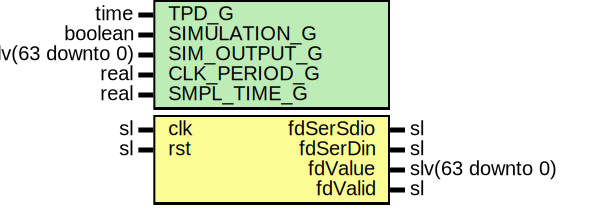

# Entity: DS2411Core

## Diagram

## Description

Company    : SLAC National Accelerator Laboratory
Description: Controller for DS2411 64-bit serial ID PROM
This file is part of 'SLAC Firmware Standard Library'.
It is subject to the license terms in the LICENSE.txt file found in the
top-level directory of this distribution and at:
   https://confluence.slac.stanford.edu/display/ppareg/LICENSE.html.
No part of 'SLAC Firmware Standard Library', including this file,
may be copied, modified, propagated, or distributed except according to
the terms contained in the LICENSE.txt file.
## Generics

| Generic name | Type             | Value               | Description |
| ------------ | ---------------- | ------------------- | ----------- |
| TPD_G        | time             | 1 ns                |             |
| SIMULATION_G | boolean          | false               |             |
| SIM_OUTPUT_G | slv(63 downto 0) | x"0123456789ABCDEF" |             |
| CLK_PERIOD_G | real             | 6.4E-9              |             |
| SMPL_TIME_G  | real             | 13.1E-6             |             |
## Ports

| Port name | Direction | Type             | Description                               |
| --------- | --------- | ---------------- | ----------------------------------------- |
| clk       | in        | sl               | Clock & Reset Signals                     |
| rst       | in        | sl               |                                           |
| fdSerSdio | inout     | sl               | ID Prom Signals                           |
| fdSerDin  | out       | sl               | output hookup of the fdSerSdio (optional) |
| fdValue   | out       | slv(63 downto 0) | Serial Number                             |
| fdValid   | out       | sl               |                                           |
## Signals

| Name              | Type             | Description |
| ----------------- | ---------------- | ----------- |
| curState          | StateType        |             |
| 
      nxtState   | StateType        |             |
| setOutLow         | sl               |             |
| 
      fdValidSet | sl               |             |
| 
      iFdSerDin  | sl               |             |
| 
      bitSet     | sl               |             |
| 
      bitCntEn   | sl               |             |
| bitCntRst         | sl               |             |
| 
      timeCntRst | sl               |             |
| timeCnt           | slv(31 downto 0) |             |
| bitCnt            | slv(5 downto 0)  |             |
| setOutLowInv      | sl               |             |
| fdSerial          | slv(63 downto 0) |             |
## Types

| Name      | Type                                                                                                                                                                                                                                                                                          | Description |
| --------- | --------------------------------------------------------------------------------------------------------------------------------------------------------------------------------------------------------------------------------------------------------------------------------------------- | ----------- |
| StateType | ( ST_START,  ST_RESET,  ST_WAIT,  ST_WRITE,  ST_PAUSE,  ST_READ,  ST_DONE)  |             |
