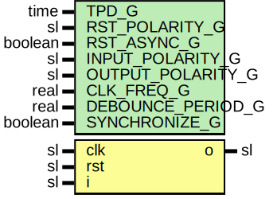

# Entity: Debouncer

- **File**: Debouncer.vhd
## Diagram

## Description

Company    : SLAC National Accelerator Laboratory
Description: Debouncer for pushbutton switches
This file is part of 'SLAC Firmware Standard Library'.
It is subject to the license terms in the LICENSE.txt file found in the
top-level directory of this distribution and at:
   https://confluence.slac.stanford.edu/display/ppareg/LICENSE.html.
No part of 'SLAC Firmware Standard Library', including this file,
may be copied, modified, propagated, or distributed except according to
the terms contained in the LICENSE.txt file.
## Generics

| Generic name      | Type    | Value      | Description                                 |
| ----------------- | ------- | ---------- | ------------------------------------------- |
| TPD_G             | time    | 1 ns       |                                             |
| RST_POLARITY_G    | sl      | '1'        | '1' for active high rst, '0' for active low |
| RST_ASYNC_G       | boolean | false      |                                             |
| INPUT_POLARITY_G  | sl      | '0'        |                                             |
| OUTPUT_POLARITY_G | sl      | '1'        |                                             |
| CLK_FREQ_G        | real    | 156.250E+6 | units of Hz                                 |
| DEBOUNCE_PERIOD_G | real    | 1.0E-3     | units of seconds                            |
| SYNCHRONIZE_G     | boolean | true       |                                             |
## Ports

| Port name | Direction | Type | Description |
| --------- | --------- | ---- | ----------- |
| clk       | in        | sl   |             |
| rst       | in        | sl   |             |
| i         | in        | sl   |             |
| o         | out       | sl   |             |
## Signals

| Name    | Type    | Description |
| ------- | ------- | ----------- |
| r       | RegType |             |
| rin     | RegType |             |
| iSynced | sl      |             |
## Constants

| Name          | Type            | Value                                                                                                                                                                                   | Description |
| ------------- | --------------- | --------------------------------------------------------------------------------------------------------------------------------------------------------------------------------------- | ----------- |
| CLK_PERIOD_C  | real            |  1.0/CLK_FREQ_G                                                                                                                                                                         |             |
| CNT_MAX_C     | natural         |  getTimeRatio(DEBOUNCE_PERIOD_G,  CLK_PERIOD_C) - 1                                                                                                  |             |
| POLARITY_EQ_C | boolean         |  ite(INPUT_POLARITY_G = OUTPUT_POLARITY_G,  true,  false)                                                         |             |
| SYNC_INIT_C   | slv(1 downto 0) |  (others => not INPUT_POLARITY_G)                                                                                                                                                       |             |
| REG_RESET_C   | RegType         |        (filter     => 0,         iSyncedDly => not INPUT_POLARITY_G,         o          => not OUTPUT_POLARITY_G) |             |
## Types

| Name    | Type | Description |
| ------- | ---- | ----------- |
| RegType |      |             |
## Processes
- comb: ( r, iSynced, rst )
- seq: ( clk, rst )
