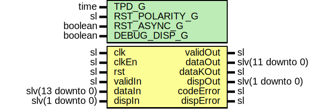

# Entity: Decoder12b14b

- **File**: Decoder12b14b.vhd
## Diagram

## Description

Title      : Line Code 12B14B: https://confluence.slac.stanford.edu/x/6AJODQ
Company    : SLAC National Accelerator Laboratory
Description: 12B14B Decoder Module
This file is part of 'SLAC Firmware Standard Library'.
It is subject to the license terms in the LICENSE.txt file found in the
top-level directory of this distribution and at:
   https://confluence.slac.stanford.edu/display/ppareg/LICENSE.html.
No part of 'SLAC Firmware Standard Library', including this file,
may be copied, modified, propagated, or distributed except according to
the terms contained in the LICENSE.txt file.
## Generics

| Generic name   | Type    | Value | Description |
| -------------- | ------- | ----- | ----------- |
| TPD_G          | time    | 1 ns  |             |
| RST_POLARITY_G | sl      | '0'   |             |
| RST_ASYNC_G    | boolean | false |             |
| DEBUG_DISP_G   | boolean | false |             |
## Ports

| Port name | Direction | Type             | Description           |
| --------- | --------- | ---------------- | --------------------- |
| clk       | in        | sl               |                       |
| clkEn     | in        | sl               | Optional Clock Enable |
| rst       | in        | sl               | Optional Reset        |
| validIn   | in        | sl               |                       |
| dataIn    | in        | slv(13 downto 0) |                       |
| dispIn    | in        | slv(1 downto 0)  |                       |
| validOut  | out       | sl               |                       |
| dataOut   | out       | slv(11 downto 0) |                       |
| dataKOut  | out       | sl               |                       |
| dispOut   | out       | slv(1 downto 0)  |                       |
| codeError | out       | sl               |                       |
| dispError | out       | sl               |                       |
## Signals

| Name | Type    | Description |
| ---- | ------- | ----------- |
| r    | RegType |             |
| rin  | RegType |             |
## Constants

| Name       | Type    | Value                                                                                                                                                                                                                                                                                                                                               | Description |
| ---------- | ------- | --------------------------------------------------------------------------------------------------------------------------------------------------------------------------------------------------------------------------------------------------------------------------------------------------------------------------------------------------- | ----------- |
| REG_INIT_C | RegType |  (       validOut  => '0',        dispOut   => "01",        dataOut   => (others => '0'),        dataKOut  => '0',        codeError => '0',        dispError => '0') |             |
## Types

| Name    | Type | Description |
| ------- | ---- | ----------- |
| RegType |      |             |
## Processes
- comb: ( dataIn, dispIn, r, rst, validIn )
- seq: ( clk, rst )
