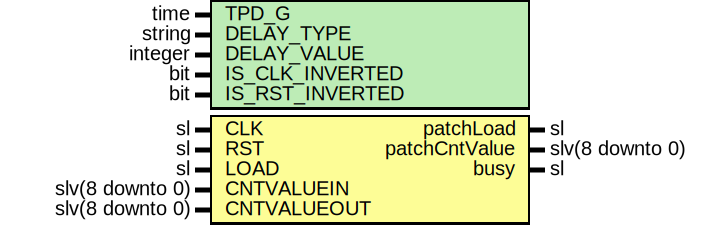

# Entity: Delaye3PatchFsm

- **File**: Delaye3PatchFsm.vhd
## Diagram

## Description

-----------------------------------------------------------------------------
 Company    : SLAC National Accelerator Laboratory
-----------------------------------------------------------------------------
 Description: FSM that patches the silicon's issue of increments > 8
 https://forums.xilinx.com/t5/Versal-and-UltraScale/IDELAY-ODELAY-Usage/td-p/812362
-----------------------------------------------------------------------------
 This file is part of 'SLAC Firmware Standard Library'.
 It is subject to the license terms in the LICENSE.txt file found in the
 top-level directory of this distribution and at:
    https://confluence.slac.stanford.edu/display/ppareg/LICENSE.html.
 No part of 'SLAC Firmware Standard Library', including this file,
 may be copied, modified, propagated, or distributed except according to
 the terms contained in the LICENSE.txt file.
-----------------------------------------------------------------------------
## Generics

| Generic name    | Type    | Value   | Description                                                 |
| --------------- | ------- | ------- | ----------------------------------------------------------- |
| TPD_G           | time    | 1 ns    |                                                             |
| DELAY_TYPE      | string  | "FIXED" |  Set the type of tap delay line (FIXED, VARIABLE, VAR_LOAD) |
| DELAY_VALUE     | integer | 0       |  Input delay value setting                                  |
| IS_CLK_INVERTED | bit     | '0'     |  Optional inversion for CLK                                 |
| IS_RST_INVERTED | bit     | '0'     |                                                             |
## Ports

| Port name     | Direction | Type            | Description                                         |
| ------------- | --------- | --------------- | --------------------------------------------------- |
| CLK           | in        | sl              |  1-bit input: Clock input                           |
| RST           | in        | sl              |  1-bit input: Asynchronous Reset to the DELAY_VALUE |
| LOAD          | in        | sl              |  1-bit input: Load DELAY_VALUE input                |
| CNTVALUEIN    | in        | slv(8 downto 0) |  9-bit input: Counter value input                   |
| CNTVALUEOUT   | in        | slv(8 downto 0) |  9-bit output: Counter value output                 |
| patchLoad     | out       | sl              | outputs                                             |
| patchCntValue | out       | slv(8 downto 0) |                                                     |
| busy          | out       | sl              |                                                     |
## Signals

| Name | Type    | Description |
| ---- | ------- | ----------- |
| r    | RegType |             |
| rin  | RegType |             |
## Constants

| Name       | Type    | Value                                                                                                                                                                                                                                                                                                                                                                                                 | Description |
| ---------- | ------- | ----------------------------------------------------------------------------------------------------------------------------------------------------------------------------------------------------------------------------------------------------------------------------------------------------------------------------------------------------------------------------------------------------- | ----------- |
| REG_INIT_C | RegType |  (       Load      => '0',        dlyValue  => toSlv(DELAY_VALUE,  9),        dlyTarget => toSlv(DELAY_VALUE,  9),        waitCnt   => (others => '0'),        state     => IDLE_S) |             |
## Types

| Name      | Type                                                                                               | Description |
| --------- | -------------------------------------------------------------------------------------------------- | ----------- |
| StateType | ( IDLE_S,  LOAD_S,  WAIT_S)  |             |
| RegType   |                                                                                                    |             |
