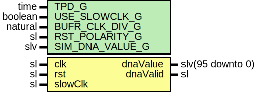

# Entity: DeviceDnaUltraScale

## Diagram

## Description

Company    : SLAC National Accelerator Laboratory
Description: Wrapper for the UltraScale DNA_PORT
This file is part of 'SLAC Firmware Standard Library'.
It is subject to the license terms in the LICENSE.txt file found in the
top-level directory of this distribution and at:
   https://confluence.slac.stanford.edu/display/ppareg/LICENSE.html.
No part of 'SLAC Firmware Standard Library', including this file,
may be copied, modified, propagated, or distributed except according to
the terms contained in the LICENSE.txt file.
## Generics

| Generic name    | Type    | Value                       | Description |
| --------------- | ------- | --------------------------- | ----------- |
| TPD_G           | time    | 1 ns                        |             |
| USE_SLOWCLK_G   | boolean | false                       |             |
| BUFR_CLK_DIV_G  | natural | 8                           |             |
| RST_POLARITY_G  | sl      | '1'                         |             |
| SIM_DNA_VALUE_G | slv     | x"000000000000000000000000" |             |
## Ports

| Port name | Direction | Type             | Description |
| --------- | --------- | ---------------- | ----------- |
| clk       | in        | sl               |             |
| rst       | in        | sl               |             |
| slowClk   | in        | sl               |             |
| dnaValue  | out       | slv(95 downto 0) |             |
| dnaValid  | out       | sl               |             |
## Signals

| Name    | Type    | Description |
| ------- | ------- | ----------- |
| r       | RegType |             |
| rin     | RegType |             |
| dnaDout | sl      |             |
| divClk  | sl      |             |
| locClk  | sl      |             |
| locRst  | sl      |             |
| dnaRead | sl      |             |
## Constants

| Name               | Type    | Value                                                                                                                                                                                                                                                                              | Description |
| ------------------ | ------- | ---------------------------------------------------------------------------------------------------------------------------------------------------------------------------------------------------------------------------------------------------------------------------------- | ----------- |
| DNA_SHIFT_LENGTH_C | natural |  96                                                                                                                                                                                                                                                                                |             |
| REG_INIT_C         | RegType |  (       state    => READ_S,        bitCount => 0,        dnaValue => (others => '0'),        dnaValid => '0',        dnaRead  => '1') |             |
## Types

| Name      | Type                                                                                               | Description |
| --------- | -------------------------------------------------------------------------------------------------- | ----------- |
| StateType | (READ_S,  SHIFT_S,  DONE_S)  |             |
| RegType   |                                                                                                    |             |
## Processes
- comb: ( dnaDout, locRst, r )
- sync: ( locClk )
## Instantiations

- BUFGCE_DIV_Inst: BUFGCE_DIV
- RstSync_Inst: surf.RstSync
- DNA_PORT_I: DNA_PORTE2
- SyncValid: surf.Synchronizer
- SyncData: surf.SynchronizerVector
