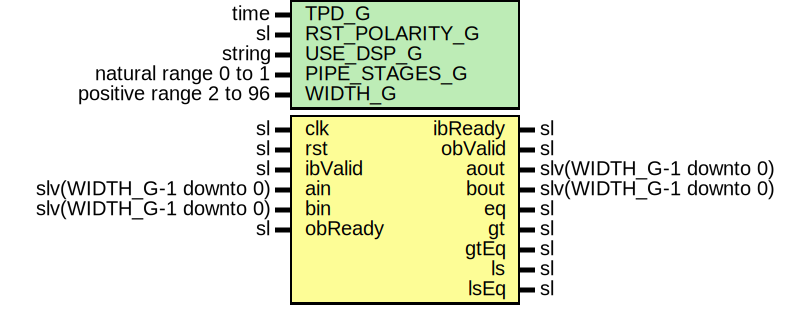

# Entity: DspComparator

## Diagram

## Description

Company    : SLAC National Accelerator Laboratory
Description: Generalized DSP inferred comparator
This file is part of 'SLAC Firmware Standard Library'.
It is subject to the license terms in the LICENSE.txt file found in the
top-level directory of this distribution and at:
   https://confluence.slac.stanford.edu/display/ppareg/LICENSE.html.
No part of 'SLAC Firmware Standard Library', including this file,
may be copied, modified, propagated, or distributed except according to
the terms contained in the LICENSE.txt file.
## Generics

| Generic name   | Type                   | Value | Description                                 |
| -------------- | ---------------------- | ----- | ------------------------------------------- |
| TPD_G          | time                   | 1 ns  |                                             |
| RST_POLARITY_G | sl                     | '1'   | '1' for active high rst, '0' for active low |
| USE_DSP_G      | string                 | "yes" |                                             |
| PIPE_STAGES_G  | natural range 0 to 1   | 0     |                                             |
| WIDTH_G        | positive range 2 to 96 | 32    |                                             |
## Ports

| Port name | Direction | Type                    | Description                       |
| --------- | --------- | ----------------------- | --------------------------------- |
| clk       | in        | sl                      |                                   |
| rst       | in        | sl                      |                                   |
| ibValid   | in        | sl                      | Inbound Interface                 |
| ibReady   | out       | sl                      |                                   |
| ain       | in        | slv(WIDTH_G-1 downto 0) |                                   |
| bin       | in        | slv(WIDTH_G-1 downto 0) |                                   |
| obValid   | out       | sl                      | Outbound Interface                |
| obReady   | in        | sl                      |                                   |
| aout      | out       | slv(WIDTH_G-1 downto 0) | Registered copy of ain            |
| bout      | out       | slv(WIDTH_G-1 downto 0) | Registered copy of bin            |
| eq        | out       | sl                      | equal                    (a =  b) |
| gt        | out       | sl                      | greater than             (a >  b) |
| gtEq      | out       | sl                      | greater than or equal to (a >= b) |
| ls        | out       | sl                      | less than                (a <  b) |
| lsEq      | out       | sl                      |                                   |
## Signals

| Name    | Type                        | Description |
| ------- | --------------------------- | ----------- |
| r       | RegType                     |             |
| rin     | RegType                     |             |
| tReady  | sl                          |             |
| eqInt   | sl                          |             |
| gtInt   | sl                          |             |
| gtEqInt | sl                          |             |
| lsInt   | sl                          |             |
| lsEqInt | sl                          |             |
| sData   | slv(2*WIDTH_G-1+5 downto 0) |             |
| mData   | slv(2*WIDTH_G-1+5 downto 0) |             |
## Constants

| Name       | Type    | Value                                                                                                                                                                                                                                                                                                | Description |
| ---------- | ------- | ---------------------------------------------------------------------------------------------------------------------------------------------------------------------------------------------------------------------------------------------------------------------------------------------------- | ----------- |
| REG_INIT_C | RegType |  (       ibReady => '0',        tValid  => '0',        aout    => (others => '0'),        bout    => (others => '0'),        diff    => (others => '0')) |             |
## Types

| Name    | Type | Description |
| ------- | ---- | ----------- |
| RegType |      |             |
## Processes
- comb: ( ain, bin, ibValid, r, rst, tReady )
- seq: ( clk )
## Instantiations

- U_Pipe: surf.FifoOutputPipeline
