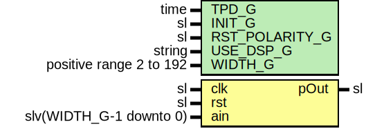

# Entity: DspXor

## Diagram

## Description

Company    : SLAC National Accelerator Laboratory
Description: Generalized DSP inferred XOR, which can be used to help with
             performance when implementing FEC and CRC algorithms
Equation: p = XOR(a[i])
This file is part of 'SLAC Firmware Standard Library'.
It is subject to the license terms in the LICENSE.txt file found in the
top-level directory of this distribution and at:
   https://confluence.slac.stanford.edu/display/ppareg/LICENSE.html.
No part of 'SLAC Firmware Standard Library', including this file,
may be copied, modified, propagated, or distributed except according to
the terms contained in the LICENSE.txt file.
## Generics

| Generic name   | Type                    | Value   | Description                                         |
| -------------- | ----------------------- | ------- | --------------------------------------------------- |
| TPD_G          | time                    | 1 ns    |                                                     |
| INIT_G         | sl                      | '1'     |                                                     |
| RST_POLARITY_G | sl                      | '1'     | '1' for active HIGH reset, '0' for active LOW reset |
| USE_DSP_G      | string                  | "logic" |                                                     |
| WIDTH_G        | positive range 2 to 192 | 96      |                                                     |
## Ports

| Port name | Direction | Type                    | Description        |
| --------- | --------- | ----------------------- | ------------------ |
| clk       | in        | sl                      |                    |
| rst       | in        | sl                      |                    |
| ain       | in        | slv(WIDTH_G-1 downto 0) | Inbound Interface  |
| pOut      | out       | sl                      | Outbound Interface |
## Signals

| Name | Type    | Description |
| ---- | ------- | ----------- |
| r    | RegType |             |
| rin  | RegType |             |
## Constants

| Name       | Type    | Value                 | Description |
| ---------- | ------- | --------------------- | ----------- |
| REG_INIT_C | RegType |  (       p => INIT_G) |             |
## Types

| Name    | Type | Description |
| ------- | ---- | ----------- |
| RegType |      |             |
## Processes
- comb: ( ain, r )
- seq: ( clk, rst )
