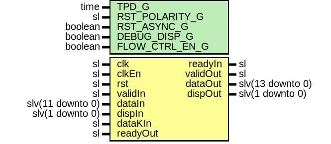

# Entity: Encoder12b14b

- **File**: Encoder12b14b.vhd
## Diagram

## Description

-----------------------------------------------------------------------------
 Title      : Line Code 12B14B: https://confluence.slac.stanford.edu/x/6AJODQ
-----------------------------------------------------------------------------
 Company    : SLAC National Accelerator Laboratory
-----------------------------------------------------------------------------
 Description: 12B14B Encoder Module
-----------------------------------------------------------------------------
 This file is part of 'SLAC Firmware Standard Library'.
 It is subject to the license terms in the LICENSE.txt file found in the
 top-level directory of this distribution and at:
    https://confluence.slac.stanford.edu/display/ppareg/LICENSE.html.
 No part of 'SLAC Firmware Standard Library', including this file,
 may be copied, modified, propagated, or distributed except according to
 the terms contained in the LICENSE.txt file.
-----------------------------------------------------------------------------
## Generics

| Generic name   | Type    | Value | Description |
| -------------- | ------- | ----- | ----------- |
| TPD_G          | time    | 1 ns  |             |
| RST_POLARITY_G | sl      | '0'   |             |
| RST_ASYNC_G    | boolean | false |             |
| DEBUG_DISP_G   | boolean | false |             |
| FLOW_CTRL_EN_G | boolean | false |             |
## Ports

| Port name | Direction | Type             | Description            |
| --------- | --------- | ---------------- | ---------------------- |
| clk       | in        | sl               |                        |
| clkEn     | in        | sl               |  Optional Clock Enable |
| rst       | in        | sl               |  Optional Reset        |
| validIn   | in        | sl               |                        |
| readyIn   | out       | sl               |                        |
| dataIn    | in        | slv(11 downto 0) |                        |
| dispIn    | in        | slv(1 downto 0)  |                        |
| dataKIn   | in        | sl               |                        |
| validOut  | out       | sl               |                        |
| readyOut  | in        | sl               |                        |
| dataOut   | out       | slv(13 downto 0) |                        |
| dispOut   | out       | slv(1 downto 0)  |                        |
## Signals

| Name | Type    | Description              |
| ---- | ------- | ------------------------ |
| r    | RegType |       invalidK => '0');  |
| rin  | RegType |                          |
## Constants

| Name       | Type    | Value                                                                                                                                                                                                                                        | Description |
| ---------- | ------- | -------------------------------------------------------------------------------------------------------------------------------------------------------------------------------------------------------------------------------------------- | ----------- |
| REG_INIT_C | RegType |  (       validOut => toSl(not FLOW_CTRL_EN_G),        readyIn  => '0',        dispOut  => "00",        dataOut  => (others => '0')) |             |
## Types

| Name    | Type | Description |
| ------- | ---- | ----------- |
| RegType |      |             |
## Processes
- comb: ( dataIn, dataKIn, dispIn, r, rst )
- seq: ( clk, rst )
