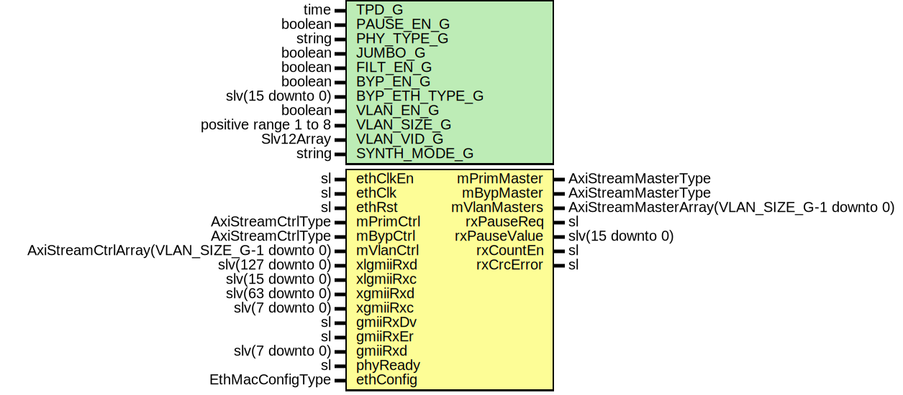

# Entity: EthMacRx

- **File**: EthMacRx.vhd
## Diagram

## Description

-----------------------------------------------------------------------------
 Company    : SLAC National Accelerator Laboratory
-----------------------------------------------------------------------------
 Description: Ethernet MAC RX Wrapper
-----------------------------------------------------------------------------
 This file is part of 'SLAC Firmware Standard Library'.
 It is subject to the license terms in the LICENSE.txt file found in the
 top-level directory of this distribution and at:
    https://confluence.slac.stanford.edu/display/ppareg/LICENSE.html.
 No part of 'SLAC Firmware Standard Library', including this file,
 may be copied, modified, propagated, or distributed except according to
 the terms contained in the LICENSE.txt file.
-----------------------------------------------------------------------------
## Generics

| Generic name   | Type                  | Value         | Description                 |
| -------------- | --------------------- | ------------- | --------------------------- |
| TPD_G          | time                  | 1 ns          | Simulation Generics         |
| PAUSE_EN_G     | boolean               | true          | MAC Configurations          |
| PHY_TYPE_G     | string                | "XGMII"       |                             |
| JUMBO_G        | boolean               | true          |                             |
| FILT_EN_G      | boolean               | false         | Non-VLAN Configurations     |
| BYP_EN_G       | boolean               | false         |                             |
| BYP_ETH_TYPE_G | slv(15 downto 0)      | x"0000"       |                             |
| VLAN_EN_G      | boolean               | false         | VLAN Configurations         |
| VLAN_SIZE_G    | positive range 1 to 8 | 1             |                             |
| VLAN_VID_G     | Slv12Array            | (0 => x"001") |                             |
| SYNTH_MODE_G   | string                | "inferred"    | Internal RAM sythesis mode  |
## Ports

| Port name    | Direction | Type                                         | Description              |
| ------------ | --------- | -------------------------------------------- | ------------------------ |
| ethClkEn     | in        | sl                                           | Clock and Reset          |
| ethClk       | in        | sl                                           |                          |
| ethRst       | in        | sl                                           |                          |
| mPrimMaster  | out       | AxiStreamMasterType                          | Primary Interface        |
| mPrimCtrl    | in        | AxiStreamCtrlType                            |                          |
| mBypMaster   | out       | AxiStreamMasterType                          | Bypass Interface         |
| mBypCtrl     | in        | AxiStreamCtrlType                            |                          |
| mVlanMasters | out       | AxiStreamMasterArray(VLAN_SIZE_G-1 downto 0) | VLAN Interfaces          |
| mVlanCtrl    | in        | AxiStreamCtrlArray(VLAN_SIZE_G-1 downto 0)   |                          |
| xlgmiiRxd    | in        | slv(127 downto 0)                            | XLGMII PHY Interface     |
| xlgmiiRxc    | in        | slv(15 downto 0)                             |                          |
| xgmiiRxd     | in        | slv(63 downto 0)                             | XGMII PHY Interface      |
| xgmiiRxc     | in        | slv(7 downto 0)                              |                          |
| gmiiRxDv     | in        | sl                                           | GMII PHY Interface       |
| gmiiRxEr     | in        | sl                                           |                          |
| gmiiRxd      | in        | slv(7 downto 0)                              |                          |
| rxPauseReq   | out       | sl                                           | Flow Control Interface   |
| rxPauseValue | out       | slv(15 downto 0)                             |                          |
| phyReady     | in        | sl                                           | Configuration and status |
| ethConfig    | in        | EthMacConfigType                             |                          |
| rxCountEn    | out       | sl                                           |                          |
| rxCrcError   | out       | sl                                           |                          |
## Signals

| Name         | Type                                         | Description |
| ------------ | -------------------------------------------- | ----------- |
| macIbMaster  | AxiStreamMasterType                          |             |
| pauseMaster  | AxiStreamMasterType                          |             |
| pauseMasters | AxiStreamMasterArray(VLAN_SIZE_G-1 downto 0) |             |
| csumMaster   | AxiStreamMasterType                          |             |
| bypassMaster | AxiStreamMasterType                          |             |
## Instantiations

- U_Import: surf.EthMacRxImport
- U_Pause: surf.EthMacRxPause
**Description**
----------------
 RX Pause Module
----------------

- U_Csum: surf.EthMacRxCsum
**Description**
----------------------------
 RX Non-VLAN Checksum Module
----------------------------

- U_Bypass: surf.EthMacRxBypass
**Description**
-----------------
 RX Bypass Module
-----------------

- U_Filter: surf.EthMacRxFilter
**Description**
-----------------
 RX Filter Module
-----------------

