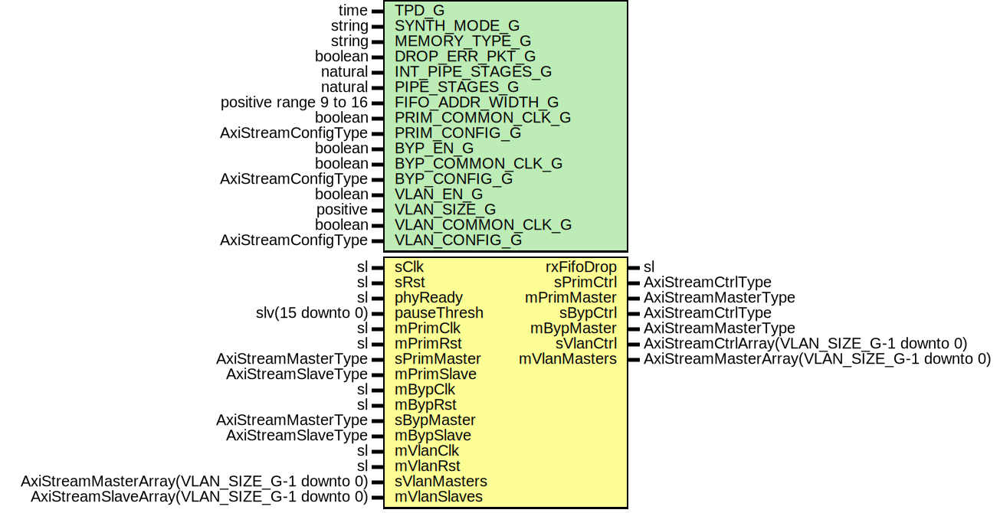

# Entity: EthMacRxFifo

- **File**: EthMacRxFifo.vhd
## Diagram

## Description

-----------------------------------------------------------------------------
 Company    : SLAC National Accelerator Laboratory
-----------------------------------------------------------------------------
 Description: Outbound FIFO buffers
-----------------------------------------------------------------------------
 This file is part of 'SLAC Firmware Standard Library'.
 It is subject to the license terms in the LICENSE.txt file found in the
 top-level directory of this distribution and at:
    https://confluence.slac.stanford.edu/display/ppareg/LICENSE.html.
 No part of 'SLAC Firmware Standard Library', including this file,
 may be copied, modified, propagated, or distributed except according to
 the terms contained in the LICENSE.txt file.
-----------------------------------------------------------------------------
## Generics

| Generic name      | Type                   | Value                  | Description |
| ----------------- | ---------------------- | ---------------------- | ----------- |
| TPD_G             | time                   | 1 ns                   |             |
| SYNTH_MODE_G      | string                 | "inferred"             |             |
| MEMORY_TYPE_G     | string                 | "block"                |             |
| DROP_ERR_PKT_G    | boolean                | true                   |             |
| INT_PIPE_STAGES_G | natural                | 1                      |             |
| PIPE_STAGES_G     | natural                | 1                      |             |
| FIFO_ADDR_WIDTH_G | positive range 9 to 16 | 11                     |             |
| PRIM_COMMON_CLK_G | boolean                | false                  |             |
| PRIM_CONFIG_G     | AxiStreamConfigType    | INT_EMAC_AXIS_CONFIG_C |             |
| BYP_EN_G          | boolean                | false                  |             |
| BYP_COMMON_CLK_G  | boolean                | false                  |             |
| BYP_CONFIG_G      | AxiStreamConfigType    | INT_EMAC_AXIS_CONFIG_C |             |
| VLAN_EN_G         | boolean                | false                  |             |
| VLAN_SIZE_G       | positive               | 1                      |             |
| VLAN_COMMON_CLK_G | boolean                | false                  |             |
| VLAN_CONFIG_G     | AxiStreamConfigType    | INT_EMAC_AXIS_CONFIG_C |             |
## Ports

| Port name    | Direction | Type                                         | Description                 |
| ------------ | --------- | -------------------------------------------- | --------------------------- |
| sClk         | in        | sl                                           | Clock and Reset             |
| sRst         | in        | sl                                           |                             |
| phyReady     | in        | sl                                           | Status/Config (sClk domain) |
| rxFifoDrop   | out       | sl                                           |                             |
| pauseThresh  | in        | slv(15 downto 0)                             |                             |
| mPrimClk     | in        | sl                                           | Primary Interface           |
| mPrimRst     | in        | sl                                           |                             |
| sPrimMaster  | in        | AxiStreamMasterType                          |                             |
| sPrimCtrl    | out       | AxiStreamCtrlType                            |                             |
| mPrimMaster  | out       | AxiStreamMasterType                          |                             |
| mPrimSlave   | in        | AxiStreamSlaveType                           |                             |
| mBypClk      | in        | sl                                           | Bypass interface            |
| mBypRst      | in        | sl                                           |                             |
| sBypMaster   | in        | AxiStreamMasterType                          |                             |
| sBypCtrl     | out       | AxiStreamCtrlType                            |                             |
| mBypMaster   | out       | AxiStreamMasterType                          |                             |
| mBypSlave    | in        | AxiStreamSlaveType                           |                             |
| mVlanClk     | in        | sl                                           | VLAN Interfaces             |
| mVlanRst     | in        | sl                                           |                             |
| sVlanMasters | in        | AxiStreamMasterArray(VLAN_SIZE_G-1 downto 0) |                             |
| sVlanCtrl    | out       | AxiStreamCtrlArray(VLAN_SIZE_G-1 downto 0)   |                             |
| mVlanMasters | out       | AxiStreamMasterArray(VLAN_SIZE_G-1 downto 0) |                             |
| mVlanSlaves  | in        | AxiStreamSlaveArray(VLAN_SIZE_G-1 downto 0)  |                             |
## Signals

| Name      | Type                        | Description |
| --------- | --------------------------- | ----------- |
| r         | RegType                     |             |
| rin       | RegType                     |             |
| primDrop  | sl                          |             |
| bypDrop   | sl                          |             |
| vlanDrops | slv(VLAN_SIZE_G-1 downto 0) |             |
## Constants

| Name             | Type                              | Value                                                                                                           | Description |
| ---------------- | --------------------------------- | --------------------------------------------------------------------------------------------------------------- | ----------- |
| MAX_THRESH_SLV_C | slv(FIFO_ADDR_WIDTH_G-1 downto 0) |  (others => '1')                                                                                                |             |
| VALID_THOLD_C    | natural                           |  ite(DROP_ERR_PKT_G,  0,  1)              |             |
| REG_INIT_C       | RegType                           |  (       rxFifoDrop      => '0',        fifoPauseThresh => MAX_THRESH_SLV_C) |             |
## Types

| Name    | Type | Description |
| ------- | ---- | ----------- |
| RegType |      |             |
## Processes
- comb: ( bypDrop, pauseThresh, phyReady, primDrop, r, sRst,
                   vlanDrops )
- seq: ( sClk )
## Instantiations

- U_Fifo: surf.SsiFifo
