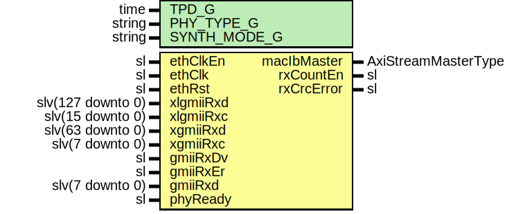

# Entity: EthMacRxImport

- **File**: EthMacRxImport.vhd
## Diagram

## Description

Company    : SLAC National Accelerator Laboratory
Description: Mapping for 1GbE/10GbE/40GbE ETH MAC RX path
This file is part of 'SLAC Firmware Standard Library'.
It is subject to the license terms in the LICENSE.txt file found in the
top-level directory of this distribution and at:
   https://confluence.slac.stanford.edu/display/ppareg/LICENSE.html.
No part of 'SLAC Firmware Standard Library', including this file,
may be copied, modified, propagated, or distributed except according to
the terms contained in the LICENSE.txt file.
## Generics

| Generic name | Type   | Value      | Description |
| ------------ | ------ | ---------- | ----------- |
| TPD_G        | time   | 1 ns       |             |
| PHY_TYPE_G   | string | "XGMII"    |             |
| SYNTH_MODE_G | string | "inferred" |             |
## Ports

| Port name   | Direction | Type                | Description              |
| ----------- | --------- | ------------------- | ------------------------ |
| ethClkEn    | in        | sl                  | Clock and Reset          |
| ethClk      | in        | sl                  |                          |
| ethRst      | in        | sl                  |                          |
| macIbMaster | out       | AxiStreamMasterType | AXIS Interface           |
| xlgmiiRxd   | in        | slv(127 downto 0)   | XLGMII PHY Interface     |
| xlgmiiRxc   | in        | slv(15 downto 0)    |                          |
| xgmiiRxd    | in        | slv(63 downto 0)    | XGMII PHY Interface      |
| xgmiiRxc    | in        | slv(7 downto 0)     |                          |
| gmiiRxDv    | in        | sl                  | GMII PHY Interface       |
| gmiiRxEr    | in        | sl                  |                          |
| gmiiRxd     | in        | slv(7 downto 0)     |                          |
| phyReady    | in        | sl                  | Configuration and status |
| rxCountEn   | out       | sl                  |                          |
| rxCrcError  | out       | sl                  |                          |
