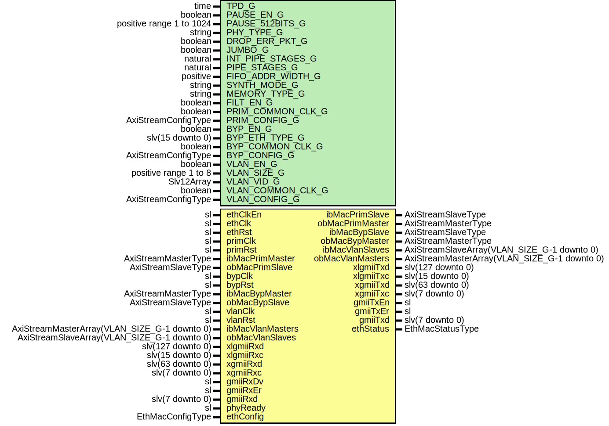

# Entity: EthMacTop

- **File**: EthMacTop.vhd
## Diagram

## Description

-----------------------------------------------------------------------------
 Company    : SLAC National Accelerator Laboratory
-----------------------------------------------------------------------------
 Description: Top-level for 1GbE/10GbE/40GbE ETH MAC Module
-----------------------------------------------------------------------------
 This file is part of 'SLAC Firmware Standard Library'.
 It is subject to the license terms in the LICENSE.txt file found in the
 top-level directory of this distribution and at:
    https://confluence.slac.stanford.edu/display/ppareg/LICENSE.html.
 No part of 'SLAC Firmware Standard Library', including this file,
 may be copied, modified, propagated, or distributed except according to
 the terms contained in the LICENSE.txt file.
-----------------------------------------------------------------------------
## Generics

| Generic name      | Type                     | Value              | Description                                                  |
| ----------------- | ------------------------ | ------------------ | ------------------------------------------------------------ |
| TPD_G             | time                     | 1 ns               | Simulation Generics                                          |
| PAUSE_EN_G        | boolean                  | true               | MAC Configurations                                           |
| PAUSE_512BITS_G   | positive range 1 to 1024 | 8                  |  For 10GbE: 8 clock cycles for 512 bits = one pause "quanta" |
| PHY_TYPE_G        | string                   | "XGMII"            |  "GMII", "XGMII", or "XLGMII"                                |
| DROP_ERR_PKT_G    | boolean                  | true               |                                                              |
| JUMBO_G           | boolean                  | true               |                                                              |
| INT_PIPE_STAGES_G | natural                  | 1                  | RX FIFO Configurations                                       |
| PIPE_STAGES_G     | natural                  | 1                  |                                                              |
| FIFO_ADDR_WIDTH_G | positive                 | 11                 |                                                              |
| SYNTH_MODE_G      | string                   | "inferred"         |                                                              |
| MEMORY_TYPE_G     | string                   | "block"            |                                                              |
| FILT_EN_G         | boolean                  | false              | Non-VLAN Configurations                                      |
| PRIM_COMMON_CLK_G | boolean                  | false              |                                                              |
| PRIM_CONFIG_G     | AxiStreamConfigType      | EMAC_AXIS_CONFIG_C |                                                              |
| BYP_EN_G          | boolean                  | false              |                                                              |
| BYP_ETH_TYPE_G    | slv(15 downto 0)         | x"0000"            |                                                              |
| BYP_COMMON_CLK_G  | boolean                  | false              |                                                              |
| BYP_CONFIG_G      | AxiStreamConfigType      | EMAC_AXIS_CONFIG_C |                                                              |
| VLAN_EN_G         | boolean                  | false              | VLAN Configurations                                          |
| VLAN_SIZE_G       | positive range 1 to 8    | 1                  |                                                              |
| VLAN_VID_G        | Slv12Array               | (0 => x"001")      |                                                              |
| VLAN_COMMON_CLK_G | boolean                  | false              |                                                              |
| VLAN_CONFIG_G     | AxiStreamConfigType      | EMAC_AXIS_CONFIG_C |                                                              |
## Ports

| Port name        | Direction | Type                                         | Description              |
| ---------------- | --------- | -------------------------------------------- | ------------------------ |
| ethClkEn         | in        | sl                                           | Core Clock and Reset     |
| ethClk           | in        | sl                                           |                          |
| ethRst           | in        | sl                                           |                          |
| primClk          | in        | sl                                           | Primary Interface        |
| primRst          | in        | sl                                           |                          |
| ibMacPrimMaster  | in        | AxiStreamMasterType                          |                          |
| ibMacPrimSlave   | out       | AxiStreamSlaveType                           |                          |
| obMacPrimMaster  | out       | AxiStreamMasterType                          |                          |
| obMacPrimSlave   | in        | AxiStreamSlaveType                           |                          |
| bypClk           | in        | sl                                           | Bypass interface         |
| bypRst           | in        | sl                                           |                          |
| ibMacBypMaster   | in        | AxiStreamMasterType                          |                          |
| ibMacBypSlave    | out       | AxiStreamSlaveType                           |                          |
| obMacBypMaster   | out       | AxiStreamMasterType                          |                          |
| obMacBypSlave    | in        | AxiStreamSlaveType                           |                          |
| vlanClk          | in        | sl                                           | VLAN Interfaces          |
| vlanRst          | in        | sl                                           |                          |
| ibMacVlanMasters | in        | AxiStreamMasterArray(VLAN_SIZE_G-1 downto 0) |                          |
| ibMacVlanSlaves  | out       | AxiStreamSlaveArray(VLAN_SIZE_G-1 downto 0)  |                          |
| obMacVlanMasters | out       | AxiStreamMasterArray(VLAN_SIZE_G-1 downto 0) |                          |
| obMacVlanSlaves  | in        | AxiStreamSlaveArray(VLAN_SIZE_G-1 downto 0)  |                          |
| xlgmiiRxd        | in        | slv(127 downto 0)                            | XLGMII PHY Interface     |
| xlgmiiRxc        | in        | slv(15 downto 0)                             |                          |
| xlgmiiTxd        | out       | slv(127 downto 0)                            |                          |
| xlgmiiTxc        | out       | slv(15 downto 0)                             |                          |
| xgmiiRxd         | in        | slv(63 downto 0)                             | XGMII PHY Interface      |
| xgmiiRxc         | in        | slv(7 downto 0)                              |                          |
| xgmiiTxd         | out       | slv(63 downto 0)                             |                          |
| xgmiiTxc         | out       | slv(7 downto 0)                              |                          |
| gmiiRxDv         | in        | sl                                           | GMII PHY Interface       |
| gmiiRxEr         | in        | sl                                           |                          |
| gmiiRxd          | in        | slv(7 downto 0)                              |                          |
| gmiiTxEn         | out       | sl                                           |                          |
| gmiiTxEr         | out       | sl                                           |                          |
| gmiiTxd          | out       | slv(7 downto 0)                              |                          |
| phyReady         | in        | sl                                           | Configuration and status |
| ethConfig        | in        | EthMacConfigType                             |                          |
| ethStatus        | out       | EthMacStatusType                             |                          |
## Signals

| Name         | Type                                         | Description |
| ------------ | -------------------------------------------- | ----------- |
| sPrimMaster  | AxiStreamMasterType                          |             |
| sPrimSlave   | AxiStreamSlaveType                           |             |
| mPrimMaster  | AxiStreamMasterType                          |             |
| mPrimCtrl    | AxiStreamCtrlType                            |             |
| sBypMaster   | AxiStreamMasterType                          |             |
| sBypSlave    | AxiStreamSlaveType                           |             |
| mBypMaster   | AxiStreamMasterType                          |             |
| mBypCtrl     | AxiStreamCtrlType                            |             |
| sVlanMasters | AxiStreamMasterArray(VLAN_SIZE_G-1 downto 0) |             |
| sVlanSlaves  | AxiStreamSlaveArray(VLAN_SIZE_G-1 downto 0)  |             |
| mVlanMasters | AxiStreamMasterArray(VLAN_SIZE_G-1 downto 0) |             |
| mVlanCtrl    | AxiStreamCtrlArray(VLAN_SIZE_G-1 downto 0)   |             |
| rxPauseReq   | sl                                           |             |
| rxPauseValue | slv(15 downto 0)                             |             |
| flowCtrl     | AxiStreamCtrlType                            |             |
## Instantiations

- U_TxFifo: surf.EthMacTxFifo
 **Description**
--------
 TX FIFO
--------

- U_Tx: surf.EthMacTx
 **Description**
----------
 TX Module
----------

- U_FlowCtrl: surf.EthMacFlowCtrl
 **Description**
-------------------
 Flow Control Logic
-------------------

- U_Rx: surf.EthMacRx
 **Description**
----------
 RX Module
----------

- U_RxFifo: surf.EthMacRxFifo
 **Description**
--------
 RX FIFO
--------

