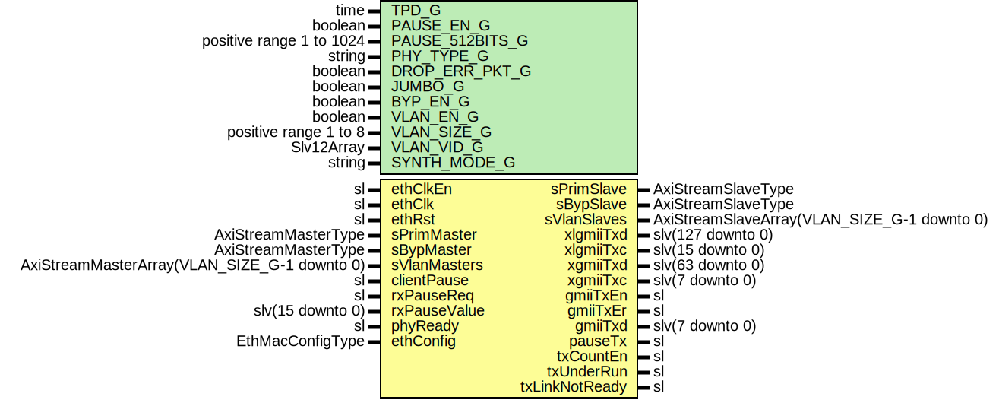

# Entity: EthMacTx

- **File**: EthMacTx.vhd
## Diagram

## Description

-----------------------------------------------------------------------------
 Company    : SLAC National Accelerator Laboratory
-----------------------------------------------------------------------------
 Description: Ethernet MAC TX Wrapper
-----------------------------------------------------------------------------
 This file is part of 'SLAC Firmware Standard Library'.
 It is subject to the license terms in the LICENSE.txt file found in the
 top-level directory of this distribution and at:
    https://confluence.slac.stanford.edu/display/ppareg/LICENSE.html.
 No part of 'SLAC Firmware Standard Library', including this file,
 may be copied, modified, propagated, or distributed except according to
 the terms contained in the LICENSE.txt file.
-----------------------------------------------------------------------------
## Generics

| Generic name    | Type                     | Value         | Description              |
| --------------- | ------------------------ | ------------- | ------------------------ |
| TPD_G           | time                     | 1 ns          | Simulation Generics      |
| PAUSE_EN_G      | boolean                  | true          | MAC Configurations       |
| PAUSE_512BITS_G | positive range 1 to 1024 | 8             |                          |
| PHY_TYPE_G      | string                   | "XGMII"       |                          |
| DROP_ERR_PKT_G  | boolean                  | true          |                          |
| JUMBO_G         | boolean                  | true          |                          |
| BYP_EN_G        | boolean                  | false         | Non-VLAN Configurations  |
| VLAN_EN_G       | boolean                  | false         | VLAN Configurations      |
| VLAN_SIZE_G     | positive range 1 to 8    | 1             |                          |
| VLAN_VID_G      | Slv12Array               | (0 => x"001") |                          |
| SYNTH_MODE_G    | string                   | "inferred"    | RAM Synthesis mode       |
## Ports

| Port name      | Direction | Type                                         | Description              |
| -------------- | --------- | -------------------------------------------- | ------------------------ |
| ethClkEn       | in        | sl                                           | Clock and Reset          |
| ethClk         | in        | sl                                           |                          |
| ethRst         | in        | sl                                           |                          |
| sPrimMaster    | in        | AxiStreamMasterType                          | Primary Interface        |
| sPrimSlave     | out       | AxiStreamSlaveType                           |                          |
| sBypMaster     | in        | AxiStreamMasterType                          | Bypass interface         |
| sBypSlave      | out       | AxiStreamSlaveType                           |                          |
| sVlanMasters   | in        | AxiStreamMasterArray(VLAN_SIZE_G-1 downto 0) | VLAN Interfaces          |
| sVlanSlaves    | out       | AxiStreamSlaveArray(VLAN_SIZE_G-1 downto 0)  |                          |
| xlgmiiTxd      | out       | slv(127 downto 0)                            | XLGMII PHY Interface     |
| xlgmiiTxc      | out       | slv(15 downto 0)                             |                          |
| xgmiiTxd       | out       | slv(63 downto 0)                             | XGMII PHY Interface      |
| xgmiiTxc       | out       | slv(7 downto 0)                              |                          |
| gmiiTxEn       | out       | sl                                           | GMII PHY Interface       |
| gmiiTxEr       | out       | sl                                           |                          |
| gmiiTxd        | out       | slv(7 downto 0)                              |                          |
| clientPause    | in        | sl                                           | Flow control Interface   |
| rxPauseReq     | in        | sl                                           |                          |
| rxPauseValue   | in        | slv(15 downto 0)                             |                          |
| pauseTx        | out       | sl                                           |                          |
| phyReady       | in        | sl                                           | Configuration and status |
| ethConfig      | in        | EthMacConfigType                             |                          |
| txCountEn      | out       | sl                                           |                          |
| txUnderRun     | out       | sl                                           |                          |
| txLinkNotReady | out       | sl                                           |                          |
## Signals

| Name         | Type                                         | Description |
| ------------ | -------------------------------------------- | ----------- |
| bypassMaster | AxiStreamMasterType                          |             |
| bypassSlave  | AxiStreamSlaveType                           |             |
| csumMaster   | AxiStreamMasterType                          |             |
| csumSlave    | AxiStreamSlaveType                           |             |
| csumMasters  | AxiStreamMasterArray(VLAN_SIZE_G-1 downto 0) |             |
| csumSlaves   | AxiStreamSlaveArray(VLAN_SIZE_G-1 downto 0)  |             |
| macObMaster  | AxiStreamMasterType                          |             |
| macObSlave   | AxiStreamSlaveType                           |             |
## Instantiations

- U_Bypass: surf.EthMacTxBypass
- U_Csum: surf.EthMacTxCsum
 **Description**
----------------------------
 TX Non-VLAN Checksum Module
----------------------------

- U_Pause: surf.EthMacTxPause
 **Description**
----------------
 TX Pause Module
----------------

- U_Export: surf.EthMacTxExport
 **Description**
---------------------
 TX MAC Export Module
---------------------

