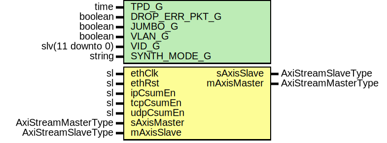

# Entity: EthMacTxCsum

- **File**: EthMacTxCsum.vhd
## Diagram

## Description

-----------------------------------------------------------------------------
 Company    : SLAC National Accelerator Laboratory
-----------------------------------------------------------------------------
 Description: TX Checksum Hardware Offloading Engine
 https://docs.google.com/spreadsheets/d/1_1M1keasfq8RLmRYHkO0IlRhMq5YZTgJ7OGrWvkib8I/edit?usp=sharing
-----------------------------------------------------------------------------
 This file is part of 'SLAC Firmware Standard Library'.
 It is subject to the license terms in the LICENSE.txt file found in the
 top-level directory of this distribution and at:
    https://confluence.slac.stanford.edu/display/ppareg/LICENSE.html.
 No part of 'SLAC Firmware Standard Library', including this file,
 may be copied, modified, propagated, or distributed except according to
 the terms contained in the LICENSE.txt file.
-----------------------------------------------------------------------------
## Generics

| Generic name   | Type             | Value      | Description |
| -------------- | ---------------- | ---------- | ----------- |
| TPD_G          | time             | 1 ns       |             |
| DROP_ERR_PKT_G | boolean          | true       |             |
| JUMBO_G        | boolean          | true       |             |
| VLAN_G         | boolean          | false      |             |
| VID_G          | slv(11 downto 0) | x"001"     |             |
| SYNTH_MODE_G   | string           | "inferred" |             |
## Ports

| Port name   | Direction | Type                | Description          |
| ----------- | --------- | ------------------- | -------------------- |
| ethClk      | in        | sl                  | Clock and Reset      |
| ethRst      | in        | sl                  |                      |
| ipCsumEn    | in        | sl                  | Configurations       |
| tcpCsumEn   | in        | sl                  |                      |
| udpCsumEn   | in        | sl                  |                      |
| sAxisMaster | in        | AxiStreamMasterType | Outbound data to MAC |
| sAxisSlave  | out       | AxiStreamSlaveType  |                      |
| mAxisMaster | out       | AxiStreamMasterType |                      |
| mAxisSlave  | in        | AxiStreamSlaveType  |                      |
## Signals

| Name      | Type                | Description |
| --------- | ------------------- | ----------- |
| r         | RegType             |             |
| rin       | RegType             |             |
| rxMaster  | AxiStreamMasterType |             |
| rxSlave   | AxiStreamSlaveType  |             |
| sMaster   | AxiStreamMasterType |             |
| sSlave    | AxiStreamSlaveType  |             |
| mMaster   | AxiStreamMasterType |             |
| mSlave    | AxiStreamSlaveType  |             |
| txMaster  | AxiStreamMasterType |             |
| txSlave   | AxiStreamSlaveType  |             |
| tranPause | sl                  |             |
| fragDet   | sl                  |             |
| eofeDet   | sl                  |             |
| ipv4Det   | sl                  |             |
| udpDet    | sl                  |             |
| tcpDet    | sl                  |             |
| ipv4Len   | slv(15 downto 0)    |             |
| ipv4Csum  | slv(15 downto 0)    |             |
| protLen   | slv(15 downto 0)    |             |
| protCsum  | slv(15 downto 0)    |             |
| tranValid | sl                  |             |
## Constants

| Name             | Type    | Value                                                                                                                                                                                                                                                                                                                                                                                                                                                                                                                                                                                                                                                                                                                                                                                                                                                                                                                                                                                                                                                                                                                                                                                                                                                                                                                                                                                                                                                                                                                                                                                                                                                                                                                                                                   | Description |
| ---------------- | ------- | ----------------------------------------------------------------------------------------------------------------------------------------------------------------------------------------------------------------------------------------------------------------------------------------------------------------------------------------------------------------------------------------------------------------------------------------------------------------------------------------------------------------------------------------------------------------------------------------------------------------------------------------------------------------------------------------------------------------------------------------------------------------------------------------------------------------------------------------------------------------------------------------------------------------------------------------------------------------------------------------------------------------------------------------------------------------------------------------------------------------------------------------------------------------------------------------------------------------------------------------------------------------------------------------------------------------------------------------------------------------------------------------------------------------------------------------------------------------------------------------------------------------------------------------------------------------------------------------------------------------------------------------------------------------------------------------------------------------------------------------------------------------------- | ----------- |
| MAX_FRAME_SIZE_C | natural |  ite(JUMBO_G,  9000,  1500)                                                                                                                                                                                                                                                                                                                                                                                                                                                                                                                                                                                                                                                                                                                                                                                                                                                                                                                                                                                                                                                                                                                                                                                                                                                                                                                                                                                                                                                                                                                                                                                                                                                                       |             |
| REG_INIT_C       | RegType |  (       tranWr   => '0',        fragDet  => (others => '0'),        eofeDet  => (others => '0'),        ipv4Det  => (others => '0'),        udpDet   => (others => '0'),        tcpDet   => (others => '0'),        tcpFlag  => '0',        ipv4Len  => (others => (others => '0')),        ipv4Csum => (others => '0'),        protLen  => (others => (others => '0')),        protCsum => (others => '0'),        ipv4Hdr  => (others => (others => '0')),        calc     => (others => ETH_MAC_CSUM_ACCUM_INIT_C),        len      => (others => '0'),        tKeep    => (others => '0'),        tData    => (others => '0'),        tranRd   => '0',        mvCnt    => 0,        dbg      => (others => '0'),        rxSlave  => AXI_STREAM_SLAVE_INIT_C,        txMaster => AXI_STREAM_MASTER_INIT_C,        mSlave   => AXI_STREAM_SLAVE_INIT_C,        sMaster  => AXI_STREAM_MASTER_INIT_C,        state    => IDLE_S) |             |
## Types

| Name      | Type                                                                                                                                                                                                    | Description |
| --------- | ------------------------------------------------------------------------------------------------------------------------------------------------------------------------------------------------------- | ----------- |
| StateType | ( IDLE_S,  IPV4_HDR0_S,  IPV4_HDR1_S,  MOVE_S,  BLOWOFF_S)  |             |
| RegType   |                                                                                                                                                                                                         |             |
## Processes
- comb: ( eofeDet, ethRst, fragDet, ipCsumEn, ipv4Csum, ipv4Det,
                   ipv4Len, mMaster, protCsum, protLen, r, rxMaster, sSlave,
                   tcpCsumEn, tcpDet, tranPause, tranValid, txSlave, udpCsumEn,
                   udpDet )
- seq: ( ethClk )
## Instantiations

- U_RxPipeline: surf.AxiStreamPipeline
- Fifo_Cache: surf.AxiStreamFifoV2
- Fifo_Trans: surf.Fifo
- U_TxPipeline: surf.AxiStreamPipeline
