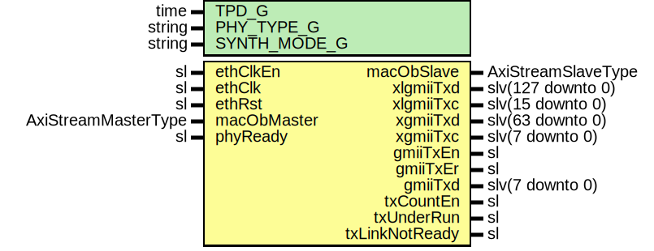

# Entity: EthMacTxExport

- **File**: EthMacTxExport.vhd
## Diagram

## Description

-----------------------------------------------------------------------------
 Company    : SLAC National Accelerator Laboratory
-----------------------------------------------------------------------------
 Description: Mapping for 1GbE/10GbE/40GbE ETH MAC TX path
-----------------------------------------------------------------------------
 This file is part of 'SLAC Firmware Standard Library'.
 It is subject to the license terms in the LICENSE.txt file found in the
 top-level directory of this distribution and at:
    https://confluence.slac.stanford.edu/display/ppareg/LICENSE.html.
 No part of 'SLAC Firmware Standard Library', including this file,
 may be copied, modified, propagated, or distributed except according to
 the terms contained in the LICENSE.txt file.
-----------------------------------------------------------------------------
## Generics

| Generic name | Type   | Value      | Description |
| ------------ | ------ | ---------- | ----------- |
| TPD_G        | time   | 1 ns       |             |
| PHY_TYPE_G   | string | "XGMII"    |             |
| SYNTH_MODE_G | string | "inferred" |             |
## Ports

| Port name      | Direction | Type                | Description              |
| -------------- | --------- | ------------------- | ------------------------ |
| ethClkEn       | in        | sl                  | Clock and Reset          |
| ethClk         | in        | sl                  |                          |
| ethRst         | in        | sl                  |                          |
| macObMaster    | in        | AxiStreamMasterType | AXIS Interface           |
| macObSlave     | out       | AxiStreamSlaveType  |                          |
| xlgmiiTxd      | out       | slv(127 downto 0)   | XLGMII PHY Interface     |
| xlgmiiTxc      | out       | slv(15 downto 0)    |                          |
| xgmiiTxd       | out       | slv(63 downto 0)    | XGMII PHY Interface      |
| xgmiiTxc       | out       | slv(7 downto 0)     |                          |
| gmiiTxEn       | out       | sl                  | GMII PHY Interface       |
| gmiiTxEr       | out       | sl                  |                          |
| gmiiTxd        | out       | slv(7 downto 0)     |                          |
| phyReady       | in        | sl                  | Configuration and status |
| txCountEn      | out       | sl                  |                          |
| txUnderRun     | out       | sl                  |                          |
| txLinkNotReady | out       | sl                  |                          |
