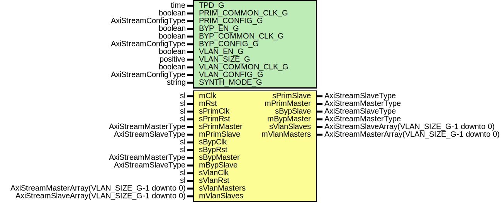

# Entity: EthMacTxFifo

## Diagram

## Description

Company    : SLAC National Accelerator Laboratory
Description: Inbound FIFO buffers
This file is part of 'SLAC Firmware Standard Library'.
It is subject to the license terms in the LICENSE.txt file found in the
top-level directory of this distribution and at:
   https://confluence.slac.stanford.edu/display/ppareg/LICENSE.html.
No part of 'SLAC Firmware Standard Library', including this file,
may be copied, modified, propagated, or distributed except according to
the terms contained in the LICENSE.txt file.
## Generics

| Generic name      | Type                | Value                  | Description |
| ----------------- | ------------------- | ---------------------- | ----------- |
| TPD_G             | time                | 1 ns                   |             |
| PRIM_COMMON_CLK_G | boolean             | false                  |             |
| PRIM_CONFIG_G     | AxiStreamConfigType | INT_EMAC_AXIS_CONFIG_C |             |
| BYP_EN_G          | boolean             | false                  |             |
| BYP_COMMON_CLK_G  | boolean             | false                  |             |
| BYP_CONFIG_G      | AxiStreamConfigType | INT_EMAC_AXIS_CONFIG_C |             |
| VLAN_EN_G         | boolean             | false                  |             |
| VLAN_SIZE_G       | positive            | 1                      |             |
| VLAN_COMMON_CLK_G | boolean             | false                  |             |
| VLAN_CONFIG_G     | AxiStreamConfigType | INT_EMAC_AXIS_CONFIG_C |             |
| SYNTH_MODE_G      | string              | "inferred"             |             |
## Ports

| Port name    | Direction | Type                                         | Description            |
| ------------ | --------- | -------------------------------------------- | ---------------------- |
| mClk         | in        | sl                                           | Master Clock and Reset |
| mRst         | in        | sl                                           |                        |
| sPrimClk     | in        | sl                                           | Primary Interface      |
| sPrimRst     | in        | sl                                           |                        |
| sPrimMaster  | in        | AxiStreamMasterType                          |                        |
| sPrimSlave   | out       | AxiStreamSlaveType                           |                        |
| mPrimMaster  | out       | AxiStreamMasterType                          |                        |
| mPrimSlave   | in        | AxiStreamSlaveType                           |                        |
| sBypClk      | in        | sl                                           | Bypass interface       |
| sBypRst      | in        | sl                                           |                        |
| sBypMaster   | in        | AxiStreamMasterType                          |                        |
| sBypSlave    | out       | AxiStreamSlaveType                           |                        |
| mBypMaster   | out       | AxiStreamMasterType                          |                        |
| mBypSlave    | in        | AxiStreamSlaveType                           |                        |
| sVlanClk     | in        | sl                                           | VLAN Interfaces        |
| sVlanRst     | in        | sl                                           |                        |
| sVlanMasters | in        | AxiStreamMasterArray(VLAN_SIZE_G-1 downto 0) |                        |
| sVlanSlaves  | out       | AxiStreamSlaveArray(VLAN_SIZE_G-1 downto 0)  |                        |
| mVlanMasters | out       | AxiStreamMasterArray(VLAN_SIZE_G-1 downto 0) |                        |
| mVlanSlaves  | in        | AxiStreamSlaveArray(VLAN_SIZE_G-1 downto 0)  |                        |
