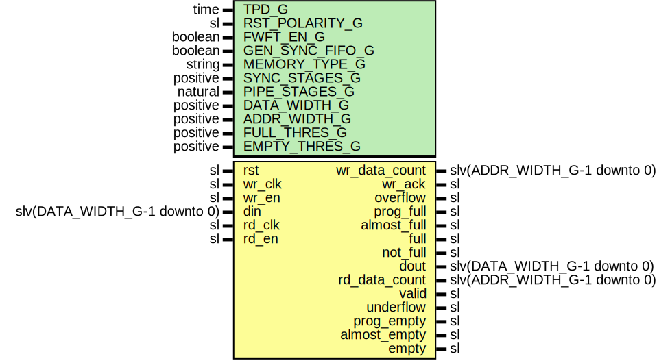

# Entity: FifoAlteraMf

- **File**: FifoAlteraMf.vhd
## Diagram

## Description

Company    : SLAC National Accelerator Laboratory
Description: Wrapper for Xilinx XPM FIFO module
This file is part of 'SLAC Firmware Standard Library'.
It is subject to the license terms in the LICENSE.txt file found in the
top-level directory of this distribution and at:
   https://confluence.slac.stanford.edu/display/ppareg/LICENSE.html.
No part of 'SLAC Firmware Standard Library', including this file,
may be copied, modified, propagated, or distributed except according to
the terms contained in the LICENSE.txt file.
## Generics

| Generic name    | Type     | Value  | Description                                 |
| --------------- | -------- | ------ | ------------------------------------------- |
| TPD_G           | time     | 1 ns   |                                             |
| RST_POLARITY_G  | sl       | '1'    | '1' for active high rst, '0' for active low |
| FWFT_EN_G       | boolean  | false  |                                             |
| GEN_SYNC_FIFO_G | boolean  | false  |                                             |
| MEMORY_TYPE_G   | string   | "auto" |                                             |
| SYNC_STAGES_G   | positive | 3      |                                             |
| PIPE_STAGES_G   | natural  | 0      |                                             |
| DATA_WIDTH_G    | positive | 18     |                                             |
| ADDR_WIDTH_G    | positive | 10     |                                             |
| FULL_THRES_G    | positive | 16     |                                             |
| EMPTY_THRES_G   | positive | 16     |                                             |
## Ports

| Port name     | Direction | Type                         | Description                 |
| ------------- | --------- | ---------------------------- | --------------------------- |
| rst           | in        | sl                           | Asynchronous Reset          |
| wr_clk        | in        | sl                           | Write Ports (wr_clk domain) |
| wr_en         | in        | sl                           |                             |
| din           | in        | slv(DATA_WIDTH_G-1 downto 0) |                             |
| wr_data_count | out       | slv(ADDR_WIDTH_G-1 downto 0) |                             |
| wr_ack        | out       | sl                           |                             |
| overflow      | out       | sl                           |                             |
| prog_full     | out       | sl                           |                             |
| almost_full   | out       | sl                           |                             |
| full          | out       | sl                           |                             |
| not_full      | out       | sl                           |                             |
| rd_clk        | in        | sl                           | Read Ports (rd_clk domain)  |
| rd_en         | in        | sl                           |                             |
| dout          | out       | slv(DATA_WIDTH_G-1 downto 0) |                             |
| rd_data_count | out       | slv(ADDR_WIDTH_G-1 downto 0) |                             |
| valid         | out       | sl                           |                             |
| underflow     | out       | sl                           |                             |
| prog_empty    | out       | sl                           |                             |
| almost_empty  | out       | sl                           |                             |
| empty         | out       | sl                           |                             |
## Signals

| Name      | Type                         | Description |
| --------- | ---------------------------- | ----------- |
| reset     | sl                           |             |
| sRdEn     | sl                           |             |
| sValid    | sl                           |             |
| dataOut   | slv(DATA_WIDTH_G-1 downto 0) |             |
| fifoFull  | sl                           |             |
| fifoEmpty | sl                           |             |
| wrCount   | slv(ADDR_WIDTH_G-1 downto 0) |             |
| rdCount   | slv(ADDR_WIDTH_G-1 downto 0) |             |
## Constants

| Name      | Type   | Value                                                                                                | Description |
| --------- | ------ | ---------------------------------------------------------------------------------------------------- | ----------- |
| FWFT_EN_C | string |  ite(FWFT_EN_G,  "ON",  "OFF") |             |
## Processes
- unnamed: ( fifoEmpty, fifoFull, rdCount, wrCount )
