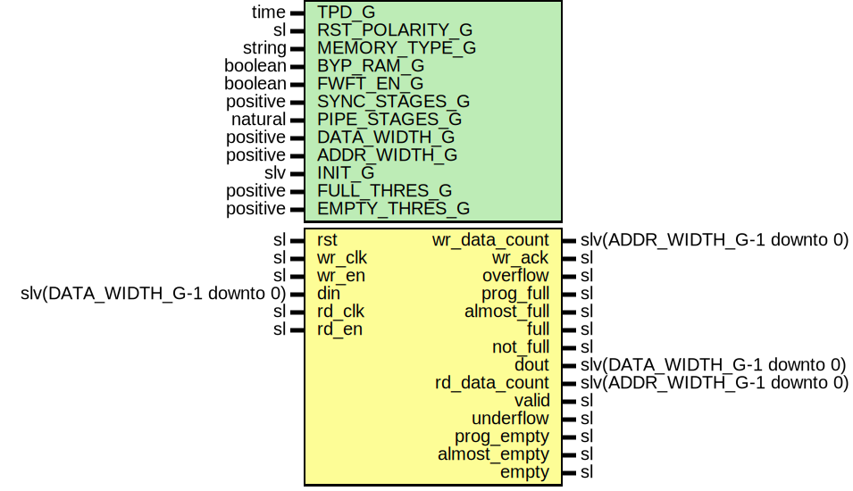

# Entity: FifoAsync

## Diagram

## Description

Company    : SLAC National Accelerator Laboratory
Description: ASYNC FIFO module
This file is part of 'SLAC Firmware Standard Library'.
It is subject to the license terms in the LICENSE.txt file found in the
top-level directory of this distribution and at:
   https://confluence.slac.stanford.edu/display/ppareg/LICENSE.html.
No part of 'SLAC Firmware Standard Library', including this file,
may be copied, modified, propagated, or distributed except according to
the terms contained in the LICENSE.txt file.
## Generics

| Generic name   | Type     | Value   | Description                                 |
| -------------- | -------- | ------- | ------------------------------------------- |
| TPD_G          | time     | 1 ns    |                                             |
| RST_POLARITY_G | sl       | '1'     | '1' for active high rst, '0' for active low |
| MEMORY_TYPE_G  | string   | "block" |                                             |
| BYP_RAM_G      | boolean  | false   |                                             |
| FWFT_EN_G      | boolean  | false   |                                             |
| SYNC_STAGES_G  | positive | 3       |                                             |
| PIPE_STAGES_G  | natural  | 0       |                                             |
| DATA_WIDTH_G   | positive | 16      |                                             |
| ADDR_WIDTH_G   | positive | 4       |                                             |
| INIT_G         | slv      | "0"     |                                             |
| FULL_THRES_G   | positive | 1       |                                             |
| EMPTY_THRES_G  | positive | 1       |                                             |
## Ports

| Port name     | Direction | Type                         | Description                 |
| ------------- | --------- | ---------------------------- | --------------------------- |
| rst           | in        | sl                           | Asynchronous Reset          |
| wr_clk        | in        | sl                           | Write Ports (wr_clk domain) |
| wr_en         | in        | sl                           |                             |
| din           | in        | slv(DATA_WIDTH_G-1 downto 0) |                             |
| wr_data_count | out       | slv(ADDR_WIDTH_G-1 downto 0) |                             |
| wr_ack        | out       | sl                           |                             |
| overflow      | out       | sl                           |                             |
| prog_full     | out       | sl                           |                             |
| almost_full   | out       | sl                           |                             |
| full          | out       | sl                           |                             |
| not_full      | out       | sl                           |                             |
| rd_clk        | in        | sl                           | Read Ports (rd_clk domain)  |
| rd_en         | in        | sl                           |                             |
| dout          | out       | slv(DATA_WIDTH_G-1 downto 0) |                             |
| rd_data_count | out       | slv(ADDR_WIDTH_G-1 downto 0) |                             |
| valid         | out       | sl                           |                             |
| underflow     | out       | sl                           |                             |
| prog_empty    | out       | sl                           |                             |
| almost_empty  | out       | sl                           |                             |
| empty         | out       | sl                           |                             |
## Signals

| Name        | Type                         | Description |
| ----------- | ---------------------------- | ----------- |
| wrRst       | sl                           |             |
| rdRst       | sl                           |             |
| rdRdy       | sl                           |             |
| rdIndex     | slv(ADDR_WIDTH_G-1 downto 0) |             |
| wrRdy       | sl                           |             |
| wrIndex     | slv(ADDR_WIDTH_G-1 downto 0) |             |
| rdRdySync   | sl                           |             |
| rdIndexSync | slv(ADDR_WIDTH_G-1 downto 0) |             |
| wrRdySync   | sl                           |             |
| wrIndexSync | slv(ADDR_WIDTH_G-1 downto 0) |             |
| wea         | sl                           |             |
| addra       | slv(ADDR_WIDTH_G-1 downto 0) |             |
| dina        | slv(DATA_WIDTH_G-1 downto 0) |             |
| addrb       | slv(ADDR_WIDTH_G-1 downto 0) |             |
| doutb       | slv(DATA_WIDTH_G-1 downto 0) |             |
| enb         | sl                           |             |
| regceb      | sl                           |             |
| localDout   | slv(DATA_WIDTH_G-1 downto 0) |             |
| localValid  | sl                           |             |
| localRdEn   | sl                           |             |
## Constants

| Name        | Type                          | Value            | Description |
| ----------- | ----------------------------- | ---------------- | ----------- |
| SYNC_INIT_C | slv(SYNC_STAGES_G-1 downto 0) |  (others => '0') |             |
| GRAY_INIT_C | slv(ADDR_WIDTH_G-1 downto 0)  |  (others => '0') |             |
## Instantiations

- U_wrRst: surf.RstSync
- U_rdIndex: surf.SynchronizerVector
- U_rdRdy: surf.Synchronizer
- U_WR_FSM: surf.FifoWrFsm
- U_rdRst: surf.RstSync
**Description**
      rd_clk clock domain

- U_wrIndex: surf.SynchronizerVector
- U_wrRdy: surf.Synchronizer
- U_RD_FSM: surf.FifoRdFsm
