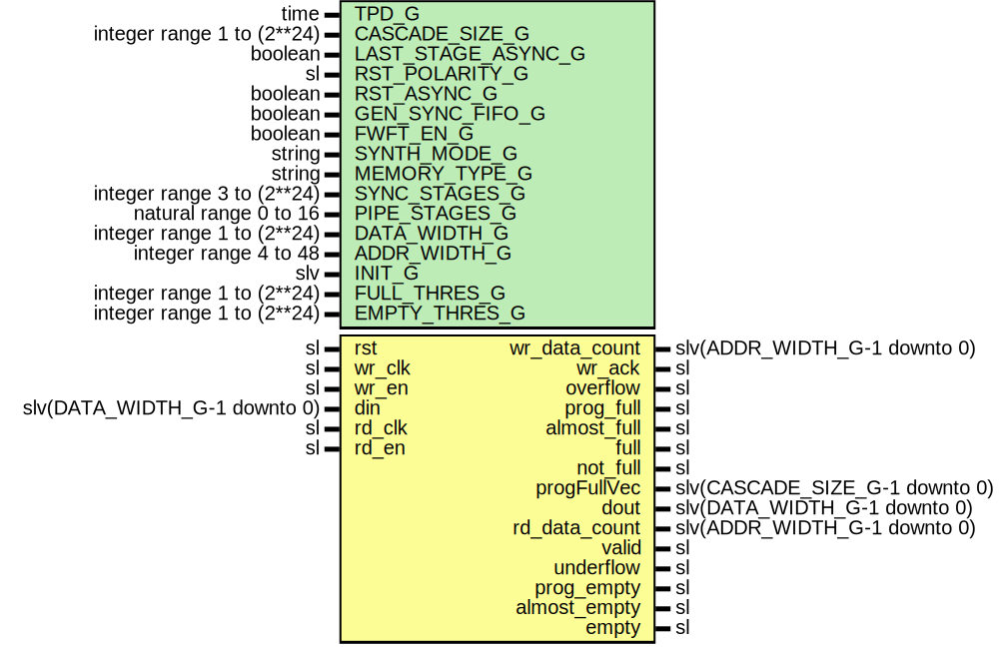

# Entity: FifoCascade

- **File**: FifoCascade.vhd
## Diagram

## Description

-----------------------------------------------------------------------------
 Company    : SLAC National Accelerator Laboratory
-----------------------------------------------------------------------------
 Description: Wrapper for cascading FWFT FIFOs together
-----------------------------------------------------------------------------
 This file is part of 'SLAC Firmware Standard Library'.
 It is subject to the license terms in the LICENSE.txt file found in the
 top-level directory of this distribution and at:
    https://confluence.slac.stanford.edu/display/ppareg/LICENSE.html.
 No part of 'SLAC Firmware Standard Library', including this file,
 may be copied, modified, propagated, or distributed except according to
 the terms contained in the LICENSE.txt file.
-----------------------------------------------------------------------------
## Generics

| Generic name       | Type                       | Value      | Description                                                       |
| ------------------ | -------------------------- | ---------- | ----------------------------------------------------------------- |
| TPD_G              | time                       | 1 ns       |                                                                   |
| CASCADE_SIZE_G     | integer range 1 to (2**24) | 1          |  Number of FIFOs to cascade (if set to 1, then no FIFO cascading) |
| LAST_STAGE_ASYNC_G | boolean                    | true       |  If set to true, the last stage will be the ASYNC FIFO            |
| RST_POLARITY_G     | sl                         | '1'        |  '1' for active high rst, '0' for active low                      |
| RST_ASYNC_G        | boolean                    | false      |                                                                   |
| GEN_SYNC_FIFO_G    | boolean                    | false      |                                                                   |
| FWFT_EN_G          | boolean                    | false      |                                                                   |
| SYNTH_MODE_G       | string                     | "inferred" |                                                                   |
| MEMORY_TYPE_G      | string                     | "block"    |                                                                   |
| SYNC_STAGES_G      | integer range 3 to (2**24) | 3          |                                                                   |
| PIPE_STAGES_G      | natural range 0 to 16      | 0          |                                                                   |
| DATA_WIDTH_G       | integer range 1 to (2**24) | 16         |                                                                   |
| ADDR_WIDTH_G       | integer range 4 to 48      | 4          |                                                                   |
| INIT_G             | slv                        | "0"        |                                                                   |
| FULL_THRES_G       | integer range 1 to (2**24) | 1          |                                                                   |
| EMPTY_THRES_G      | integer range 1 to (2**24) | 1          |                                                                   |
## Ports

| Port name     | Direction | Type                           | Description                      |
| ------------- | --------- | ------------------------------ | -------------------------------- |
| rst           | in        | sl                             | Resets                           |
| wr_clk        | in        | sl                             | rite Ports (wr_clk domain)       |
| wr_en         | in        | sl                             |                                  |
| din           | in        | slv(DATA_WIDTH_G-1 downto 0)   |                                  |
| wr_data_count | out       | slv(ADDR_WIDTH_G-1 downto 0)   |                                  |
| wr_ack        | out       | sl                             |                                  |
| overflow      | out       | sl                             |                                  |
| prog_full     | out       | sl                             |                                  |
| almost_full   | out       | sl                             |                                  |
| full          | out       | sl                             |                                  |
| not_full      | out       | sl                             |                                  |
| progFullVec   | out       | slv(CASCADE_SIZE_G-1 downto 0) |  Output stage = 0                |
| rd_clk        | in        | sl                             | unused if GEN_SYNC_FIFO_G = true |
| rd_en         | in        | sl                             |                                  |
| dout          | out       | slv(DATA_WIDTH_G-1 downto 0)   |                                  |
| rd_data_count | out       | slv(ADDR_WIDTH_G-1 downto 0)   |                                  |
| valid         | out       | sl                             |                                  |
| underflow     | out       | sl                             |                                  |
| prog_empty    | out       | sl                             |                                  |
| almost_empty  | out       | sl                             |                                  |
| empty         | out       | sl                             |                                  |
## Signals

| Name              | Type                         | Description |
| ----------------- | ---------------------------- | ----------- |
| progFull          | sl                           |             |
| 
      cascadeClk | sl                           |             |
| readJump          | slv(CASCADE_SIZE_C downto 0) |             |
| 
      validJump  | slv(CASCADE_SIZE_C downto 0) |             |
| 
      AFullJump  | slv(CASCADE_SIZE_C downto 0) |             |
| dataJump          | FifoDataType                 |             |
## Constants

| Name                  | Type    | Value                                                                                                                     | Description |
| --------------------- | ------- | ------------------------------------------------------------------------------------------------------------------------- | ----------- |
| GEN_SYNC_FIFO_FIRST_C | boolean |  ite(LAST_STAGE_ASYNC_G,  true,  GEN_SYNC_FIFO_G)   |             |
| GEN_SYNC_FIFO_LAST_C  | boolean |  ite(LAST_STAGE_ASYNC_G,  GEN_SYNC_FIFO_G,  true)   |             |
| CASCADE_SIZE_C        | integer |  ite((CASCADE_SIZE_G = 1),  0,  (CASCADE_SIZE_G-2)) |             |
## Types

| Name         | Type | Description |
| ------------ | ---- | ----------- |
| FifoDataType |      |             |
