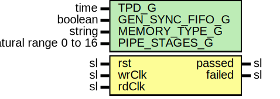

# Entity: FifoTbSubModule

- **File**: FifoFwftTbSubModule.vhd
## Diagram

## Description

Company    : SLAC National Accelerator Laboratory
Description: Simulation sub module for testing the FifoFwft modules
This file is part of 'SLAC Firmware Standard Library'.
It is subject to the license terms in the LICENSE.txt file found in the
top-level directory of this distribution and at:
   https://confluence.slac.stanford.edu/display/ppareg/LICENSE.html.
No part of 'SLAC Firmware Standard Library', including this file,
may be copied, modified, propagated, or distributed except according to
the terms contained in the LICENSE.txt file.
## Generics

| Generic name    | Type                  | Value   | Description |
| --------------- | --------------------- | ------- | ----------- |
| TPD_G           | time                  | 1 ns    |             |
| GEN_SYNC_FIFO_G | boolean               | false   |             |
| MEMORY_TYPE_G   | string                | "block" |             |
| PIPE_STAGES_G   | natural range 0 to 16 | 0       |             |
## Ports

| Port name | Direction | Type | Description |
| --------- | --------- | ---- | ----------- |
| rst       | in        | sl   |             |
| wrClk     | in        | sl   |             |
| rdClk     | in        | sl   |             |
| passed    | out       | sl   |             |
| failed    | out       | sl   |             |
## Signals

| Name              | Type             | Description |
| ----------------- | ---------------- | ----------- |
| wrEn              | sl               |             |
| 
      aFull      | sl               |             |
| 
      valid      | sl               |             |
| 
      rdEn       | sl               |             |
| 
      passedDet  | sl               |             |
| 
      failedDet  | sl               |             |
| 
      ready      | sl               |             |
| readDelay         | slv(4 downto 0)  |             |
| 
      writeDelay | slv(4 downto 0)  |             |
| din               | slv(15 downto 0) |             |
| 
      dout       | slv(15 downto 0) |             |
| 
      check      | slv(15 downto 0) |             |
## Processes
- unnamed: ( wrClk )
- unnamed: ( rdClk )
## Instantiations

- Fifo_Inst: surf.Fifo
