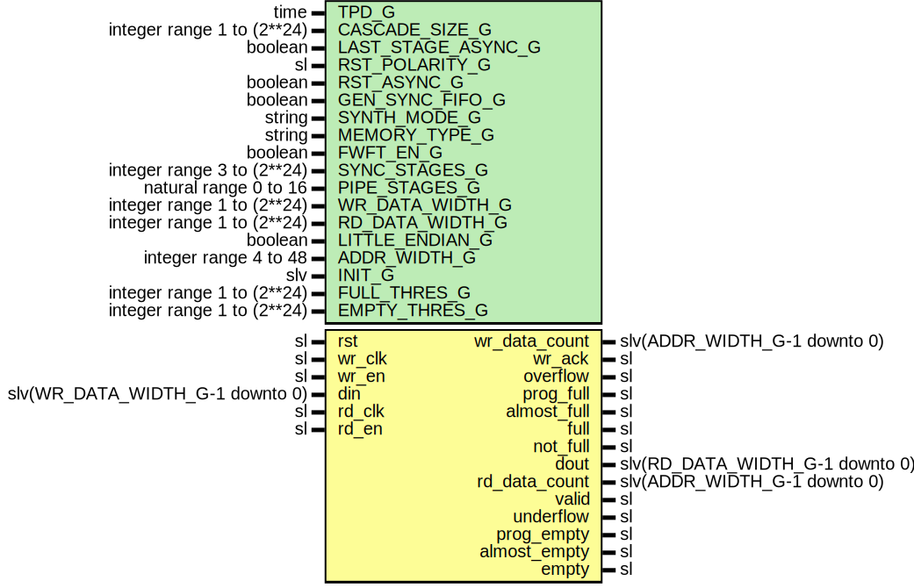

# Entity: FifoMux

- **File**: FifoMux.vhd
## Diagram

## Description

-----------------------------------------------------------------------------
 Company    : SLAC National Accelerator Laboratory
-----------------------------------------------------------------------------
 Description: Resizing FIFO module
-----------------------------------------------------------------------------
 This file is part of 'SLAC Firmware Standard Library'.
 It is subject to the license terms in the LICENSE.txt file found in the
 top-level directory of this distribution and at:
    https://confluence.slac.stanford.edu/display/ppareg/LICENSE.html.
 No part of 'SLAC Firmware Standard Library', including this file,
 may be copied, modified, propagated, or distributed except according to
 the terms contained in the LICENSE.txt file.
-----------------------------------------------------------------------------
## Generics

| Generic name       | Type                       | Value      | Description                                                       |
| ------------------ | -------------------------- | ---------- | ----------------------------------------------------------------- |
| TPD_G              | time                       | 1 ns       |                                                                   |
| CASCADE_SIZE_G     | integer range 1 to (2**24) | 1          |  number of FIFOs to cascade (if set to 1, then no FIFO cascading) |
| LAST_STAGE_ASYNC_G | boolean                    | true       |  if set to true, the last stage will be the ASYNC FIFO            |
| RST_POLARITY_G     | sl                         | '1'        |  '1' for active high rst, '0' for active low                      |
| RST_ASYNC_G        | boolean                    | false      |                                                                   |
| GEN_SYNC_FIFO_G    | boolean                    | false      |                                                                   |
| SYNTH_MODE_G       | string                     | "inferred" |                                                                   |
| MEMORY_TYPE_G      | string                     | "block"    |                                                                   |
| FWFT_EN_G          | boolean                    | true       |                                                                   |
| SYNC_STAGES_G      | integer range 3 to (2**24) | 3          |                                                                   |
| PIPE_STAGES_G      | natural range 0 to 16      | 0          |                                                                   |
| WR_DATA_WIDTH_G    | integer range 1 to (2**24) | 64         |                                                                   |
| RD_DATA_WIDTH_G    | integer range 1 to (2**24) | 16         |                                                                   |
| LITTLE_ENDIAN_G    | boolean                    | false      |                                                                   |
| ADDR_WIDTH_G       | integer range 4 to 48      | 10         |                                                                   |
| INIT_G             | slv                        | "0"        |                                                                   |
| FULL_THRES_G       | integer range 1 to (2**24) | 1          |                                                                   |
| EMPTY_THRES_G      | integer range 1 to (2**24) | 1          |                                                                   |
## Ports

| Port name     | Direction | Type                            | Description                      |
| ------------- | --------- | ------------------------------- | -------------------------------- |
| rst           | in        | sl                              |   Reset                          |
| wr_clk        | in        | sl                              | rite Ports (wr_clk domain)       |
| wr_en         | in        | sl                              |                                  |
| din           | in        | slv(WR_DATA_WIDTH_G-1 downto 0) |                                  |
| wr_data_count | out       | slv(ADDR_WIDTH_G-1 downto 0)    |                                  |
| wr_ack        | out       | sl                              |                                  |
| overflow      | out       | sl                              |                                  |
| prog_full     | out       | sl                              |                                  |
| almost_full   | out       | sl                              |                                  |
| full          | out       | sl                              |                                  |
| not_full      | out       | sl                              |                                  |
| rd_clk        | in        | sl                              | unused if GEN_SYNC_FIFO_G = true |
| rd_en         | in        | sl                              |                                  |
| dout          | out       | slv(RD_DATA_WIDTH_G-1 downto 0) |                                  |
| rd_data_count | out       | slv(ADDR_WIDTH_G-1 downto 0)    |                                  |
| valid         | out       | sl                              |                                  |
| underflow     | out       | sl                              |                                  |
| prog_empty    | out       | sl                              |                                  |
| almost_empty  | out       | sl                              |                                  |
| empty         | out       | sl                              |                                  |
## Signals

| Name         | Type                              | Description |
| ------------ | --------------------------------- | ----------- |
| wrR          | WrRegType                         |             |
|  wrRin       | WrRegType                         |             |
| fifo_din     | slv(FIFO_DATA_WIDTH_C-1 downto 0) |             |
| fifo_wr_en   | sl                                |             |
| wrRst        | sl                                |             |
| rdR          | RdRegType                         |             |
|  rdRin       | RdRegType                         |             |
| fifo_dout    | slv(FIFO_DATA_WIDTH_C-1 downto 0) |             |
| fifo_rd_data | slv(RD_DATA_WIDTH_G-1 downto 0)   |             |
| fifo_valid   | sl                                |             |
| fifo_rd_en   | sl                                |             |
| fifo_empty   | sl                                |             |
| rdRst        | sl                                |             |
## Constants

| Name              | Type      | Value                                                                                                                                                                         | Description                                   |
| ----------------- | --------- | ----------------------------------------------------------------------------------------------------------------------------------------------------------------------------- | --------------------------------------------- |
| FIFO_DATA_WIDTH_C | integer   |  ite(WR_DATA_WIDTH_G > RD_DATA_WIDTH_G,  WR_DATA_WIDTH_G,  RD_DATA_WIDTH_G)                             |                                               |
| WR_LOGIC_EN_C     | boolean   |  (WR_DATA_WIDTH_G < RD_DATA_WIDTH_G)                                                                                                                                          | --------------  Write Signals --------------  |
| WR_SIZE_C         | integer   |  ite(WR_LOGIC_EN_C,  RD_DATA_WIDTH_G / WR_DATA_WIDTH_G,  1)                                             |                                               |
| WR_REG_INIT_C     | WrRegType |  (       count  => (others => '0'),        wrData => (others => (others => '0')),        wrEn   => '0') |                                               |
| RD_LOGIC_EN_C     | boolean   |  (RD_DATA_WIDTH_G < WR_DATA_WIDTH_G)                                                                                                                                          | -------------  Read Signals -------------     |
| RD_SIZE_C         | integer   |  ite(RD_LOGIC_EN_C,  WR_DATA_WIDTH_G / RD_DATA_WIDTH_G,  1)                                             |                                               |
| RD_REG_INIT_C     | RdRegType |  (       count => (others => '0'))                                                                                                                                            |                                               |
## Types

| Name        | Type | Description |
| ----------- | ---- | ----------- |
| WrDataArray |      |             |
| WrRegType   |      |             |
| RdRegType   |      |             |
| RdDataArray |      |             |
## Processes
- wrComb: ( din, wrR, wr_en )
**Description**
------------  Write Logic ------------ 
- wrSeq: ( rst, wr_clk )
- rdComb: ( fifo_dout, fifo_empty, fifo_valid, rdR, rd_en )
- rdSeq: ( rdRst, rd_clk )
**Description**
 If fifo is asynchronous, must use async reset on rd side. 
## Instantiations

- RstSync_RdRst: surf.RstSync
**Description**
-----------
 Read logic
-----------
 Module reset should be driven by wr_clk
 Must synchronize it over to the rd_clk

- FifoCascade_Inst: surf.FifoCascade
**Description**
------
 Fifo
------

