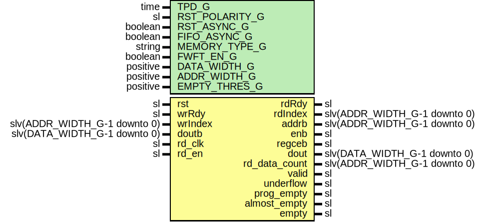

# Entity: FifoRdFsm

## Diagram

## Description

Company    : SLAC National Accelerator Laboratory
Description: FIFO Read FSM
This file is part of 'SLAC Firmware Standard Library'.
It is subject to the license terms in the LICENSE.txt file found in the
top-level directory of this distribution and at:
   https://confluence.slac.stanford.edu/display/ppareg/LICENSE.html.
No part of 'SLAC Firmware Standard Library', including this file,
may be copied, modified, propagated, or distributed except according to
the terms contained in the LICENSE.txt file.
## Generics

| Generic name   | Type     | Value   | Description                                 |
| -------------- | -------- | ------- | ------------------------------------------- |
| TPD_G          | time     | 1 ns    |                                             |
| RST_POLARITY_G | sl       | '1'     | '1' for active high rst, '0' for active low |
| RST_ASYNC_G    | boolean  | false   |                                             |
| FIFO_ASYNC_G   | boolean  | false   |                                             |
| MEMORY_TYPE_G  | string   | "block" |                                             |
| FWFT_EN_G      | boolean  | false   |                                             |
| DATA_WIDTH_G   | positive | 16      |                                             |
| ADDR_WIDTH_G   | positive | 4       |                                             |
| EMPTY_THRES_G  | positive | 1       |                                             |
## Ports

| Port name     | Direction | Type                         | Description         |
| ------------- | --------- | ---------------------------- | ------------------- |
| rst           | in        | sl                           | Reset               |
| rdRdy         | out       | sl                           | RD/WR FSM Interface |
| rdIndex       | out       | slv(ADDR_WIDTH_G-1 downto 0) |                     |
| wrRdy         | in        | sl                           |                     |
| wrIndex       | in        | slv(ADDR_WIDTH_G-1 downto 0) |                     |
| addrb         | out       | slv(ADDR_WIDTH_G-1 downto 0) | RAM Interface       |
| doutb         | in        | slv(DATA_WIDTH_G-1 downto 0) |                     |
| enb           | out       | sl                           |                     |
| regceb        | out       | sl                           |                     |
| rd_clk        | in        | sl                           | FIFO Read Interface |
| rd_en         | in        | sl                           |                     |
| dout          | out       | slv(DATA_WIDTH_G-1 downto 0) |                     |
| rd_data_count | out       | slv(ADDR_WIDTH_G-1 downto 0) |                     |
| valid         | out       | sl                           |                     |
| underflow     | out       | sl                           |                     |
| prog_empty    | out       | sl                           |                     |
| almost_empty  | out       | sl                           |                     |
| empty         | out       | sl                           |                     |
## Signals

| Name | Type    | Description |
| ---- | ------- | ----------- |
| r    | RegType |             |
| rin  | RegType |             |
## Constants

| Name       | Type                         | Value                                                                                                                                                                                                                                                                                                                                                                                                                                                                                                                                                                                                                                                                                                                                                                                                                                                                                                                                                                                                                                                                                        | Description |
| ---------- | ---------------------------- | -------------------------------------------------------------------------------------------------------------------------------------------------------------------------------------------------------------------------------------------------------------------------------------------------------------------------------------------------------------------------------------------------------------------------------------------------------------------------------------------------------------------------------------------------------------------------------------------------------------------------------------------------------------------------------------------------------------------------------------------------------------------------------------------------------------------------------------------------------------------------------------------------------------------------------------------------------------------------------------------------------------------------------------------------------------------------------------------- | ----------- |
| MAX_CNT_C  | slv(ADDR_WIDTH_G-1 downto 0) |  (others => '1')                                                                                                                                                                                                                                                                                                                                                                                                                                                                                                                                                                                                                                                                                                                                                                                                                                                                                                                                                                                                                                                                             |             |
| REG_INIT_C | RegType                      |  (       rdRdy        => ite(FIFO_ASYNC_G,  '0',  '1'),        tValid       => (others => '0'),        enb          => ite(FWFT_EN_G,  '0',  '1'),        regceb       => ite(FWFT_EN_G,  '0',  '1'),        valid        => '0',        underflow    => '0',        prog_empty   => '1',        almost_empty => '1',        empty        => '1',        count        => (others => '0'),        rdAddr       => (others => '0'),        rdIndex      => (others => '0')) |             |
## Types

| Name    | Type | Description |
| ------- | ---- | ----------- |
| RegType |      |             |
## Processes
- comb: ( doutb, r, rd_en, wrIndex, wrRdy )
