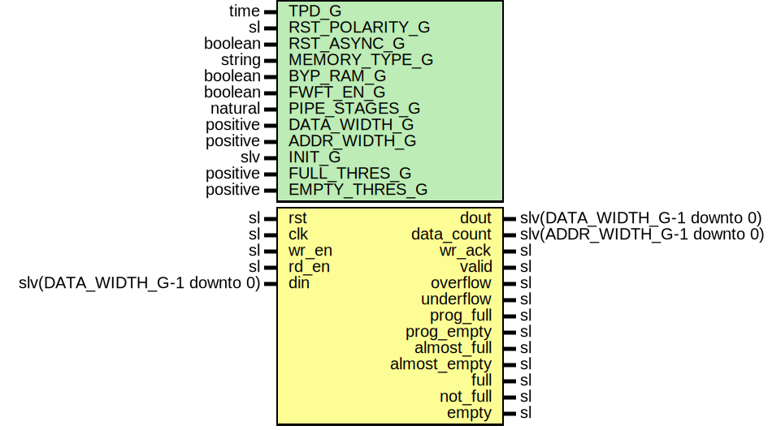

# Entity: FifoSync

- **File**: FifoSync.vhd
## Diagram

## Description

-----------------------------------------------------------------------------
 Company    : SLAC National Accelerator Laboratory
-----------------------------------------------------------------------------
 Description: SYNC FIFO module
-----------------------------------------------------------------------------
 This file is part of 'SLAC Firmware Standard Library'.
 It is subject to the license terms in the LICENSE.txt file found in the
 top-level directory of this distribution and at:
    https://confluence.slac.stanford.edu/display/ppareg/LICENSE.html.
 No part of 'SLAC Firmware Standard Library', including this file,
 may be copied, modified, propagated, or distributed except according to
 the terms contained in the LICENSE.txt file.
-----------------------------------------------------------------------------
## Generics

| Generic name   | Type     | Value   | Description                                  |
| -------------- | -------- | ------- | -------------------------------------------- |
| TPD_G          | time     | 1 ns    |                                              |
| RST_POLARITY_G | sl       | '1'     |  '1' for active high rst, '0' for active low |
| RST_ASYNC_G    | boolean  | false   |                                              |
| MEMORY_TYPE_G  | string   | "block" |                                              |
| BYP_RAM_G      | boolean  | false   |                                              |
| FWFT_EN_G      | boolean  | false   |                                              |
| PIPE_STAGES_G  | natural  | 0       |                                              |
| DATA_WIDTH_G   | positive | 16      |                                              |
| ADDR_WIDTH_G   | positive | 4       |                                              |
| INIT_G         | slv      | "0"     |                                              |
| FULL_THRES_G   | positive | 1       |                                              |
| EMPTY_THRES_G  | positive | 1       |                                              |
## Ports

| Port name    | Direction | Type                         | Description |
| ------------ | --------- | ---------------------------- | ----------- |
| rst          | in        | sl                           |             |
| clk          | in        | sl                           |             |
| wr_en        | in        | sl                           |             |
| rd_en        | in        | sl                           |             |
| din          | in        | slv(DATA_WIDTH_G-1 downto 0) |             |
| dout         | out       | slv(DATA_WIDTH_G-1 downto 0) |             |
| data_count   | out       | slv(ADDR_WIDTH_G-1 downto 0) |             |
| wr_ack       | out       | sl                           |             |
| valid        | out       | sl                           |             |
| overflow     | out       | sl                           |             |
| underflow    | out       | sl                           |             |
| prog_full    | out       | sl                           |             |
| prog_empty   | out       | sl                           |             |
| almost_full  | out       | sl                           |             |
| almost_empty | out       | sl                           |             |
| full         | out       | sl                           |             |
| not_full     | out       | sl                           |             |
| empty        | out       | sl                           |             |
## Signals

| Name       | Type                         | Description |
| ---------- | ---------------------------- | ----------- |
| rdRdy      | sl                           |             |
| rdIndex    | slv(ADDR_WIDTH_G-1 downto 0) |             |
| wrRdy      | sl                           |             |
| wrIndex    | slv(ADDR_WIDTH_G-1 downto 0) |             |
| wea        | sl                           |             |
| addra      | slv(ADDR_WIDTH_G-1 downto 0) |             |
| dina       | slv(DATA_WIDTH_G-1 downto 0) |             |
| addrb      | slv(ADDR_WIDTH_G-1 downto 0) |             |
| doutb      | slv(DATA_WIDTH_G-1 downto 0) |             |
| enb        | sl                           |             |
| regceb     | sl                           |             |
| localDout  | slv(DATA_WIDTH_G-1 downto 0) |             |
| localValid | sl                           |             |
| localRdEn  | sl                           |             |
## Instantiations

- U_WR_FSM: surf.FifoWrFsm
- U_RD_FSM: surf.FifoRdFsm
