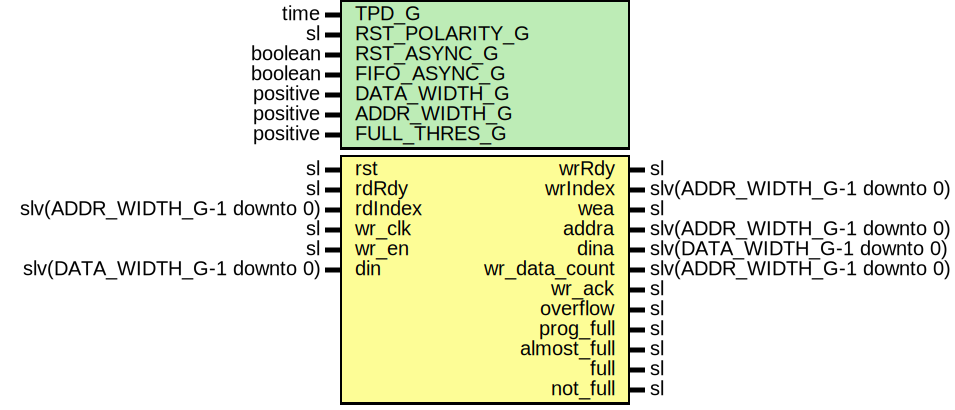

# Entity: FifoWrFsm

- **File**: FifoWrFsm.vhd
## Diagram

## Description

-----------------------------------------------------------------------------
 Company    : SLAC National Accelerator Laboratory
-----------------------------------------------------------------------------
 Description: FIFO Write FSM
-----------------------------------------------------------------------------
 This file is part of 'SLAC Firmware Standard Library'.
 It is subject to the license terms in the LICENSE.txt file found in the
 top-level directory of this distribution and at:
    https://confluence.slac.stanford.edu/display/ppareg/LICENSE.html.
 No part of 'SLAC Firmware Standard Library', including this file,
 may be copied, modified, propagated, or distributed except according to
 the terms contained in the LICENSE.txt file.
-----------------------------------------------------------------------------
## Generics

| Generic name   | Type     | Value | Description                                  |
| -------------- | -------- | ----- | -------------------------------------------- |
| TPD_G          | time     | 1 ns  |                                              |
| RST_POLARITY_G | sl       | '1'   |  '1' for active high rst, '0' for active low |
| RST_ASYNC_G    | boolean  | false |                                              |
| FIFO_ASYNC_G   | boolean  | false |                                              |
| DATA_WIDTH_G   | positive | 16    |                                              |
| ADDR_WIDTH_G   | positive | 4     |                                              |
| FULL_THRES_G   | positive | 1     |                                              |
## Ports

| Port name     | Direction | Type                         | Description          |
| ------------- | --------- | ---------------------------- | -------------------- |
| rst           | in        | sl                           | Reset                |
| rdRdy         | in        | sl                           | RD/WR FSM Interface  |
| rdIndex       | in        | slv(ADDR_WIDTH_G-1 downto 0) |                      |
| wrRdy         | out       | sl                           |                      |
| wrIndex       | out       | slv(ADDR_WIDTH_G-1 downto 0) |                      |
| wea           | out       | sl                           | RAM Interface        |
| addra         | out       | slv(ADDR_WIDTH_G-1 downto 0) |                      |
| dina          | out       | slv(DATA_WIDTH_G-1 downto 0) |                      |
| wr_clk        | in        | sl                           | FIFO Write Interface |
| wr_en         | in        | sl                           |                      |
| din           | in        | slv(DATA_WIDTH_G-1 downto 0) |                      |
| wr_data_count | out       | slv(ADDR_WIDTH_G-1 downto 0) |                      |
| wr_ack        | out       | sl                           |                      |
| overflow      | out       | sl                           |                      |
| prog_full     | out       | sl                           |                      |
| almost_full   | out       | sl                           |                      |
| full          | out       | sl                           |                      |
| not_full      | out       | sl                           |                      |
## Signals

| Name | Type    | Description |
| ---- | ------- | ----------- |
| r    | RegType |             |
| rin  | RegType |             |
## Constants

| Name       | Type                         | Value                                                                                                                                                                                                                                                                                                                                                                                                                                                                                                                                                                                                                                                                                                                                          | Description |
| ---------- | ---------------------------- | ---------------------------------------------------------------------------------------------------------------------------------------------------------------------------------------------------------------------------------------------------------------------------------------------------------------------------------------------------------------------------------------------------------------------------------------------------------------------------------------------------------------------------------------------------------------------------------------------------------------------------------------------------------------------------------------------------------------------------------------------- | ----------- |
| FULL_C     | slv(ADDR_WIDTH_G-1 downto 0) |  (others => '1')                                                                                                                                                                                                                                                                                                                                                                                                                                                                                                                                                                                                                                                                                                                               |             |
| AFULL_C    | slv(ADDR_WIDTH_G-1 downto 0) |  FULL_C-1                                                                                                                                                                                                                                                                                                                                                                                                                                                                                                                                                                                                                                                                                                                                      |             |
| REG_INIT_C | RegType                      |  (       wrRdy       => ite(FIFO_ASYNC_G,  '0',  '1'),        wr_ack      => '0',        overflow    => '0',        prog_full   => '1',        almost_full => '1',        full        => '1',        not_full    => '0',        count       => (others => '1'),        wrAddr      => (others => '0'),        wrIndex     => (others => '0')) |             |
## Types

| Name    | Type | Description |
| ------- | ---- | ----------- |
| RegType |      |             |
## Processes
- comb: ( din, r, rdIndex, rdRdy, wr_en )
