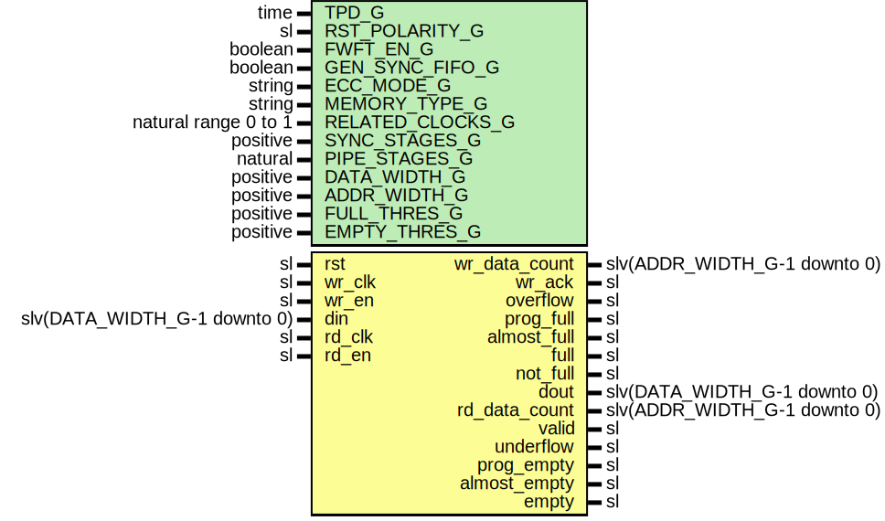

# Entity: FifoXpm

## Diagram

## Description

Company    : SLAC National Accelerator Laboratory
Description: Wrapper for Xilinx XPM FIFO module
This file is part of 'SLAC Firmware Standard Library'.
It is subject to the license terms in the LICENSE.txt file found in the
top-level directory of this distribution and at:
   https://confluence.slac.stanford.edu/display/ppareg/LICENSE.html.
No part of 'SLAC Firmware Standard Library', including this file,
may be copied, modified, propagated, or distributed except according to
the terms contained in the LICENSE.txt file.
## Generics

| Generic name     | Type                 | Value    | Description                                 |
| ---------------- | -------------------- | -------- | ------------------------------------------- |
| TPD_G            | time                 | 1 ns     |                                             |
| RST_POLARITY_G   | sl                   | '1'      | '1' for active high rst, '0' for active low |
| FWFT_EN_G        | boolean              | false    |                                             |
| GEN_SYNC_FIFO_G  | boolean              | false    |                                             |
| ECC_MODE_G       | string               | "no_ecc" | Allowed values: no_ecc, en_ecc              |
| MEMORY_TYPE_G    | string               | "block"  |                                             |
| RELATED_CLOCKS_G | natural range 0 to 1 | 0        |                                             |
| SYNC_STAGES_G    | positive             | 3        |                                             |
| PIPE_STAGES_G    | natural              | 0        |                                             |
| DATA_WIDTH_G     | positive             | 18       |                                             |
| ADDR_WIDTH_G     | positive             | 10       |                                             |
| FULL_THRES_G     | positive             | 16       |                                             |
| EMPTY_THRES_G    | positive             | 16       |                                             |
## Ports

| Port name     | Direction | Type                         | Description                 |
| ------------- | --------- | ---------------------------- | --------------------------- |
| rst           | in        | sl                           | Asynchronous Reset          |
| wr_clk        | in        | sl                           | Write Ports (wr_clk domain) |
| wr_en         | in        | sl                           |                             |
| din           | in        | slv(DATA_WIDTH_G-1 downto 0) |                             |
| wr_data_count | out       | slv(ADDR_WIDTH_G-1 downto 0) |                             |
| wr_ack        | out       | sl                           |                             |
| overflow      | out       | sl                           |                             |
| prog_full     | out       | sl                           |                             |
| almost_full   | out       | sl                           |                             |
| full          | out       | sl                           |                             |
| not_full      | out       | sl                           |                             |
| rd_clk        | in        | sl                           | Read Ports (rd_clk domain)  |
| rd_en         | in        | sl                           |                             |
| dout          | out       | slv(DATA_WIDTH_G-1 downto 0) |                             |
| rd_data_count | out       | slv(ADDR_WIDTH_G-1 downto 0) |                             |
| valid         | out       | sl                           |                             |
| underflow     | out       | sl                           |                             |
| prog_empty    | out       | sl                           |                             |
| almost_empty  | out       | sl                           |                             |
| empty         | out       | sl                           |                             |
## Signals

| Name              | Type                          | Description |
| ----------------- | ----------------------------- | ----------- |
| reset             | sl                            |             |
| sRdEn             | sl                            |             |
| sValid            | sl                            |             |
| dout_xpm          | slv(DATA_WIDTH_G-1 downto 0)  |             |
| wr_data_count_xpm | slv(COUNT_WIDTH_C-1 downto 0) |             |
| wr_ack_xpm        | sl                            |             |
| overflow_xpm      | sl                            |             |
| prog_full_xpm     | sl                            |             |
| almost_full_xpm   | sl                            |             |
| full_xpm          | sl                            |             |
| rd_data_count_xpm | slv(COUNT_WIDTH_C-1 downto 0) |             |
| underflow_xpm     | sl                            |             |
| prog_empty_xpm    | sl                            |             |
| almost_empty_xpm  | sl                            |             |
| empty_xpm         | sl                            |             |
## Constants

| Name                | Type     | Value                                                                                                                                                                                                                                                                            | Description                                                                                                                                                                                                                                                                                       |
| ------------------- | -------- | -------------------------------------------------------------------------------------------------------------------------------------------------------------------------------------------------------------------------------------------------------------------------------- | ------------------------------------------------------------------------------------------------------------------------------------------------------------------------------------------------------------------------------------------------------------------------------------------------- |
| READ_MODE_C         | string   |  ite(FWFT_EN_G,  "fwft",  "std")                                                                                                                                                                           |                                                                                                                                                                                                                                                                                                   |
| DOUT_INIT_C         | string   |  "0"                                                                                                                                                                                                                                                                             |                                                                                                                                                                                                                                                                                                   |
| MIN_THRES_C         | positive |  8                                                                                                                                                                                                                                                                               |                                                                                                                                                                                                                                                                                                   |
| MAX_THRES_C         | positive |  2**ADDR_WIDTH_G - 8                                                                                                                                                                                                                                                             |                                                                                                                                                                                                                                                                                                   |
| WAKEUP_TIME_C       | integer  |  0                                                                                                                                                                                                                                                                               | 0: Disable sleep, 2: Use Sleep Pin                                                                                                                                                                                                                                                                |
| FIFO_WRITE_DEPTH_C  | positive |  2**ADDR_WIDTH_G                                                                                                                                                                                                                                                                 | Defines the FIFO Write Depth, must be power of two                                                                                                                                                                                                                                                |
| FIFO_READ_LATENCY_C | natural  |  ite(FWFT_EN_G,  0,  1)                                                                                                                                                                                    | If READ_MODE = "fwft", then the only applicable value is 0                                                                                                                                                                                                                                        |
| FULL_RESET_VALUE_C  | natural  |  1                                                                                                                                                                                                                                                                               | Assert back pressure during reset                                                                                                                                                                                                                                                                 |
| COUNT_WIDTH_C       | positive |  ite(FWFT_EN_G,  ADDR_WIDTH_G+1,  ADDR_WIDTH_G)                                                                                                                                                            | In standard READ_MODE, the effective depth = FIFO_WRITE_DEPTHIn First-Word-Fall-Through READ_MODE, the effective depth = FIFO_WRITE_DEPTH+2COUNT_WIDTH_C = ADDR_WIDTH_G+1 to report the correct fill count (units of words)                                                                       |
| FULL_THRES_C        | positive |        ite((FULL_THRES_G < MIN_THRES_C),  MIN_THRES_C,            ite((FULL_THRES_G > MAX_THRES_C),  MAX_THRES_C,  FULL_THRES_G))    | Force Full threshold to be within allowed XPM range                                                                                                                                                                                                                                               |
| EMPTY_THRES_C       | positive |        ite((EMPTY_THRES_G < MIN_THRES_C),  MIN_THRES_C,            ite((EMPTY_THRES_G > MAX_THRES_C),  MAX_THRES_C,  EMPTY_THRES_G)) | Force Empty threshold to be within allowed XPM range                                                                                                                                                                                                                                              |
| USE_ADV_FEATURES_C  | string   |  "1F1F"                                                                                                                                                                                                                                                                          | BIT0:  Enable overflowBIT1:  Enable prog_fullBIT2:  Enable wr_data_countBIT3:  Enable almost_fullBIT4:  Enable wr_ackBIT5:  UndefinedBIT6:  UndefinedBIT7:  UndefinedBIT8:  Enable underflowBIT9:  Enable prog_emptyBIT10: Enable rd_data_countBIT11: Enable almost_emptyBIT12: Enable data_valid |
## Processes
- unnamed: ( rd_data_count_xpm, wr_data_count_xpm )
