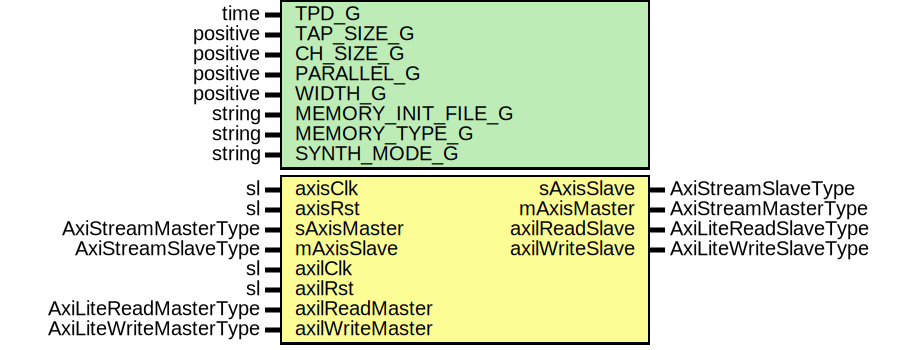

# Entity: FirFilterMultiChannel

- **File**: FirFilterMultiChannel.vhd
## Diagram

## Description

Company    : SLAC National Accelerator Laboratory
Description: Multi-Channel Finite Impulse Response (FIR) Filter
This file is part of 'SLAC Firmware Standard Library'.
It is subject to the license terms in the LICENSE.txt file found in the
top-level directory of this distribution and at:
   https://confluence.slac.stanford.edu/display/ppareg/LICENSE.html.
No part of 'SLAC Firmware Standard Library', including this file,
may be copied, modified, propagated, or distributed except according to
the terms contained in the LICENSE.txt file.
## Generics

| Generic name       | Type     | Value         | Description                                       |
| ------------------ | -------- | ------------- | ------------------------------------------------- |
| TPD_G              | time     | 1 ns          |                                                   |
| TAP_SIZE_G         | positive | 21            | Number of programmable taps                       |
| CH_SIZE_G          | positive | 128           | Number of data channels                           |
| PARALLEL_G         | positive | 4             | Number of parallel channel processing             |
| WIDTH_G            | positive | 12            | Number of bits per data word                      |
| MEMORY_INIT_FILE_G | string   | "none"        | Used to load tap coefficients into RAM at boot up |
| MEMORY_TYPE_G      | string   | "distributed" |                                                   |
| SYNTH_MODE_G       | string   | "inferred"    |                                                   |
## Ports

| Port name       | Direction | Type                   | Description                           |
| --------------- | --------- | ---------------------- | ------------------------------------- |
| axisClk         | in        | sl                     | AXI Stream Interface (axilClk domain) |
| axisRst         | in        | sl                     |                                       |
| sAxisMaster     | in        | AxiStreamMasterType    |                                       |
| sAxisSlave      | out       | AxiStreamSlaveType     |                                       |
| mAxisMaster     | out       | AxiStreamMasterType    |                                       |
| mAxisSlave      | in        | AxiStreamSlaveType     |                                       |
| axilClk         | in        | sl                     | AXI-Lite Interface (axilClk domain)   |
| axilRst         | in        | sl                     |                                       |
| axilReadMaster  | in        | AxiLiteReadMasterType  |                                       |
| axilReadSlave   | out       | AxiLiteReadSlaveType   |                                       |
| axilWriteMaster | in        | AxiLiteWriteMasterType |                                       |
| axilWriteSlave  | out       | AxiLiteWriteSlaveType  |                                       |
## Signals

| Name       | Type                                                | Description |
| ---------- | --------------------------------------------------- | ----------- |
| r          | RegType                                             |             |
| rin        | RegType                                             |             |
| datain     | DataArray                                           |             |
| coeffin    | CoeffArray                                          |             |
| cascin     | CascArray                                           |             |
| cascout    | CascArray                                           |             |
| cascCache  | CascArray                                           |             |
| ramWe      | sl                                                  |             |
| raddr      | slv(RAM_ADDR_WIDTH_C-1 downto 0)                    |             |
| waddr      | slv(RAM_ADDR_WIDTH_C-1 downto 0)                    |             |
| coeffinSlv | slv(WIDTH_G*TAP_SIZE_G*PARALLEL_G-1 downto 0)       |             |
| ramDin     | slv((2*WIDTH_G+1)*TAP_SIZE_G*PARALLEL_G-1 downto 0) |             |
| ramDout    | slv((2*WIDTH_G+1)*TAP_SIZE_G*PARALLEL_G-1 downto 0) |             |
## Constants

| Name             | Type     | Value                                                                                                                                                                                                                                                                                                                                                                                                                                                                                                                                                  | Description |
| ---------------- | -------- | ------------------------------------------------------------------------------------------------------------------------------------------------------------------------------------------------------------------------------------------------------------------------------------------------------------------------------------------------------------------------------------------------------------------------------------------------------------------------------------------------------------------------------------------------------ | ----------- |
| WORD_PER_FRAME   | positive |  CH_SIZE_G/PARALLEL_G                                                                                                                                                                                                                                                                                                                                                                                                                                                                                                                                  |             |
| RAM_ADDR_WIDTH_C | positive |  bitSize(WORD_PER_FRAME-1)                                                                                                                                                                                                                                                                                                                                                                                                                                                                                                                             |             |
| REG_INIT_C       | RegType  |  (       ramWe       => '0',        addr        => (others => '0'),        datain      => (others => (others => '0')),        cascin      => (others => (others => (others => '0'))),        sAxisSlave  => AXI_STREAM_SLAVE_INIT_C,        axisMeta    => AXI_STREAM_MASTER_INIT_C,        mAxisMaster => AXI_STREAM_MASTER_INIT_C) |             |
## Types

| Name       | Type | Description |
| ---------- | ---- | ----------- |
| DataArray  |      |             |
| CoeffArray |      |             |
| CascArray  |      |             |
| RegType    |      |             |
## Functions
- toSlv (din : CascArray)  return slv 
- toCascArray (din : slv)  return CascArray 
- toCoeffArray (din : slv)  return CoeffArray 
## Processes
- comb: ( axisRst, cascCache, cascout, mAxisSlave, r, sAxisMaster )
- seq: ( axisClk )
## Instantiations

- U_TapCoeff: surf.AxiDualPortRam
