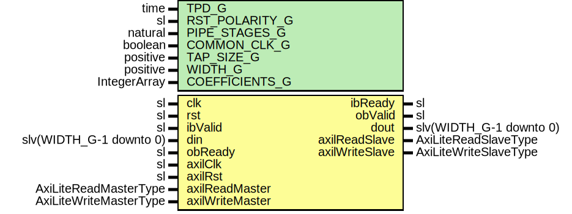

# Entity: FirFilterSingleChannel

- **File**: FirFilterSingleChannel.vhd
## Diagram

## Description

-----------------------------------------------------------------------------
 Company    : SLAC National Accelerator Laboratory
-----------------------------------------------------------------------------
 Description: Single Channel Finite Impulse Response (FIR) Filter
-----------------------------------------------------------------------------
 This file is part of 'SLAC Firmware Standard Library'.
 It is subject to the license terms in the LICENSE.txt file found in the
 top-level directory of this distribution and at:
    https://confluence.slac.stanford.edu/display/ppareg/LICENSE.html.
 No part of 'SLAC Firmware Standard Library', including this file,
 may be copied, modified, propagated, or distributed except according to
 the terms contained in the LICENSE.txt file.
-----------------------------------------------------------------------------
## Generics

| Generic name   | Type         | Value | Description                                  |
| -------------- | ------------ | ----- | -------------------------------------------- |
| TPD_G          | time         | 1 ns  |                                              |
| RST_POLARITY_G | sl           | '1'   |  '1' for active high rst, '0' for active low |
| PIPE_STAGES_G  | natural      | 0     |                                              |
| COMMON_CLK_G   | boolean      | false |                                              |
| TAP_SIZE_G     | positive     |       |  Number of programmable taps                 |
| WIDTH_G        | positive     |       |  Number of bits per data word                |
| COEFFICIENTS_G | IntegerArray |       |                                              |
## Ports

| Port name       | Direction | Type                    | Description                         |
| --------------- | --------- | ----------------------- | ----------------------------------- |
| clk             | in        | sl                      | Clock and Reset                     |
| rst             | in        | sl                      |                                     |
| ibValid         | in        | sl                      | Inbound Interface                   |
| ibReady         | out       | sl                      |                                     |
| din             | in        | slv(WIDTH_G-1 downto 0) |                                     |
| obValid         | out       | sl                      | Outbound Interface                  |
| obReady         | in        | sl                      |                                     |
| dout            | out       | slv(WIDTH_G-1 downto 0) |                                     |
| axilClk         | in        | sl                      | AXI-Lite Interface (axilClk domain) |
| axilRst         | in        | sl                      |                                     |
| axilReadMaster  | in        | AxiLiteReadMasterType   |                                     |
| axilReadSlave   | out       | AxiLiteReadSlaveType    |                                     |
| axilWriteMaster | in        | AxiLiteWriteMasterType  |                                     |
| axilWriteSlave  | out       | AxiLiteWriteSlaveType   |                                     |
## Signals

| Name        | Type                    | Description |
| ----------- | ----------------------- | ----------- |
| r           | RegType                 |             |
| rin         | RegType                 |             |
| cascin      | CascArray               |             |
| cascout     | CascArray               |             |
| datain      | slv(WIDTH_G-1 downto 0) |             |
| tReady      | sl                      |             |
| readMaster  | AxiLiteReadMasterType   |             |
| readSlave   | AxiLiteReadSlaveType    |             |
| writeMaster | AxiLiteWriteMasterType  |             |
| writeSlave  | AxiLiteWriteSlaveType   |             |
## Constants

| Name            | Type       | Value                                                                                                                                                                                                                                                                                                                                                                                                                                                                                                                                                                                                                                       | Description |
| --------------- | ---------- | ------------------------------------------------------------------------------------------------------------------------------------------------------------------------------------------------------------------------------------------------------------------------------------------------------------------------------------------------------------------------------------------------------------------------------------------------------------------------------------------------------------------------------------------------------------------------------------------------------------------------------------------- | ----------- |
| COEFFICIENTS_C  | CoeffArray |  InitCoeffArray                                                                                                                                                                                                                                                                                                                                                                                                                                                                                                                                                                                                                             |             |
| NUM_ADDR_BITS_C | positive   |  bitSize(TAP_SIZE_G-1)+2                                                                                                                                                                                                                                                                                                                                                                                                                                                                                                                                                                                                                    |             |
| REG_INIT_C      | RegType    |  (       cnt        => 0,        datain     => (others => '0'),        cascin     => (others => (others => '0')),        coeffin    => COEFFICIENTS_C,        ibReady    => '0',        tValid     => '0',        tdata      => (others => '0'),        readSlave  => AXI_LITE_READ_SLAVE_INIT_C,        writeSlave => AXI_LITE_WRITE_SLAVE_INIT_C) |             |
## Types

| Name       | Type | Description |
| ---------- | ---- | ----------- |
| CoeffArray |      |             |
| CascArray  |      |             |
| RegType    |      |             |
## Functions
## Processes
- comb: ( cascout, din, ibValid, r, readMaster, rst, tReady,
                   writeMaster )
- seq: ( clk )
## Instantiations

- U_AxiLiteAsync: surf.AxiLiteAsync
- U_Pipe: surf.FifoOutputPipeline
